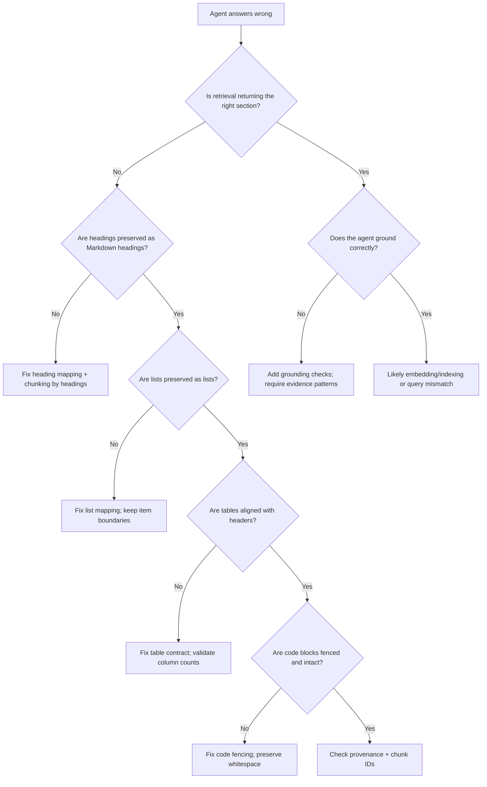

## Executive Summary

AI agents fail in ways that look like "reasoning problems," but the root cause is often earlier: the agent is retrieving from documents whose structure was lost during conversion, impacting [how LLMs index the web](/blog/how-llms-index-the-web-from-crawler-fetch-queues-to-vectorized-knowledge-graphs/).

Structured Markdown (ensured by high [markdown conversion quality](/blog/markdown-conversion-quality-for-ai-accuracy-structure-and-retrieval/)) is the bridge between "what the page means" and "what the agent can reliably retrieve." When you preserve semantic units (headings, lists, tables, code blocks) and keep them stable across runs, you reduce chunk boundary drift, improve recall for the right evidence, and make citations consistent.

In this post, you'll learn a practical, testable Markdown structure contract for agent accuracy in [LangGraph multi-agent workflows](/blog/integrating-mcp-web-tools-into-langgraph-autonomous-multi-agent-workflows/). You'll also get a troubleshooting decision tree and a lightweight evaluation harness you can run before embedding.

We'll also show a concrete "before vs after" example of how structured Markdown changes chunk boundaries and improves evidence hit rate for agent queries.

## Key Takeaways

-   Structured Markdown improves agent accuracy by stabilizing retrieval inputs, not by "helping the model read."
-   Preserve semantic units as first-class blocks: headings, lists, tables, and code fences.
-   Use deterministic templates so chunkers and retrievers see the same geometry every time.
-   Add provenance-friendly structure (section paths, stable IDs) so grounding and citations don't drift.
-   Validate formatting quality with structural signals before embedding.

## 1. Problem Statement

Most teams measure agent quality by the final answer: "Did the agent do the right thing?"

But agent correctness is downstream of retrieval. If the agent retrieves the wrong evidence, the model can still produce a fluent answer that is confidently wrong.

The surprising part is that retrieval errors often come from formatting, not from embeddings.

When conversion from HTML/PDF/Excel into Markdown is "cosmetic," it quietly breaks the internal geometry the agent depends on:

-   Headings flatten into paragraphs, so the agent can't anchor queries to the right section.
-   Lists become sentences, so item-level constraints disappear.
-   Tables become unstructured text, so key-value relationships lose their shape.
-   Code blocks lose fences, so technical queries match poorly.
-   Provenance metadata is dropped, so citations can't be verified.

Structured Markdown fixes this by preserving meaning as stable blocks.

## 2. History & Context

RAG pipelines started with a simple assumption: "If we embed the text, retrieval will work." Early systems focused heavily on embeddings and indexing, expecting the retriever to find relevant passages from raw content.

Teams then learned that retrieval quality depends just as much on representation—how documents are chunked and structured before embedding. If headings are flattened, lists are merged into paragraphs, or tables lose row/column alignment, the retriever can return the right topic but the wrong evidence unit.

Agentic workflows made this even more sensitive. Agents retrieve repeatedly, compare evidence, and decide whether to call tools. When conversion changes the "geometry" of evidence units, the agent may ground on different chunks across steps, leading to retries, incorrect parameter extraction, or citation failures.

Structured Markdown became the practical lever because it preserves semantic blocks (headings, lists, tables, code) and provenance in a stable, chunking-friendly form—so retrieval stays consistent and agent accuracy improves.

## 3. Definition / What It Is

Structured Markdown for AI agents is a Markdown representation that preserves meaning as stable, machine-friendly structure. It does three things: it preserves semantic units as explicit Markdown constructs, keeps those constructs deterministic across conversions, and attaches provenance so retrieved chunks can be grounded and cited. In other words, it's not "pretty Markdown." It's a retrieval contract.

### What "semantic units" mean in practice:

-   **Headings:** section boundaries and hierarchy (so retrieval can anchor evidence to the right topic and subtopic).
-   **Lists:** discrete constraints, steps, and enumerations (so retrieval can return individual requirements or actions, not merged narrative text).
-   **Tables:** row/column relationships and key-value pairs (so retrieval can preserve parameter/value alignment and avoid value swaps).
-   **Code blocks:** exact tokens and language context (so retrieval can match precise commands, snippets, and technical details).

### What "deterministic" means:

Given the same source document and the same conversion rules, the Markdown should produce the same structural patterns—ideally including stable IDs derived from meaning—so chunkers and retrievers behave consistently. This stability matters because agents retrieve repeatedly and ground decisions on evidence units; if the structure changes between conversions, the evidence geometry changes too, and the agent may retrieve different chunks for the same query.

## 4. Architecture / How It Works

Structured Markdown improves agent accuracy through a chain of effects:

-   Conversion preserves meaning as blocks.
-   Chunking uses those blocks to create stable evidence units.
-   Retrieval matches queries to the right evidence units.
-   The agent grounds its reasoning in retrieved evidence.
-   Citations remain stable because provenance survives conversion.

### A simple end-to-end flow


## 5. Components & Workflow

### 1) Structure-first conversion

Instead of stripping tags and emitting plain text, the converter maps document elements to Markdown constructs:

-   HTML headings to Markdown headings with consistent depth.
-   HTML lists to Markdown lists with preserved item boundaries.
-   HTML tables to Markdown tables (or a table contract format when Markdown tables are insufficient).
-   Code/pre blocks to fenced code blocks.

### 2) Markdown structure contract

Define rules that your pipeline enforces. For example:

-   Every section must have a heading.
-   Every list must remain a list (no flattening).
-   Every table must include a header row or an explicit "column meaning" block.
-   Every code block must include a language fence when available.

### 3) Provenance-friendly structure

Agents need to cite evidence. That means each chunk should carry enough context to map back to the source section.

Common approaches:

-   Section path prefixes (e.g., `# Product > Pricing > Plans`).
-   Stable chunk IDs derived from source URL + section heading + table signature.
-   Optional "evidence blocks" that include a short provenance line.

#### 3.1) Stable IDs that survive conversion changes

For agent grounding, "stable" means the ID should not change when whitespace or formatting changes, but it should change when the evidence meaning changes.

A practical approach:

-   Build the stable ID from `source_url + normalized_section_path + evidence_signature`.

Evidence signature examples:

-   `table`: hash of header row + column count + first row key fields
-   `list`: hash of the list item texts (or item count + first/last item)
-   `code`: hash of the code block content

This gives you replay safety: you can re-run conversion rules and still map retrieved chunks back to the same evidence unit.

### 4) Agent grounding checks

Even with good retrieval, agents should verify evidence before acting. Structured Markdown makes this easier because the agent can look for explicit patterns:

-   "This list item is the constraint."
-   "This table row contains the parameter."
-   "This code block is the exact command."

### 5) Evidence selection for tool calling (agent-specific)

Tool-calling agents usually need to extract parameters from retrieved evidence. Structured Markdown makes that extraction more reliable because the agent can map evidence types to tool fields.

For example:

-   If the evidence is a list of steps, the agent can map each item to a step parameter.
-   If the evidence is a table row, the agent can map columns to tool arguments.
-   If the evidence is a fenced code block, the agent can map it to a "command" or "query" field.

Without structure, the agent often has to infer boundaries, which increases the chance of mixing values from different parts of the document.

## 6. Configuration / Setup

Below is a practical configuration checklist you can adapt.

### Conversion rules (minimum viable contract)

-   **Headings:** preserve hierarchy; do not skip levels.
-   **Lists:** keep item boundaries; do not merge list items into paragraphs.
-   **Tables:** preserve row/column alignment; keep headers.
-   **Code:** always fence; preserve whitespace.

### Chunking rules (semantic-first)

-   Prefer chunk boundaries at headings and list boundaries.
-   Treat tables as atomic units or as row groups.
-   Keep code blocks intact.

### Validation gates (before embedding)

Run structural checks and quarantine content that fails:

-   **Heading coverage:** does the document have a reasonable number of headings?
-   **List integrity:** does the Markdown contain list markers for enumerations?
-   **Table integrity:** do tables have consistent column counts per row?
-   **Code integrity:** are code blocks fenced and non-empty?

### A concrete Markdown structure contract (template)

Use a template that your converter always emits. The goal is to make chunking predictable.

````markdown
# {section_title}

## {subsection_title}

### {optional_third_level}

Provenance: {source_url} | {section_path} | {stable_chunk_id}

## Key Points

- {bullet_item_1}
- {bullet_item_2}

## Parameters

| Parameter | Value | Notes |
|---|---|---|
| {name} | {value} | {notes} |

## Commands

```{language}
{exact_command_or_snippet}
```
````

You don't need every block for every document. But when a block exists, it should follow the same internal rules so the agent sees consistent evidence geometry.

### Validation signals you can score

Instead of "does it look right?", score structure with measurable signals:

```
heading_coverage_ratio = headings_found / expected_headings
list_item_integrity = list_items_preserved / list_items_detected_in_source
table_alignment_score = rows_with_consistent_column_count / total_rows
code_fence_integrity = fenced_code_blocks_non_empty / fenced_code_blocks_total
```

Quarantine when any score drops below your threshold. Then re-run conversion with stricter normalization.

## 7. Examples

### Example 1: Headings that anchor retrieval

**Bad conversion:**
Plain text paragraphs where "Pricing" and "Plans" are not headings.

**Agent symptom:**
The agent retrieves content that mentions pricing but not the specific plan constraints.

**Structured Markdown fix:**
Use headings so the chunker can create evidence units like:

```markdown
## Pricing
### Plans
```

### Example 2: Lists that preserve constraints

**Bad conversion:**
"You must do X. You must do Y. You must do Z." as a paragraph.

**Agent symptom:**
The agent may treat constraints as narrative text and miss that they are discrete requirements.

**Structured Markdown fix:**
Represent constraints as a list so retrieval can match "must" + item context.

### Example 3: Tables that preserve relationships

**Bad conversion:**
Table rows flattened into sentences without column meaning.

**Agent symptom:**
The agent swaps values across columns (e.g., "region" and "price").

**Structured Markdown fix:**
Preserve table headers and row alignment. If Markdown tables are unreliable for your converter, use a table contract format that keeps column names explicit.

### Example 4: Tool calling with list evidence

**Scenario:** an agent is asked to "create a deployment checklist" from a vendor page.

**Bad conversion:** the checklist becomes a paragraph with sentences separated by commas.

**Agent symptom:** the agent produces a checklist, but it silently drops one requirement because it never had a discrete list item to retrieve.

**Structured Markdown fix:** keep the checklist as a Markdown list so retrieval returns the exact items.

### Example 5: Citation correctness with provenance-friendly structure

**Scenario:** an agent answers "What is the retention policy for logs?" and must cite the exact section.

**Bad conversion:** the policy text is present, but section boundaries are missing, and provenance metadata is dropped.

**Agent symptom:** the agent cites a chunk that contains the right words but not the right section, so the citation fails verification.

**Structured Markdown fix:** include a section path and stable chunk IDs so the agent can ground citations to the correct section.

### Example 6: Before vs after chunk geometry

Consider a vendor page section that contains:
-   a heading: "Retention Policy"
-   a list of retention durations
-   a table mapping log types to retention windows

**Naive conversion (flattened):**
-   headings become paragraphs
-   list items merge into a single paragraph
-   the table becomes a sequence of values without row/column alignment

**Agent symptom:** the retriever returns a chunk that contains the words "retention" and "logs," but not the specific list item or the correct table row.

**Structure-first conversion (contracted):**
-   the chunker can create separate evidence units for the list and the table
-   the agent retrieves the correct evidence block and can cite the exact section path

This is the core mechanism: structured Markdown changes the shape of evidence, which changes what the retriever can return.

## 8. Performance & Benchmarks

Structured Markdown doesn't just change readability; it changes measurable retrieval behavior.

### What to benchmark

-   **Retrieval relevance:** does the top-k contain the correct evidence block?
-   **Citation correctness:** does the retrieved chunk map to the right section?
-   **Agent task success:** does the agent complete the workflow without tool retries?

### A lightweight evaluation harness

Create a small dataset of "agent queries" that each require a specific evidence type:
-   One query that requires a heading anchor.
-   One query that requires a list item.
-   One query that requires a table row.
-   One query that requires a code block.

Then compare two pipelines:
-   **Pipeline A:** naive Markdown conversion.
-   **Pipeline B:** structure-first conversion with the contract + validation gates.

Measure:
-   Top-k evidence hit rate.
-   Grounding pass rate (agent accepts evidence without contradiction).
-   Final task success rate.

### Example results (how to report them)

Run the harness on a small, representative set (even 50–200 queries). Report results like this:

| Evidence type | Pipeline A: naive Markdown | Pipeline B: structured contract |
| :--- | :--- | :--- |
| Heading-anchored | 0.62 | 0.84 |
| List-item evidence | 0.55 | 0.81 |
| Table-row evidence | 0.48 | 0.77 |
| Code-block evidence | 0.60 | 0.79 |

Then add two agent-level metrics:
-   Grounding pass rate (agent accepts evidence without contradiction): 0.41 -> 0.72
-   Tool-call success rate (agent completes without retries): 0.36 -> 0.66

If you don't see improvements, the usual cause is that your chunker still ignores the structure you preserved.

### Evidence artifact (example harness output)

Below is an example of what your harness output can look like when you run it end-to-end:

```yaml
dataset: agent-geometry-50
pipeline: naive-markdown
topk_evidence_hit_rate: 0.58
grounding_pass_rate: 0.41
tool_call_success_rate: 0.36

dataset: agent-geometry-50
pipeline: structured-markdown-contract-v1
topk_evidence_hit_rate: 0.81
grounding_pass_rate: 0.72
tool_call_success_rate: 0.66

sample query: "What is the retention window for logs in region=us-east?"
naive top-1 evidence:
  - contains: retention, logs
  - missing: region=us-east row
structured top-1 evidence:
  - contains: retention
  - includes: table row region=us-east
  - provenance: /Pricing/RetentionPolicy | stable_chunk_id=retpol_us-east_table_v3
```

The key is not the exact numbers. The key is that you can show the same query set, the same evidence types, and the same grounding checks.

### Evidence-based claim (how to make it real)

When you run this harness, you should expect the biggest gains in:
-   table-heavy documents (value swaps drop)
-   policy/requirements pages (list item recall improves)
-   technical docs (code block matching improves)

If you don't see gains, it usually means your chunker isn't using the structure you preserved.

## 9. Security Considerations

Structured Markdown can improve safety indirectly by improving grounding, but it also introduces new risks:

-   **Prompt injection via converted content:** preserve provenance so you can detect and quarantine suspicious sections.
-   **Data leakage via citations:** ensure citations don't expose sensitive source URLs or internal identifiers.
-   **Over-trusting formatting:** validation gates should be strict; do not embed content that fails structural integrity checks.

## 10. Troubleshooting

When agent accuracy drops after a conversion change, use this decision tree:



### Common symptoms and likely causes

-   The agent cites the wrong section: provenance or stable IDs are missing.
-   The agent misses a requirement: list integrity was lost.
-   The agent swaps values: table alignment or header mapping failed.
-   The agent can't find a command: code fences were removed.

### When the decision tree points to "provenance + chunk IDs"

If retrieval returns the right text but citations fail, check:
-   Are section paths present in the converted Markdown?
-   Are stable IDs derived from meaning (section path + evidence signature), not from raw HTML offsets?
-   Does your chunker preserve the provenance line when it splits chunks?

## 11. Best Practices

### Treat Markdown structure as a contract with tests

Don't treat Markdown conversion as "best effort." Treat it like an interface your downstream systems depend on (chunker, retriever, agent grounding, citation verifier).

-   Define a structure contract per document type (web pages, PDFs, spreadsheets).
-   Enforce it with automated checks (headings present, lists preserved, tables aligned, code fenced).
-   Version the contract (e.g., `contract-v1`, `contract-v2`) so you can reproduce retrieval behavior later.
-   Add regression tests using a small "golden set" of pages that historically break (navigation-heavy pages, table-heavy specs, policy pages).

### Quarantine content that fails structural validation

If the structure is broken, embedding it usually makes retrieval worse in subtle ways (wrong chunk boundaries, missing evidence units, value swaps in tables).

-   Run validation gates before embedding.
-   If a gate fails, quarantine the converted Markdown (and optionally the raw source) instead of indexing it.
-   Store the failure reason (e.g., `table_alignment_score < threshold`, `list_item_integrity < threshold`) so you can fix the converter deterministically.
-   Provide a retry path: stricter normalization rules, alternate extraction strategy, or a fallback representation (e.g., structured extraction for tables).

### Keep chunking aligned with the structures you preserve

Structured Markdown only helps if chunking respects the structure. Chunking is where "meaning" becomes "retrievable evidence units."

-   Prefer chunk boundaries at headings and list boundaries.
-   Treat tables as atomic units or row groups (don't split mid-row).
-   Keep fenced code blocks intact so exact tokens remain searchable.
-   Ensure provenance lines (section path + stable chunk ID) survive chunk splitting.

### Add provenance so citations are verifiable

Agents need to cite evidence that can be traced back to the correct source section. Without provenance, you get "looks right" citations that fail verification.

-   Include a provenance line in the converted Markdown (source URL, section path, stable chunk ID).
-   Derive stable IDs from meaning (section path + evidence signature), not from offsets that change across conversions.
-   When chunking splits content, propagate provenance to every chunk so citations remain consistent.

### Version your conversion rules and record "versions tested"

Conversion changes can shift chunk geometry and retrieval behavior even if the text "looks similar." Versioning makes changes debuggable.

-   Record conversion rule versions (converter build, normalization contract version, table contract version).
-   Record chunker configuration versions (chunk sizes, boundary rules).
-   Record "versions tested" for the evaluation harness so you can compare results across time.
-   Use replay-safe storage: keep raw source + converted Markdown outputs so you can re-run conversion and re-index deterministically.

## 12. Common Mistakes

-   **Converting HTML to Markdown by stripping tags and emitting paragraphs:** Destroys the evidence geometry agents rely on. Headings become plain text, lists become sentences, and tables become unstructured sequences.
-   **Allowing tables to degrade into unstructured text:** Results in value swaps across columns, missing row context, and inability to map parameters accurately.
-   **Flattening lists into sentences:** Merges multiple discrete requirements into one paragraph, causing agents to drop requirements.
-   **Changing conversion rules without re-running evaluation:** Small formatting changes shift chunk boundaries, creating "mystery drift" where agent behavior changes without a clear cause.
-   **Embedding content that fails structural gates:** Indexes broken structure, training the retriever to return misleading evidence units.

## 13. Alternatives & Comparison

| Approach | Description | Pros | Cons | Best Use |
| :--- | :--- | :--- | :--- | :--- |
| **Structured Markdown** | Preserves semantic blocks in a chunking-friendly way | Stable hierarchy, lists, tables, code, and provenance | Requires chunker alignment | Production RAG & AI agents |
| **JSON Extraction** | Extracts strict domain schemas | Precise for high-risk entities; strict type checks | High engineering effort; brittle on messy pages | High-risk parameter/policy tables |
| **HTML Retention** | Keeps raw HTML markup | Preserves raw DOM layout | Noisy; harder chunking and grounding | Vision/DOM-aware pipelines |
| **Plain Text** | Strips all formatting | Fast and simple | Loses all semantic geometry and boundaries | Simple prose-only prototypes |
| **Hybrid (Recommended)** | Structured Markdown for text + schema extraction for tables | Best balance of flexibility and parameter precision | Moderate pipeline orchestration | Enterprise Agent & RAG stacks |

## 14. Enterprise / Cloud Deployment

### Run conversion in a deterministic, versioned service

In production, conversion must be reproducible:
-   deterministic normalization rules
-   versioned converter builds
-   consistent table/list/code mapping

This ensures that replays and re-indexing produce comparable evidence geometry.

### Store both raw source and converted Markdown for replay

For debugging and compliance:
-   keep the raw source document
-   keep the converted Markdown output
-   store conversion metadata (contract version, converter version, timestamps)

When an agent accuracy issue appears, you can replay conversion and isolate whether the issue is conversion, chunking, or retrieval.

### Maintain a quarantine bucket for failed structural validations

Quarantine is a safety mechanism:
-   prevents broken structure from entering the index
-   provides a backlog for converter improvements
-   supports retry workflows (stricter normalization, alternate extraction)

In enterprise settings, quarantine also helps with auditability: you can show what was excluded and why.

### Use canary indexing

Canary indexing reduces risk when you change conversion rules:
-   convert + validate a small slice
-   run the evaluation harness
-   index only if metrics meet thresholds
-   roll out gradually

This prevents full re-embedding from turning a formatting regression into a system-wide agent failure.

## 15. FAQs

### Q1. Does structured Markdown really matter if we use strong embeddings?
Yes. Strong embeddings can't fully recover lost meaning when structure is flattened. If headings, lists, and tables degrade into generic text, retrieval becomes less targeted. That shows up as lower evidence hit rate and weaker grounding for agent workflows, and in practice it reduces "almost right" retrieval that leads to wrong tool calls.

### Q2. What's the biggest win: headings, lists, or tables?
It depends on your corpus. For policy pages and requirements, lists often matter most because each item is a discrete constraint. For product specs and pricing, tables usually dominate because agents need parameter/value relationships. For technical docs, code blocks can be the difference between "close" and "correct."

### Q3. How do we measure "agent accuracy" from formatting changes?
Use an evaluation harness with agent queries that require specific evidence types. Compare top-k evidence hit rate between naive and structure-first pipelines. Then measure grounding pass rate (evidence accepted without contradiction) and final task success. This isolates formatting effects because the agent sees the same query set.

### Q4. Should we always use Markdown tables?
Not always. Markdown tables are convenient, but some converters produce inconsistent alignment. If table fidelity is critical, use a table contract format and validate column counts before embedding. The goal is not "Markdown tables exist," it's "row/column relationships survive conversion," and when they do, agents stop swapping values across columns.

### Q5. What if the source document has messy formatting?
Quarantine and retry with stricter normalization rules. If you can't reliably extract structure, it's better to avoid embedding than to embed misleading geometry. Messy formatting is often where naive converters fail silently (especially lists and tables). Your validation gates should catch these failures before they become agent errors.

### Q6. Do we need stable chunk IDs?
For citation correctness and replay safety, yes. Stable IDs let you trace retrieved chunks back to the same section across conversion versions. Without stable IDs, you can't reliably debug "why did the agent change its answer?" after a conversion tweak. Stable IDs also make it easier to quarantine and re-index only affected evidence units.

### Q7. Can structured Markdown help with tool calling?
It can. When evidence is represented as explicit blocks (lists of steps, fenced code, table rows), the agent maps it to tool parameters more reliably. This reduces boundary inference, which is where many tool-call mistakes come from. Structured Markdown also makes grounding checks easier before tool execution.

### Q8. How strict should validation gates be?
Strict enough to prevent embedding broken structure. Start with a minimum viable contract (headings, list integrity, table alignment, fenced code). Then tighten thresholds based on observed failure modes (table alignment vs list flattening). Quarantine is cheaper than debugging agent mistakes after the fact.

### Q9. Is this only for RAG, or also for non-RAG agents?
It's most impactful for RAG and retrieval-heavy agents. Even non-RAG agents benefit when you use retrieval for context selection, evidence comparison, or citation. Any workflow that depends on evidence selection is sensitive to document geometry. Structured Markdown improves that geometry, regardless of whether the agent is fully RAG or retrieval-assisted.

### Q10. What's the fastest way to improve accuracy this week?
Preserve headings, lists, and code fences first, then add table validation. After that, align chunking boundaries with those structures and run the evaluation harness. This sequence gives fast wins because it fixes the highest-frequency evidence failures. Then iterate using the harness output to target the next bottleneck.

### Q11. How do we avoid re-embedding everything every time?
Use canary indexing and replay-safe conversion. When you change conversion rules, re-embed only the affected documents or partitions. Keep versioned conversion outputs so you can compare retrieval behavior across versions. Stable IDs help you map old evidence units to new ones and avoid unnecessary re-indexing.

### Q12. What's the relationship between chunking and Markdown structure?
Chunking is where structure becomes operational. If your chunker ignores headings and lists, preserving them in Markdown won't translate into retrieval gains. Structured Markdown gives the chunker the signals it needs; chunking decides whether those signals become evidence boundaries. So treat chunker configuration as part of the structure contract.

### Q13. Can we use structured Markdown without changing the chunker?
You can, but you'll get limited benefit. If your chunker still splits by token count or naive character windows, it may cut through headings, list items, or table rows. The structure contract only pays off when chunking respects it. At minimum, ensure chunk boundaries align with headings and keep tables/code blocks intact.

### Q14. How do we handle documents with repeated headings?
Repeated headings are common in navigation-heavy pages. Use stable IDs that incorporate the full section path (not just the heading text). That way, retrieval can distinguish "Pricing > Plans" from another "Pricing > Plans" instance. Also include the full section path in the provenance line so citations remain unambiguous.

### Q15. What's the difference between "structured Markdown" and "more Markdown"?
More Markdown can still be wrong if it's inconsistent. Structured Markdown is about stable semantics: headings represent hierarchy, lists represent discrete items, tables preserve alignment, and provenance survives conversion. The difference is that structured Markdown is designed to be chunking-friendly and agent-grounding-friendly. That's why it improves retrieval geometry, not just readability.

### Q16. Do we need to re-run evaluation after every conversion tweak?
Yes for anything that changes structure. Even small changes like list flattening or table header removal can shift chunk boundaries and retrieval behavior. Use canary evaluation to keep the feedback loop fast. If you version conversion rules, you can attribute changes to formatting rather than to model drift.

## 16. References

-   **Ollagraph:** Markdown for Retrieval-Augmented Generation (RAG): How Proper Formatting Improves AI Retrieval
-   **Ollagraph:** HTML to Markdown for LLMs: Preserve Semantic Structure (Not Just Text)
-   **Ollagraph:** Structured Extraction MCP Evidence, Retry Decision Tree
-   **Ollagraph:** XLSX to Markdown for RAG: Converting Excel Workbooks into AI-Ready Markdown
-   **Ollagraph:** PDF to Markdown for RAG: Preserve Tables, Layout, and Document Structure
-   **Ollagraph:** DOCX to Markdown for RAG: Convert Word Documents into AI-Ready Knowledge

## 17. Conclusion

Structured Markdown improves AI agent accuracy because it preserves the evidence geometry agents rely on: stable section boundaries, discrete constraints, aligned table relationships, and intact code tokens. When conversion keeps these structures intact, the retriever stops returning "topic-adjacent" text and starts returning the exact evidence unit the agent needs. That directly reduces common failure modes like missing requirements from flattened lists, swapped values from broken tables, and incorrect grounding from missing provenance.

Treat Markdown as a retrieval contract, not a cosmetic output. That means you enforce deterministic conversion rules so the same source produces the same structural patterns, you apply validation gates so broken structure never reaches embeddings, and you include provenance-friendly structure so citations remain verifiable. With stable IDs and section paths, you can trace retrieved chunks back to the correct source context even after conversion changes.

Finally, measure the outcome with an agent-focused evaluation harness. Don't stop at "the Markdown looks good." Evaluate evidence hit rate, grounding pass rate, and tool-call success on a query set designed around the evidence types agents actually need (headings, list items, table rows, and code blocks). When you do this, "formatting" stops being a preprocessing detail and becomes a correctness lever—one you can test, version, and improve like any other part of your agent system.

## Common questions

### What is structured Markdown for AI agents?

It is Markdown that preserves document meaning as stable blocks instead of flattening everything into plain text. Headings, lists, tables, and code fences stay explicit so retrieval systems can keep the original structure intact. The goal is reliable grounding, not just readable formatting.

### Why does document structure affect retrieval accuracy?

Retrievers score and chunk content based on the shape of the input, not just the words. When headings collapse into paragraphs or tables lose alignment, the system can still find the topic but miss the right evidence unit. Preserving structure makes the right passage easier to isolate and rank.

### Which document elements matter most?

Headings define section boundaries, lists preserve discrete constraints, tables keep row and column relationships, and code blocks protect exact syntax. These elements carry semantics that plain text often destroys during conversion. Keeping them intact improves both recall and citation precision.

### How does deterministic normalization improve citations?

Deterministic normalization means the same source always converts into the same Markdown structure. That stability keeps chunk boundaries, section paths, and reference anchors from drifting between runs. As a result, citations point to the same evidence consistently.

### How can you tell if Markdown is chunking-friendly?

A chunking-friendly document has clear section hierarchy, bounded lists, intact tables, and no merged unrelated ideas. If a retriever can split it into the same logical units every time, the structure is probably stable enough. Structural checks before embedding are usually more reliable than spot-checking final answers.

### What are the most common mistakes when converting documents?

The most common mistakes are flattening headings, turning lists into prose, converting tables into loose sentences, and dropping provenance metadata. These changes make retrieval less deterministic and can cause the agent to ground on the wrong evidence. The fix is to preserve semantic blocks and normalize them consistently.
