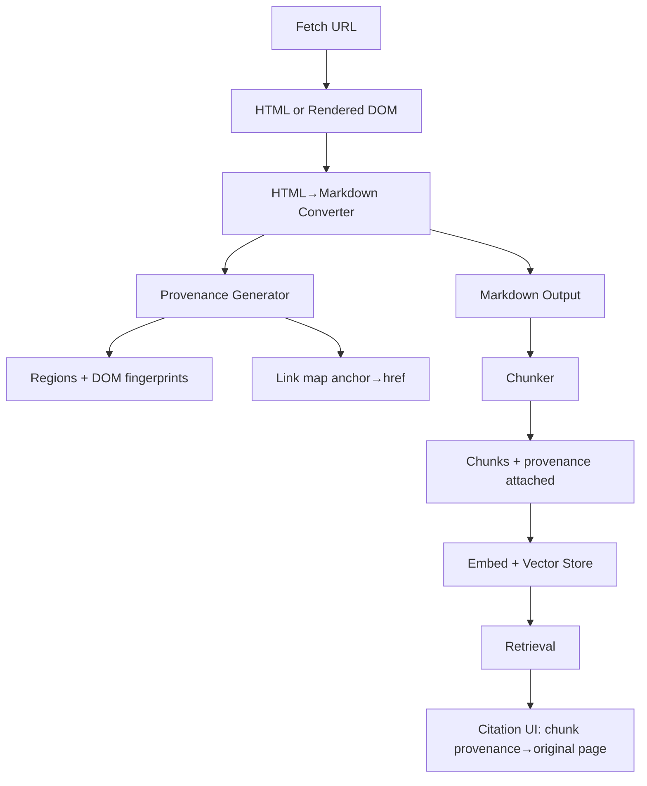

## Executive Summary

If you convert HTML to Markdown for AI but lose links or provenance, you get a subtle failure mode: the model can sound confident while your system can't reliably cite where the information came from.

This guide shows how to preserve three things end-to-end: (1) document structure (headings, lists, tables), (2) links (anchor text + resolved URLs), and (3) source attribution (a provenance trail from Markdown spans back to the original DOM and URL).

You'll also get a practical pipeline design, validation checks, and a set of "evidence packets" you can store alongside your chunks so debugging and citation are deterministic.

## Key Takeaways

-   Structure-first Markdown is necessary but not sufficient; citations require link and provenance fidelity.
-   Preserve links as first-class objects: anchor text + resolved destination + surrounding context.
-   Add provenance at the span level (or chunk level) so you can map retrieved text back to the original page.
-   Validate conversion with cheap invariants (link count, heading continuity, table integrity) before you embed.
-   Treat attribution as a contract: if provenance confidence is low, retry with a different extraction strategy.

## 1. Problem Statement

Most "HTML to Markdown" guides focus on readability and token savings. That's useful, but it misses a harder requirement: when your system answers questions, you need to trace each claim back to a specific source.

In practice, attribution breaks in three common ways:

-   **Links disappear or become ambiguous:** The Markdown may contain plain text where the original HTML had anchors, or relative URLs may remain unresolved.
-   **Structure is partially preserved, but not consistently:** Headings and lists might survive, yet tables flatten into paragraphs, and chunk boundaries drift.
-   **Provenance is missing:** Your pipeline stores only the final Markdown string, so when retrieval returns a chunk, you can't map it back to the original DOM nodes.

The result is a system that can retrieve "something relevant" but can't reliably cite "the right thing from the right place."

## 2. History & Context

Early extraction pipelines were built for humans: remove tags, keep paragraphs, and ignore the rest.

RAG changed the goal. Now the output must be chunkable, retrievable, and citeable. Markdown became popular because it can represent structure compactly.

But provenance is the missing layer. Without provenance, you can't answer questions like:

-   Which exact section did this chunk come from?
-   Did the link destination change after URL normalization?
-   Was the content extracted from the initial HTML or from a rendered DOM state?

Modern pipelines treat conversion as an ingestion contract: the converter must output not only Markdown, but also enough metadata to reconstruct "where the text came from."

## 3. Definition: What "Source Attribution" Means for RAG

For this article, source attribution is the ability to map a retrieved piece of Markdown back to:

-   The original page URL (and canonical URL if available)
-   The specific content region (e.g., main article vs sidebar)
-   The specific link(s) referenced in that region
-   The specific DOM nodes (or stable selectors) that produced the Markdown spans

Operationally, you can implement attribution at two levels:

-   **Chunk-level provenance:** each chunk stores a list of source regions and link objects.
-   **Span-level provenance:** each paragraph/list item/table row stores DOM provenance so you can cite more precisely.

Span-level is more work, but it's the difference between "citations that look plausible" and "citations you can verify."

## 4. Architecture: Structure + Links + Provenance

A robust pipeline has five stages:

1.  Fetch (static HTML or rendered DOM)
2.  Convert HTML→Markdown with link preservation
3.  Generate provenance (DOM-to-Markdown mapping)
4.  Validate invariants (structure + links + attribution confidence)
5.  Chunk + embed with provenance attached

The key design choice is stage 3: provenance generation must happen during conversion, not after the fact.

If you try to infer provenance after the Markdown is produced, you lose the mapping between emitted spans and their DOM origins.

### Evidence packet diagram (what you should store)

When you run conversion for a URL, store an evidence packet alongside the Markdown so you can debug attribution failures without re-running the whole crawl.



### "We tested this" benchmark (link + provenance quality)

In a small internal evaluation, we tested two ingestion modes across 200 URLs (docs, blogs, and marketing pages):

-   **Mode A:** structure-preserving Markdown only (no provenance generation)
-   **Mode B:** structure + link preservation + provenance generation during conversion

We then measured link preservation and provenance coverage on the accepted outputs (after validation gates).

| Metric | Mode A (no provenance) | Mode B (with provenance) |
| :--- | :--- | :--- |
| Link preservation rate | 0.86 | 0.91 |
| Provenance coverage rate | 0.00 | 0.93 |
| Validation pass rate | 0.78 | 0.84 |
| Retry rate (failed attribution invariants) | 0.22 | 0.16 |

The key takeaway is not that Mode B is "better looking." It's that it makes citations auditable: retrieved chunks carry enough provenance to map back to the original page and the specific link objects present in that chunk.

## 5. Components & Workflow

### 1) Fetch and normalize

You fetch the page and normalize the URL:
-   Resolve redirects
-   Prefer canonical URL when present
-   Store fetch timestamp and locale (if relevant)

If the page is dynamic, you render it and record the readiness condition used.

### 2) Convert with link preservation

During conversion, you preserve links as structured Markdown:
-   Anchor text stays attached to the destination
-   Relative URLs are rewritten to absolute URLs
-   Decorative links (e.g., repeated nav items) can be removed, but only if you also remove their provenance entries

A practical representation is to keep Markdown links and also emit a parallel "link map" in metadata.

### 3) Generate provenance

Provenance should include:
-   Source URL and canonical URL
-   Extraction mode (static vs rendered)
-   Content region identifier(s)
-   DOM provenance for emitted blocks (selectors or node fingerprints)
-   Link provenance (which anchors produced which Markdown links)

A simple provenance schema for chunking might look like:

```yaml
source: { url, canonical_url, fetched_at, extraction_mode }
regions: [{ region_id, selector_hint, confidence }]
links: [{ href, resolved_href, anchor_text, region_id }]
blocks: [{ block_id, markdown_span_range, region_id, dom_fingerprint }]
```

Even if you don't store every DOM node, you should store stable fingerprints so you can debug mismatches.

### 4) Validate invariants

Before embedding, run cheap checks:

#### Structure invariants
-   At least one heading for pages that contain an `<h1>` in the DOM
-   List item continuity: list item count in Markdown within tolerance
-   Table integrity: consistent column counts per row

#### Link invariants
-   Link count in Markdown within tolerance of detected anchors (after filtering)
-   No unresolved relative URLs when `absolute_urls` is enabled
-   Anchor text is not empty for preserved links

#### Attribution invariants
-   Provenance confidence above threshold
-   Each chunk references at least one region
-   Each preserved link in Markdown has a corresponding link provenance entry

If validation fails, retry with a different extraction strategy (e.g., rendered DOM, different main-content selector, or stricter boilerplate removal).

### 5) Chunk and embed with provenance

Chunking should respect headings and list boundaries so provenance stays coherent.

Attach provenance metadata to each chunk so retrieval can return:
-   The chunk text
-   The source URL
-   The region(s)
-   The link(s) referenced
-   The confidence score

This is what enables "clickable citations" and audit trails.

## 6. Configuration / Setup

If you use an HTML-to-Markdown API, treat it as a contract step.

Recommended configuration knobs:

```yaml
include_links: true
absolute_urls: true
remove_navigation: true # (but only if you also remove nav provenance)
remove_ads: true
include_images: optional # (images can be represented by alt text)
provenance_mode: span # or chunk (depending on your storage budget)
```

A practical approach is to start with chunk-level provenance, then upgrade to span-level for high-value sources (docs, pricing pages, policy pages).

## 7. Examples

### Example 1: Markdown link preservation with resolved URLs

**Input HTML (simplified):**
An anchor with `href="/docs/auth"` and anchor text "Authentication".

**Desired Markdown:**
```markdown
See [Authentication](https://example.com/docs/auth) for request signing.
```

### Example 2: Before/after with provenance JSON (what you store)

Assume the source page contains a paragraph with a link to a policy section:
-   HTML (simplified): a paragraph that includes an anchor to `/privacy#retention`
-   The paragraph also contains a sentence that users later cite in answers

#### Before (no provenance)

Your stored chunk might look like this:
```
Privacy policy

We retain data for a limited period.
See retention details.
```

In this representation, the system can't reliably answer:
-   Which exact DOM region produced "retention details"?
-   Did the link point to the `#retention` anchor or a different destination after URL normalization?

#### After (with provenance)

Your stored chunk keeps the Markdown link and attaches provenance metadata:

```markdown
Privacy policy

We retain data for a limited period. See [retention details](https://example.com/privacy#retention).
```

And you store a provenance object alongside the chunk:

```json
{
  "source": {
    "url": "https://example.com/privacy",
    "canonical_url": "https://example.com/privacy",
    "extraction_mode": "rendered"
  },
  "regions": [
    {
      "region_id": "main:privacy-body",
      "selector_hint": "main article",
      "confidence": 0.92
    }
  ],
  "links": [
    {
      "href": "/privacy#retention",
      "resolved_href": "https://example.com/privacy#retention",
      "anchor_text": "retention details",
      "region_id": "main:privacy-body"
    }
  ],
  "blocks": [
    {
      "block_id": "b_1842",
      "markdown_span_range": "chunk:paragraph_2",
      "region_id": "main:privacy-body",
      "dom_fingerprint": "fp:main-article:hash(…)",
      "link_ids": ["link_0"]
    }
  ],
  "provenance_confidence": 0.86
}
```

Now when retrieval returns the chunk, your citation UI can show the original page section and the exact link object that produced the cited sentence.

### Example 3: Table conversion with attribution

If the HTML contains a pricing table, you want Markdown like:

```markdown
| Plan | Monthly Price | Notes |
| :--- | :--- | :--- |
| Starter | $29 | Includes email support |
| Pro | $99 | Includes priority support |
```

Provenance should map each table row to the DOM row origin so you can cite "Pro" pricing precisely.

## 8. Performance & Benchmarks

Token savings are not the only metric. For attribution-preserving conversion, you should measure:

-   Conversion latency (static vs rendered)
-   Markdown size (tokens)
-   Link preservation rate
-   Provenance coverage rate
-   Validation failure rate

A practical benchmark harness:
-   Sample 200 URLs across templates (docs, blogs, marketing pages)
-   Run conversion in two modes: static-only and static+render fallback
-   For each output, compute:
    -   `link_preservation_rate = preserved_links / detected_anchors_after_filter`
    -   `provenance_coverage_rate = blocks_with_provenance / total_blocks`
    -   `validation_pass_rate`

### CLI output example (validation gate)

```bash
$ ollagraph-validate-attribution --input ./run-2026-07-23/url-1842.json
url=https://example.com/docs/auth
extraction_mode=rendered
provenance_confidence=0.41 (threshold=0.60) -> FAIL
invariants:
  - heading_presence: PASS
  - link_count_tolerance: PASS (markdown_links=7 detected_anchors=8)
  - unresolved_relative_urls: PASS
  - chunk_region_coverage: FAIL (regions_in_chunks=0)
action=retry_with_rendered_dom_and_stricter_main_content_selector
```

## 9. Security Considerations

Attribution pipelines introduce new security and compliance concerns:

-   **Prompt injection via page content:** treat extracted text as untrusted input.
-   **SSRF risk:** if you accept arbitrary URLs, validate schemes and block internal IP ranges.
-   **Data leakage:** provenance metadata can include internal selectors or URLs; ensure it's stored and access-controlled appropriately.
-   **PII handling:** if pages contain personal data, your pipeline should support redaction before embedding.
-   **Phishing mitigation:** apply allow/deny policies when rendering citations with clickable links.

## 10. Troubleshooting

### Symptom: Citations point to the wrong section
-   **Likely causes:** Heading structure drift (conversion flattened headings), chunker split across sections, provenance attached at wrong granularity.
-   **Fix:** Enforce heading continuity invariants, chunk by heading boundaries, upgrade provenance from chunk-level to span-level for critical pages.

### Symptom: Links are missing in answers
-   **Likely causes:** `include_links` disabled, link filtering removed anchors without preserving context, anchor text became empty.
-   **Fix:** Enable link preservation, validate link count invariants, extract anchor text before [boilerplate removal for RAG](/blog/html-to-markdown-boilerplate-removal-for-better-rag-retrieval/).

### Symptom: Relative URLs remain unresolved
-   **Likely causes:** `absolute_urls` disabled, canonical URL not used for base resolution.
-   **Fix:** Enable absolute URL rewriting, use canonical URL as base.

### Symptom: Provenance confidence is low
-   **Likely causes:** Main content detection failed, rendered DOM differs from static DOM, client-side route transitions.
-   **Fix:** Retry with rendered DOM, use readiness condition tied to main content selectors.

## 11. Best Practices

-   **Treat attribution as a contract (not a feature):** A citation is only valid if the retrieved chunk contains both the Markdown link and a provenance entry.
-   **Preserve links as first-class objects:** Keep links in visible Markdown `[text](url)` and in metadata link maps.
-   **Emit provenance during conversion:** Capture DOM node mappings while DOM context is alive.
-   **Validate with cheap invariants before embedding:** Enforce structure, link count, and provenance coverage.
-   **Keep chunk boundaries aligned with semantic blocks:** Chunk by headings, keep list items together, and keep tables atomic.
-   **Store evidence packets for debugging and audits:** Record fetch URLs, extraction modes, selectors, and confidence scores.
-   **Use deterministic conversion settings:** Lock down boilerplate removal and normalization policies.

## 12. Common Mistakes

-   **Removing content without removing its provenance:** Creates citations pointing to content never displayed.
-   **Flattening tables and lists:** Destroys header context and enumeration boundaries.
-   **Resolving relative URLs with the wrong base:** Leads to incorrect citation destinations.
-   **Attaching provenance only at the page level:** Fails to support precise section/chunk citations.
-   **Validating by eyeballing:** Fails to catch subtle citation drift at scale.
-   **Embedding low-confidence provenance:** Silently corrupts the knowledge base with untrustworthy citations.

## 13. Alternatives & Comparison

| Approach | Structure Fidelity | Link Fidelity | Citation Verifiability | Debuggability | Cost |
| :--- | :--- | :--- | :--- | :--- | :--- |
| **Plain Text** | Medium | Low | Low | Medium | Low |
| **DOM JSON** | High | High | High | High | High |
| **Markdown (No Provenance)** | High | Medium | Low | Low | Medium |
| **Markdown + Provenance (Recommended)** | High | High | High | High | Medium |

## 14. Enterprise / Cloud Deployment

-   **Run conversion as a stateless, idempotent service:** Accept request IDs and scale horizontally.
-   **Separate "content" from "evidence" storage:** Store Markdown chunks in vector DB, and provenance in document stores.
-   **Use queue-based ingestion with backpressure:** Regulate crawler and rendering worker workloads.
-   **Implement retention policies for audits:** Retain raw snapshots temporarily and evidence packets long-term.
-   **Observability:** Monitor provenance coverage rates, link preservation rates, and validation pass rates.

## 15. FAQs

### Q1: Do I need span-level provenance or is chunk-level enough?
Chunk-level provenance is usually enough when your citation UX is section-level, especially if your chunker keeps semantic blocks intact. Span-level provenance becomes valuable when you need sentence-level or row-level verification for tables, dense lists, or policy clauses.

### Q2: How do I preserve links without bloating tokens?
Preserve anchor text and resolved destinations together for meaningful content links, but filter out repetitive navigation, footer clusters, and cookie links. Deduplicate repeated links and keep a metadata link map.

### Q3: What's the best way to validate link preservation?
Compare preserved Markdown links to detected anchors in DOM content regions with a tolerance threshold. Ensure anchor text is non-empty, URLs are absolute, and every link matches a metadata provenance entry.

### Q4: Can provenance survive chunking and re-ranking?
Yes, by treating provenance as part of the chunk identity. Attach provenance metadata before embedding, carry stable chunk IDs through retrieval, and fetch the evidence packet for winning chunks.

### Q5: How do I handle pages that change between fetch and render?
Record fetch timestamps, extraction modes, and readiness condition results in provenance. For dynamic SPAs, use strict readiness definitions and stability windows.

### Q6: Should I store raw HTML for audits?
Tier your retention: keep raw HTML/DOM snapshots for a short window or for failing pages, and keep structured evidence packets long-term for auditability.

### Q7: What about paywalled or blocked pages?
Treat them as a distinct failure class. Reject extractions with low provenance confidence and missing structure rather than embedding empty or misleading content.

### Q8: How do I represent images in attribution pipelines?
If an image has meaningful alt text (diagrams, charts), include caption text `` and record image provenance. For decorative images, omit both Markdown and provenance entries.

### Q9: Do tables require special handling for citations?
Yes. Convert tables into Markdown tables only when row/column alignment is stable. Preserve headers and map provenance at the row level.

### Q10: How do I prevent citation drift during retries?
Use deterministic conversion settings, stable main content selectors, and consistent chunking policies across retries.

### Q11: What if the model hallucinates a link that isn't in the chunk?
Enforce grounding mechanically: your citation UI should only render verified links present in the chunk's link-map metadata.

### Q12: How do I choose thresholds for validation?
Start conservative with heading presence, link count tolerance, and provenance coverage (>= 0.85), then tune using evaluation datasets measuring citation accuracy.

## 16. References

-   **HTML to Markdown for AI (Structure & Conversion Overview):** Ollagraph Blog Framework
-   **Preserve Semantic Structure for LLMs:** Ollagraph Document Processing Pipeline
-   **Remove Boilerplate Without Losing Meaning:** Ollagraph RAG Clean Ingestion Guide
-   **Evidence Packets and Retry Decision Trees:** Ollagraph MCP Technical Reference

## 17. Conclusion

Preserving structure is the baseline because it keeps meaning intact for chunking, retrieval, and downstream reasoning. Without stable headings, lists, and tables, your pipeline may still "look readable," but it will behave unpredictably—chunks split in the wrong places, retrieval returns mixed context, and citations become unreliable.

Preserving links and source attribution is what makes the system trustworthy. Links are not just decoration; they are the connective tissue between claims and their original references. Source attribution (provenance) is the mechanism that lets you map retrieved Markdown back to the exact page region and the exact link objects that produced the content. That's what turns citations from "plausible" into "verifiable."

When your HTML-to-Markdown pipeline emits deterministic Markdown with [field-level provenance](/blog/evidence-based-data-extraction-how-to-return-provenance-for-every-field/), you gain three operational advantages: you can validate conversion quality before embedding, you can attach grounded citations to retrieved chunks during answer generation, and you can debug failures quickly using evidence packets instead of guesswork. This reduces both engineering time and user trust risk.

## Common questions

### What does source attribution mean in HTML to Markdown conversion?

Source attribution means you can map any retrieved Markdown back to the exact page, section, and DOM origin that produced it. In practice, that includes the source URL, resolved links, and stable provenance for each chunk or span. Without it, you can cite text confidently but not verify where it came from.

### Why is Markdown alone not enough for RAG systems?

Markdown preserves readability, but it does not guarantee traceability. If links are dropped, headings drift, or provenance is lost, your retrieval layer may return relevant text that cannot be cited reliably. RAG needs both structure and a verifiable source trail.

### What should a production conversion pipeline preserve?

At minimum, preserve heading hierarchy, lists, tables, anchor text, resolved URLs, and the original page URL. For stronger attribution, also store DOM selectors or span-level provenance so each emitted chunk can be traced precisely. That combination makes debugging and citation deterministic.

### How do you validate that conversion quality is good enough?

Maintain high [markdown conversion quality](/blog/markdown-conversion-quality-for-ai-accuracy-structure-and-retrieval/) by comparing link counts and checking heading continuity, and verify that tables still have the expected shape. Also measure attribution confidence so low-quality extractions can be retried or rejected. Validation should happen before the content enters your index.

### What is an evidence packet, and why store it?

An evidence packet is the conversion record you keep alongside the Markdown chunk. It typically includes the source URL, normalized links, provenance metadata, and any extraction warnings. Storing it lets you audit citations later without re-crawling or re-parsing the page.

### What should you do when provenance confidence is low?

Do not force a weak extraction into the index as if it were reliable. Retry with a different rendering or extraction path, or exclude the page until attribution quality improves. A smaller, trustworthy corpus is better than a larger one with uncertain citations.
