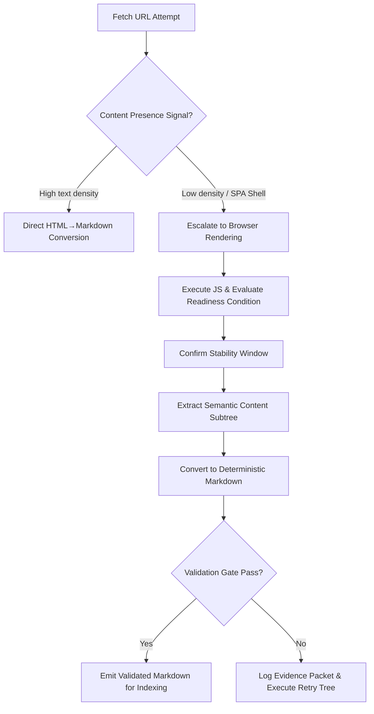
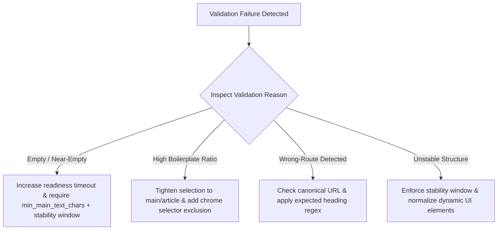

## Executive Summary

Dynamic websites break naive "HTML to Markdown" pipelines because the content you want often doesn't exist until JavaScript runs. If you scrape only the initial HTML, you frequently ingest an empty shell, the wrong route state, or UI chrome that contaminates embeddings and citations.

This post describes an end-to-end pipeline that turns JavaScript-rendered pages into deterministic, AI-ready Markdown. The core idea is simple but strict: define content readiness (not a fixed sleep), render only when needed, select main content deterministically, convert with stable formatting rules, and validate with measurable signals. When extraction fails, you don't guess—you use evidence packets to debug the exact failure mode.

You'll get:

-   A practical architecture for JS rendering → deterministic Markdown conversion → validation
-   Readiness condition patterns (selector-based, network-based, stability-based, scroll-based)
-   DOM selection heuristics that reduce boilerplate without deleting meaning
-   A validation scoring rubric you can implement and tune
-   A worked example including an evidence packet JSON
-   A Q&A section with comprehensive troubleshooting

## Key Takeaways

-   Rendering is not optional for many modern pages; the pipeline must include a readiness contract.
-   Deterministic Markdown requires stable DOM selection rules and consistent conversion policies.
-   Boilerplate removal must be retrieval-grade: measure contamination, don't eyeball cleanliness.
-   Validation should fail closed on empty/partial/wrong-route outputs.
-   Evidence packets convert "mysterious extraction failures" into actionable fixes.

## 1. Problem Statement

You scrape a URL. You convert HTML to Markdown. You ingest it into a vector store. Retrieval quality drops.

When you inspect the stored chunks, the pattern is usually one of these:

-   The Markdown contains mostly navigation, cookie banners, and footer chrome.
-   The Markdown is empty or near-empty because the meaningful content never existed in the fetched HTML.
-   The Markdown contains the wrong page state (wrong route, wrong locale, missing personalization).
-   The Markdown changes between runs: headings move, sections split differently, and chunk boundaries drift.

For static sites, "HTML to Markdown" can be deterministic enough. For dynamic sites, it's not. The content you want is created after load, often after hydration and asynchronous data fetching.

So the real problem is not conversion. It's content readiness.

A robust pipeline must answer two questions before converting:

-   Has the page reached the state where the main content exists in the DOM?
-   Is the DOM selection stable enough that Markdown output is deterministic?

This post is about building that pipeline.

## 2. History & Context

Early extraction pipelines assumed a simple model:

-   Fetch HTML
-   Parse DOM
-   Extract text
-   Convert to Markdown

That model works for server-rendered pages where the content is present in the initial response.

Modern web apps changed the default architecture:

-   **Client-side routing:** the URL may map to a route component that only renders after JS runs.
-   **Hydration:** server markup may exist, but meaningful content may be replaced or augmented after JS activation.
-   **Lazy loading:** sections appear only after scroll, intersection observers, or user interaction.
-   **Data fetching after load:** content arrives via API calls after the initial HTML.

At the same time, LLM crawlers and RAG pipelines became more sensitive to [markdown conversion quality](/blog/markdown-conversion-quality-for-ai-accuracy-structure-and-retrieval/):

-   If extracted text is empty, the crawler can't cite.
-   If extracted text is noisy, embeddings drift.
-   If extracted text is unstable, chunk boundaries change and retrieval becomes inconsistent.

The practical shift is this: treat JavaScript rendering as part of your content accessibility contract.

## 3. Definition / What It Is

In this post, "Markdown conversion for dynamic websites" means:

-   Rendering a page in a browser environment that executes JavaScript
-   Waiting for a defined "content readiness" condition
-   Selecting the main content region(s) from the rendered DOM
-   Converting those regions into deterministic Markdown
-   Validating the output with measurable extraction signals
-   Emitting evidence packets so you can debug failures

Key terms:

-   **Content readiness:** a condition that indicates the main content exists and is stable enough to extract.
-   **Deterministic Markdown:** output consistent across runs for the same page state, with stable headings, lists, and section boundaries.
-   **Evidence packet:** structured mapping from extracted Markdown back to DOM nodes (or selectors) and timing signals.
-   **Boilerplate:** repeated or low-signal UI text (navigation, cookie banners, footers, "related" widgets) that contaminates retrieval.

## 4. Search Intent Lock

-   **Primary intent:** Build a reliable pipeline that renders JavaScript pages and converts them into deterministic, AI-ready Markdown for LLM/RAG ingestion.
-   **Secondary intent:** Learn how to validate extraction quality and debug failures using measurable signals and evidence packets.

## 5. Architecture / How It Works

At a high level, the pipeline has five stages:

1.  Fetch attempt (static HTML)
2.  Render decision (do we need JS?)
3.  JS rendering + readiness wait
4.  DOM-to-Markdown conversion (deterministic)
5.  Validation + evidence emission



### Stage 1: Fetch attempt
Request the URL and parse the HTML. Extract a quick "content presence" signal:
-   Is there a main content container?
-   Does it contain enough text density?
-   Are there signs of a shell-only response (minimal article text, heavy UI scaffolding)?

If the signal passes, convert directly. If it fails, proceed to rendering.

### Stage 2: Render decision
Rendering is expensive. Define a decision policy:
-   Render if content presence is below a threshold
-   Render if the page looks like a SPA shell
-   Render if the HTML contains known placeholders (empty article containers)
-   Render if the page requires route-based rendering

### Stage 3: JS rendering + readiness wait
Render the page in a controlled browser. Wait for a condition indicating main content presence rather than an arbitrary sleep, and enforce a stability window.

### Stage 4: DOM-to-Markdown conversion
Select the main content region(s) and convert them using stable selection rules and consistent formatting policies.

### Stage 5: Validation + evidence emission
Validate output against empty results, boilerplate ratio, route mismatches, and structural sanity. Emit structured evidence packets for debugging.

## 6. Components & Workflow

### 1) URL fetcher
Performs HTTP GET, handles redirects, and captures response metadata.

### 2) Content presence detector
Parses HTML and computes text density, article element presence, and placeholder patterns to determine `needs_render`.

### 3) Renderer (Playwright-based)
Executes [rendering before extraction in web data pipelines](/blog/rendering-before-extraction-building-reliable-web-data-pipelines/) with consistent viewport and locale settings, capturing rendered DOM snapshots.

### 4) Readiness engine
Evaluates readiness conditions repeatedly until satisfied or timed out, enforcing a stability window.

### 5) DOM selector + boilerplate filter
Selects main content semantic containers (`main`, `article`, `[role="main"]`), excluding cookie banners, nav menus, and related widgets.

### 6) Deterministic Markdown converter
Converts selected DOM subtrees into Markdown with standardized headings, lists, tables, and fenced code blocks.

### 7) Validation + evidence packet emitter
Runs quality checks, triggers fallback retries on failure, and emits evidence packets.

## 7. Content Readiness: The Real Contract

A fixed sleep is not a readiness contract.

### Readiness patterns:

-   **Pattern A: Selector + minimum text threshold:** Wait until `main`/`article` exists and text length exceeds `min_main_text_chars`.
-   **Pattern B: Required heading regex:** Wait until a heading matches an expected template regex (e.g., `/^(Introduction|Overview|What you will learn)/i`).
-   **Pattern C: Network settling with a cap:** Wait until network activity settles below a threshold for `network_idle_timeout_ms`.
-   **Pattern D: Stability window (content stops changing):** Sample container text hash repeatedly and pass when hash remains unchanged for `stability_window_ms`.
-   **Pattern E: Scroll readiness for lazy-loaded content:** Scroll incrementally and pass when container length stops increasing.

## 8. DOM Selection Heuristics (Deterministic Extraction)

### Main content selection heuristics
-   Prefer `main` and `article`.
-   If absent, choose the closest ancestor containing a heading hierarchy (H1/H2) and multiple paragraphs with low link density.
-   For tabs, extract only the active tab content.

### Boilerplate exclusion heuristics
Exclude cookie banners, navigation menus, footer link lists, and "related articles" widgets based on repetition across siblings and high link-to-text density.

## 9. Deterministic Markdown Conversion Rules

-   **Headings:** Map DOM heading levels to Markdown headings consistently (`H1` → `#`, `H2` → `##`, `H3` → `###`).
-   **Lists:** Preserve list nesting depth and normalize indentation.
-   **Tables:** Enforce uniform table formatting policies across all pages.
-   **Code blocks:** Always preserve fenced code blocks with language hints.
-   **Whitespace:** Collapse consecutive spaces and normalize newlines.

## 10. Validation Scoring Rubric (Pass/Fail + Debug Reasons)

### 1) Content presence
-   `markdown_chars >= min_markdown_chars`
-   `heading_count >= min_heading_count`

### 2) Boilerplate ratio
```
boilerplate_ratio = (estimated chrome text chars) / (total extracted text chars)
```
Pass condition: `boilerplate_ratio <= boilerplate_ratio_max` (typically `<= 0.25`).

### 3) Wrong-route detection
Check for canonical URL mismatches and presence of "404 / Not Found" template markers.

### 4) Structure sanity
Verify heading ordering and table/list syntax integrity.

## 11. Evidence Packets: Provenance for Debugging

### Standard Evidence Packet Schema (JSON)

```json
{
  "url_requested": "https://example.com/docs/ai-ready",
  "url_final": "https://example.com/docs/ai-ready",
  "needs_render": true,
  "fetch_presence_score": 0.12,
  "render_readiness_passed": true,
  "render_readiness_reason": "main_selector_text_threshold",
  "render_elapsed_ms": 1840,
  "main_selectors_used": ["main", "article"],
  "boilerplate_filter_rules_used": ["exclude_cookie_banner", "exclude_related_widgets", "repetition_filter"],
  "validation_report": {
    "pass": true,
    "markdown_chars": 48210,
    "boilerplate_ratio": 0.07,
    "heading_count": 18,
    "wrong_route_detected": false
  },
  "sample_provenance": [
    {
      "markdown_span": "## What you will learn",
      "dom_selector": "article h2:nth-of-type(1)",
      "text_preview": "What you will learn"
    },
    {
      "markdown_span": "### Deterministic Markdown rules",
      "dom_selector": "article h3:nth-of-type(2)",
      "text_preview": "Deterministic Markdown rules"
    }
  ]
}
```

## 12. Configuration / Setup

```yaml
# Rendering parameters
max_render_time_ms: 8000
readiness_poll_interval_ms: 200
stability_window_ms: 800
network_idle_timeout_ms: 1200

# Readiness thresholds
min_main_text_chars: 2500
required_heading_regex: "^(Introduction|Overview|What you will learn)"
main_selector_priority: ["main", "article", "[role='main']"]

# Conversion rules
heading_level_mapping: "DOM H1->#, H2->##, H3->###"
table_conversion_mode: "strict"
code_block_policy: "fenced"
whitespace_normalization: true

# Validation gates
min_markdown_chars: 3000
boilerplate_ratio_max: 0.25
wrong_route_detection: true
```

## 13. Examples

### Failure mode 1: Empty Markdown from shell-only HTML
-   **Symptom:** Markdown chars `< min threshold`.
-   **Root cause:** Content exists only after client-side hydration.
-   **Fix:** Render decision triggered by low presence score; readiness waits for main selector + min text threshold.

### Failure mode 2: Wrong-route extraction
-   **Symptom:** Validation fails wrong-route detection.
-   **Root cause:** Missing route parameter or cookie-gated content.
-   **Fix:** Add canonical mismatch checks; retry with session/cookie policies.

### Failure mode 3: Boilerplate contamination
-   **Symptom:** Boilerplate ratio too high.
-   **Root cause:** Main selector too broad; chrome nested inside content container.
-   **Fix:** Narrow selection to semantic containers and apply repetition-based filtering.

### Failure mode 4: Partial extraction due to lazy loading
-   **Symptom:** Validation passes early but missing expected subsections.
-   **Root cause:** Content loads after scroll.
-   **Fix:** Escalate to scroll readiness until text length stabilizes.

## 14. Performance & Benchmarks (How to Measure)

### Metrics to evaluate:
-   `render_rate`: percentage of URLs requiring headless browser execution (see [static fetch vs headless browsers](/blog/static-fetch-vs-headless-browser-choosing-the-right-web-scraping-strategy/))
-   `success_rate`: percentage passing validation gates
-   `avg_markdown_chars`: volume of structured content extracted
-   `median_latency_ms`: end-to-end processing time
-   `stability_score`: Jaccard similarity of heading sets across runs

## 15. Security Considerations

-   **Sandboxed execution:** Run headless Chromium inside isolated container environments with `--no-sandbox` flags.
-   **Egress controls:** Restrict access to internal metadata endpoints (`169.254.169.254`, `127.0.0.1`).
-   **Credential protection:** Never log raw session cookies or authentication tokens in evidence packets.

## 16. Troubleshooting (Decision Tree + Fixes)



## 17. Best Practices

1.  **Define readiness explicitly; avoid fixed sleeps:** Use selector + min text threshold combined with a stability window.
2.  **Keep selection rules deterministic and versioned:** Maintain semantic container priorities (`main`, `article`).
3.  **Convert only selected main regions, not the entire DOM:** Prevent navigation and footer chrome from polluting the text.
4.  **Validate with measurable signals and fail closed:** Reject low-quality extractions before indexing.
5.  **Emit evidence packets for every attempt:** Capture diagnostic context for rapid triage.
6.  **Track stability drift across runs:** Monitor Jaccard similarity across heading sets over time.

## 18. Common Mistakes

-   Waiting a fixed number of seconds for all pages regardless of hydration state.
-   Converting the entire DOM without filtering out navigation chrome.
-   Deleting "noise" without checking semantic meaning.
-   Accepting near-empty Markdown as a successful conversion.
-   Failing to measure stability drift between crawls.

## 19. Alternatives & Comparison

| Approach | Latency | Infrastructure Cost | Stability & Determinism | Best Use Case |
| :--- | :--- | :--- | :--- | :--- |
| **SSR-Only Scraping** | Fast (150ms) | Very Low | High (Static DOM) | Server-rendered pages only |
| **JS Rendering + Readiness (Recommended)** | Moderate (1.2s) | Moderate | Very High (Deterministic) | Production dynamic SPA pipelines |
| **Raw Unconstrained LLM Extraction** | Slow (3.5s) | High | Variable (Probabilistic) | Unstructured long-tail templates |

## 20. Enterprise / Cloud Deployment

-   **Horizontal worker scaling:** Separate rendering workers from static fetch workers to optimize resource allocation.
-   **Domain-level concurrency limits:** Prevent target server overload and reduce anti-bot challenge triggers.
-   **Observability dashboards:** Track render rates, validation pass rates, and failure reason distributions.

## 21. FAQs

### Q1) Do I need to render every dynamic page?
No. First run static extraction and evaluate content presence. Only escalate to JS rendering when the initial HTML is a bare shell.

### Q2) How do I choose readiness conditions?
Combine a semantic selector (e.g., `main`, `article`) with a minimum text threshold and confirm with a stability window where the content hash stops changing.

### Q3) What makes Markdown deterministic in practice?
Strict DOM selection rules combined with consistent Markdown conversion policies for headings, lists, tables, and code fences.

### Q4) How do I prevent boilerplate from poisoning embeddings?
Enforce a maximum boilerplate ratio threshold and filter out repeated layout blocks before Markdown serialization.

### Q5) Can evidence packets be too large?
Keep full DOM snapshots optional for debug modes, and store lightweight metadata plus a small sample of provenance spans for normal runs.

### Q6) What about cookie banners and consent dialogs?
Exclude them via explicit selector rules, and apply a deterministic session policy if consent is required to view content.

### Q7) How do I handle localization?
Configure browser locale and timezone explicitly in the renderer, and validate that extracted headings match expected language patterns.

### Q8) Is Playwright always the best renderer?
Playwright is a strong default, but any browser automation tool works if it can execute JS, query the DOM at readiness time, and measure stability.

### Q9) How do I measure whether this improves retrieval?
Run offline evaluations comparing static vs rendered pipelines on a labeled question set measuring precision@k, recall@k, and citation accuracy.

### Q10) What if the page content loads only after scrolling?
Escalate to scroll readiness: scroll incrementally until main container text length stabilizes.

### Q11) How do I avoid rate limits?
Use worker concurrency limits, apply exponential backoff, and cache static results to minimize redundant headless browser sessions.

### Q12) Can I reuse the same pipeline for both RAG and citation-ready crawling?
Yes. The core readiness, extraction, and validation stages are identical; adjust validation strictness and provenance granularity based on the use case.

## 22. Conclusion

Dynamic websites break naive "HTML to Markdown" pipelines because the content you want often doesn't exist until JavaScript runs. The initial HTML is frequently a shell: navigation scaffolding, placeholders, and layout wrappers that get replaced or hydrated later. If you convert that shell, you don't just get less text—you get the wrong page state, which causes empty/partial extractions, wrong-route content, and boilerplate-heavy Markdown.

The fix is not just rendering; it's rendering with a defined content readiness contract. Instead of waiting a fixed time, you wait for measurable conditions that indicate the main content is present and stable. Then you apply deterministic DOM selection and deterministic Markdown conversion rules so the same logical content produces consistent structure and chunk boundaries across runs.

Finally, measurable validation and evidence packets turn this from a fragile craft into an engineering system. Validation detects empty outputs, excessive boilerplate, wrong-route mismatches, and structural anomalies, and it fails closed (retry or mark unextractable) rather than silently ingesting bad data. Evidence packets provide provenance for debugging, so extraction failures become actionable fixes instead of guesswork.

## 23. References

-   **Playwright Browser Automation:** https://playwright.dev/docs/intro
-   **MDN Web Docs (Client-Side Hydration):** https://developer.mozilla.org/en-US/docs/Glossary/Hydration
-   **React Server Components & Hydration:** https://react.dev/reference/react-dom/client/hydrateRoot
-   **Next.js Rendering Modes:** https://nextjs.org/docs/app/building-your-application/rendering
-   **RAG Retrieval Evaluation Standards:** https://arxiv.org/abs/2005.11401

## Common questions

### Why isn't fetching HTML enough for dynamic sites?

Because the content you want may not exist in the initial response. Modern pages often hydrate, fetch data after load, or change route state in the browser, so HTML-only extraction can capture an empty shell or the wrong page.

### What does content readiness mean?

Content readiness is the condition that the main content exists and is stable enough to extract. It should be based on measurable signals such as selectors, network completion, DOM stability, or scroll state, not a fixed sleep.

### How do you choose the main content region deterministically?

Use stable selection rules such as landmark containers, known content selectors, and priority orderings. The goal is to remove boilerplate without guessing, so the same page state produces the same extracted region every time.

### How do you make Markdown output deterministic?

Apply consistent formatting rules for headings, lists, links, tables, and code blocks. Normalize structure before conversion so identical DOM content produces identical Markdown and stable chunk boundaries.

### What should validation check before ingestion?

Validate that the output is non-empty, on the expected route, and substantial enough to represent real content. Also check for boilerplate contamination, missing sections, and unstable structure, then fail closed if the signals are weak.

### What is an evidence packet and why does it matter?

An evidence packet is a structured record of what was extracted, from which DOM nodes, and under which readiness signals. It turns a vague failure into a concrete debug trail, making it much easier to fix wrong-route, partial, or empty extractions.
