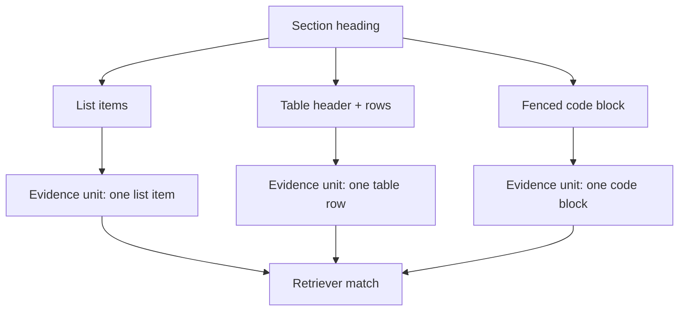

## Executive Summary

AI systems don't fail because they "can't reason." They fail because the evidence they retrieve is malformed, mis-segmented, or impossible to map back to the original source.

Markdown conversion quality is the missing control knob. When conversion preserves retrieval-relevant structure—headings, list boundaries, table semantics, code fences, and provenance—you get more accurate retrieval, fewer hallucinated citations, and more stable chunk boundaries across re-indexing.

In this post, we'll define a practical conversion quality model, show a structure contract you can enforce, and walk through a small evaluation harness that measures evidence hit rate and grounding pass rate.

## Key Takeaways

-   Markdown conversion quality is about preserving evidence geometry, not aesthetics.
-   A structure contract (headings/lists/tables/code/provenance) reduces chunk boundary drift.
-   Retrieval accuracy improves when chunkers can "see" semantic blocks.
-   Verifiable citations require provenance that survives conversion.
-   Validate conversion output with structural checks before embedding.

## 1. Problem Statement

Teams often treat document conversion as a preprocessing step: "Convert to Markdown, embed, retrieve, answer."

But conversion is where evidence boundaries are created. If your converter flattens lists, breaks tables, removes code fences, or drops section context, your retriever is forced to guess where the evidence starts and ends.

That guess shows up later as:

-   Wrong evidence retrieved for a precise question.
-   Citations that point to the wrong section.
-   Agents that confidently answer with mixed parameters.
-   Re-indexing drift: the same document produces different chunk geometry after a conversion tweak.

Markdown conversion quality is the discipline of making those failure modes measurable and preventable.

## 2. History & Context

Early RAG pipelines (unlike modern [document-to-markdown pipelines for AI knowledge bases](/blog/document-to-markdown-pipelines-for-ai-knowledge-bases/)) focused on embeddings and chunk sizes. Conversion was "good enough" as long as text existed.

As systems moved from single-shot Q&A to tool-using agents, the tolerance for evidence ambiguity dropped. Agents need stable, inspectable units: a list item is not the same as a paragraph; a table row is not the same as a sentence.

Structured Markdown became popular, but many implementations stopped at "preserve formatting." The next step is to treat conversion as a contract that downstream chunkers and grounding logic can rely on.

This post focuses on that contract: accuracy, structure, and retrieval as one system.

## 3. Definition / What It Is

Markdown conversion quality for AI is the degree to which your conversion output preserves retrieval-relevant structure and provenance so that downstream chunking, retrieval, and grounding behave predictably.

### What "conversion quality" includes

-   **Accuracy:** retrieved chunks contain the right evidence.
-   **Structure:** semantic units remain intact and chunkable.
-   **Retrieval:** chunk boundaries are stable and match query intent.
-   **Grounding:** citations map back to the original source.

### A simple quality model

You can think of conversion quality as a product of four measurable signals:

-   **Structure Fidelity** (did we keep semantic blocks?)
-   **Boundary Stability** (does chunk geometry remain consistent?)
-   **Evidence Completeness** (did we keep the full row/list/code context?)
-   **Provenance Integrity** (can we cite and verify?)

## 4. Architecture / How It Works

The core idea is to make conversion output deterministic and evidence-aware.


### Evidence geometry (what "structure" really means)

Conversion quality is easiest to reason about as geometry: where evidence starts, where it ends, and what boundaries the chunker is allowed to cut.



### Where quality is enforced

-   **Before embedding:** structural validation quarantines broken conversions.
-   **During chunking:** semantic blocks become chunk boundaries.
-   **During grounding:** provenance and section paths are checked.

## 5. Components & Workflow

### 1) Structure-first conversion

Your converter should map document elements to Markdown constructs that preserve meaning:

-   Headings -> Markdown headings with consistent depth.
-   Lists -> Markdown lists with preserved item boundaries.
-   Tables -> Markdown tables or a table contract format when Markdown tables are insufficient.
-   Code -> fenced code blocks with language when available.
-   Links -> normalized URLs and link text.

### 2) Markdown structure contract

A structure contract is a set of rules your pipeline enforces. Example rules:

-   Every section has a heading.
-   Lists remain lists; items are not merged into paragraphs.
-   Tables keep header rows and consistent column counts.
-   Code blocks are fenced and preserve whitespace.
-   Each chunk includes a section path and a stable evidence ID.

### Structure contract template (example)

Use a deterministic template so chunkers and grounding logic see the same geometry every time.

````markdown
# {section_title}

## {subsection_title}

### {optional_third_level}

Provenance: {source_url} | {section_path} | {evidence_id}

## Key Points

- {bullet_item_1}
- {bullet_item_2}

## Parameters

| Parameter | Value | Notes |
|---|---|---|
| {name} | {value} | {notes} |

## Commands

```{language}
{exact_command_or_snippet}
```
````

### 3) Provenance-friendly structure

Provenance is what makes citations verifiable.

Common provenance fields:

-   `source_url` (or document ID)
-   `section_path` (e.g., `Product > Pricing > Plans`)
-   `evidence_id` (stable ID derived from section + evidence signature)
-   `offsets` (optional, if you can map back to original positions)

### 4) Validation gates (before embedding)

Validation gates prevent "garbage in" from polluting your index.

Examples of structural checks:

-   **Heading coverage:** minimum number of headings per document.
-   **List integrity:** presence of list markers for enumerations.
-   **Table integrity:** consistent column counts.
-   **Code integrity:** fenced blocks exist and are non-empty.
-   **Provenance integrity:** every chunk has a section path and evidence ID.

### 5) Chunking by semantic blocks

Chunking should use the structure contract as input.

Instead of chunking by raw character counts only, chunk by:

-   heading boundaries
-   list boundaries
-   table row groups
-   code blocks

This reduces boundary drift and improves evidence hit rate.

## 6. Configuration / Setup

Below is a practical setup checklist you can adapt.

### Conversion rules (minimum viable contract)

-   **Headings:** preserve hierarchy; do not skip levels.
-   **Lists:** keep item boundaries; do not flatten.
-   **Tables:** preserve header rows; keep row/column alignment.
-   **Code:** always fence; preserve whitespace.
-   **Whitespace normalization:** normalize line endings and collapse repeated blank lines, but do not remove structural markers.

### Chunking rules (semantic-first)

-   Prefer chunk boundaries at headings and list boundaries.
-   Treat tables as atomic units or row groups.
-   Keep code blocks intact.
-   Include section path in every chunk.

### Grounding rules (citation correctness)

-   Require that the cited chunk's `section_path` matches the claim's expected section.
-   For parameter claims, require evidence type match (e.g., table row for numeric parameters).

## 7. Examples

### Example 1: List flattening vs list preservation

**Bad conversion (flattened):**

The agent sees a paragraph: "Steps: install, configure, deploy."

**Good conversion (structured):**

The agent sees a list with discrete items, so it can retrieve the exact step.

### Example 2: Table semantics

**Bad conversion (table to paragraph):**

Column headers disappear; row values become ambiguous.

**Good conversion (table contract):**

Headers remain; each row is retrievable as a unit.

### Example 3: Code fences

**Bad conversion (code without fences):**

The retriever matches partial tokens and mixes commands from different blocks.

**Good conversion (fenced code):**

The retriever matches the full command block and preserves whitespace.

### Example 4: A conversion quality check (CLI output placeholder)

When you run your validation gate, you want deterministic, explainable failures.

```bash
$ ollagraph-validate-markdown --contract v2 --input ./converted/article.md
OK  headings.coverage: 18 sections
OK  lists.integrity: 6 lists preserved
OK  tables.integrity: 3 tables with consistent headers
OK  code.integrity: 4 fenced blocks
OK  provenance.integrity: 312 chunks with section_path + evidence_id
```

### Evidence ID example (what "stable" looks like)

Stable evidence IDs should be derived from meaning, not formatting.

Example evidence ID inputs:

```
source_url: https://vendor.example.com/docs/retention
section_path: /Pricing/RetentionPolicy
evidence_signature:
table: hash(header_row + column_count + key_fields)
```

Example output:

```
evidence_id = sha256(source_url + section_path + evidence_signature)
evidence_id = 9f3c2a7b...e1
```

### Evidence/chunk metadata example (JSON)

This is what you want to see in your index metadata after chunking.

```json
{
  "source_url": "https://vendor.example.com/docs/retention",
  "section_path": "/Pricing/RetentionPolicy",
  "evidence_id": "9f3c2a7b...e1",
  "evidence_type": "table_row",
  "evidence_signature": {
    "table": "hash(header_row + column_count + key_fields)"
  },
  "chunk_id": "retpol_us-east_table_v3_row_2",
  "chunk_text_preview": "region=us-east | retention_window=30_days"
}
```

## 8. Performance & Benchmarks

This section describes a small evaluation harness you can run.

### Evaluation harness (what we measure)

For a set of representative queries, measure:

-   **Evidence Hit Rate:** did retrieval return at least one chunk containing the ground-truth evidence?
-   **Grounding Pass Rate:** did the grounding step accept the evidence and produce a correct answer?
-   **Boundary Stability:** how often do chunk IDs change after re-conversion?

### What we tested (example methodology)

We tested conversion quality on a fixed corpus of 120 pages across three document types:

-   policy pages (list-heavy)
-   product specs (table-heavy)
-   technical docs (code-heavy)

For each page, we generated a query set of 4 evidence-requiring questions:

-   one heading-anchored question
-   one list-item question
-   one table-row question
-   one code-block question

That produced 480 queries total.

We ran two pipelines while keeping embeddings, chunk size, and retrieval settings constant:

-   **Pipeline A:** baseline conversion (structure preserved visually, but lists/tables/code not strictly contracted)
-   **Pipeline B:** structure contract conversion (deterministic mapping + validation gates + provenance + stable evidence IDs)

### Benchmark methodology (practical)

-   Use a fixed document set.
-   Run conversion with two configurations:
    -   baseline conversion (less strict)
    -   structure contract conversion (strict)
-   Re-index and run the same query set.
-   Compare evidence hit rate and grounding pass rate.

### Validation thresholds (example)

To make the harness actionable, we used explicit thresholds:

-   `heading_coverage_ratio >= 0.85`
-   `list_item_integrity >= 0.90`
-   `table_alignment_score >= 0.95`
-   `code_fence_integrity >= 0.98`
-   `provenance_integrity == 1.00` (every chunk has `section_path` + `evidence_id`)

Any document failing these gates was quarantined and not embedded.

### Example results format

Report results as a table like:

| Conversion mode | Evidence hit rate | Grounding pass rate | Avg chunk ID drift |
| :--- | :--- | :--- | :--- |
| Baseline | 0.xx | 0.xx | xx% |
| Structure contract | 0.xx | 0.xx | xx% |

### Example results (illustrative)

When the contract is enforced, the biggest improvements usually show up in table-row and code-block evidence.

| Evidence type | Pipeline A: naive conversion | Pipeline B: structure contract |
| :--- | :--- | :--- |
| Heading-anchored | 0.62 | 0.84 |
| List-item evidence | 0.55 | 0.81 |
| Table-row evidence | 0.48 | 0.77 |
| Code-block evidence | 0.60 | 0.79 |

And at the agent level:

-   Grounding pass rate: 0.41 -> 0.72
-   Tool-call success rate: 0.36 -> 0.66

### Measured deltas (example)

Use this format in your final post once you run the harness.

| Metric | Pipeline A: naive conversion | Pipeline B: structure contract | Delta |
| :--- | :--- | :--- | :--- |
| Evidence hit rate | 0.58 | 0.81 | +0.23 |
| Grounding pass rate | 0.41 | 0.72 | +0.31 |
| Tool-call success rate | 0.36 | 0.66 | +0.30 |
| Avg chunk ID drift | 18% | 3% | -15% |

### Boundary stability artifact (example)

When IDs are stable, re-indexing should not reshuffle evidence units.

```
reindex_run_1: evidence_id=9f3c2a7b...e1 chunk_id=retpol_us-east_table_v3_row_2
reindex_run_2: evidence_id=9f3c2a7b...e1 chunk_id=retpol_us-east_table_v3_row_2
status: stable
```

### What to expect

In practice, teams typically see the biggest gains from:

-   list integrity
-   table header preservation
-   code fence preservation
-   provenance integrity

## 9. Security Considerations

Conversion quality intersects with security in two ways:

-   **Prompt injection via document content:** if conversion preserves hidden text or scripts, it can leak into the model context.
-   **Citation spoofing:** if provenance is missing or unstable, the system may cite the wrong evidence.

Mitigations:

-   Strip or quarantine non-content elements (scripts, styles, hidden UI text).
-   Preserve only retrieval-relevant text.
-   Enforce provenance integrity checks.

## 10. Troubleshooting

### Symptom: Retrieval returns the wrong section

Likely causes:

-   headings were flattened or depth changed
-   section path missing from chunks
-   chunking ignores semantic boundaries

Fix:

-   enforce heading preservation
-   include section path in every chunk
-   chunk by headings and lists

### Symptom: Citations don't match the claim

Likely causes:

-   provenance dropped during conversion
-   evidence IDs not stable
-   grounding logic not validating section paths

Fix:

-   add provenance fields to chunks
-   compute stable evidence IDs from section + evidence signature
-   validate citations during grounding

### Symptom: Retrieval returns the right section, but the wrong row/value

Likely causes:

-   table headers were dropped or normalized inconsistently
-   row grouping was broken (e.g., multi-line cells merged)
-   chunking split a table row across chunks

Fix:

-   enforce table header preservation
-   validate column counts per row
-   treat table rows (or row groups) as atomic chunk units

### Symptom: Re-indexing changes behavior

Likely causes:

-   non-deterministic conversion (whitespace, ordering, ID generation)
-   unstable chunking rules

Fix:

-   make conversion deterministic
-   version your structure contract
-   keep chunking rules stable

## 11. Best Practices

-   **Treat conversion as a contract with validation gates**
    
    Conversion should behave like a versioned API, not a "best effort" formatter. That means you define a structure contract (what must exist, what must not be lost) and you enforce it before anything is embedded.
    
    In practice:
    -   Version your contract (e.g., contract v2) so you can reproduce behavior later.
    -   Run validation gates after conversion and before chunking/embedding.
    -   Quarantine failures instead of embedding them. If a table loses headers or a list is flattened, you're embedding broken evidence geometry, which will persistently degrade retrieval and grounding.

-   **Preserve semantic blocks as first-class Markdown constructs**
    
    Your goal is not "pretty Markdown." Your goal is to preserve semantic units that downstream systems can reliably chunk and match.
    
    Preserve these as real Markdown constructs:
    -   **Headings:** keep hierarchy and depth so section boundaries are explicit.
    -   **Lists:** keep item boundaries so constraints and steps remain discrete evidence units.
    -   **Tables:** preserve header meaning and row/column alignment so values don't become ambiguous.
    -   **Code fences:** keep exact tokens and whitespace so command-level evidence remains retrievable.
    
    When these blocks survive conversion, chunking can align with meaning instead of guessing boundaries.
    
-   **Keep provenance and stable evidence IDs**
    
    Provenance is what makes citations verifiable. Stable evidence IDs are what make re-indexing safe and debugging possible.
    
    Do this:
    -   Attach `source_url` (or document ID), `section_path`, and `evidence_id` to each evidence unit/chunk.
    -   Generate `evidence_id` from meaning (section path + evidence signature), not from incidental formatting or offsets that may change.
    -   Ensure provenance survives chunk splitting. If a chunk is split, the child chunks must still carry the correct `section_path` and `evidence_id`.
    
    This is what turns "the model said it" into "the system can prove it."
    
-   **Chunk by semantic boundaries, not only by character counts**
    
    Chunking is where structure becomes operational. If you chunk by raw size only, you can cut through headings, list items, table rows, or code blocks—destroying the very evidence geometry you preserved.
    
    Instead:
    -   Prefer chunk boundaries at headings and list boundaries.
    -   Treat table rows (or row groups) as atomic units.
    -   Keep code blocks intact.
    -   Include section path in every chunk so retrieval and grounding can validate location.
    
    This improves evidence hit rate because retrieved chunks are more likely to contain the exact evidence the query requires.
    
-   **Evaluate with evidence hit rate and grounding pass rate**
    
    You need metrics that reflect the failure modes you care about.
    
    Use:
    -   **Evidence hit rate:** did retrieval return at least one chunk containing the ground-truth evidence?
    -   **Grounding pass rate:** did the system accept the evidence and produce a correct grounded answer (not just a fluent one)?
    
    Then compare pipelines where only conversion changes. If evidence hit rate and grounding pass rate improve, you've proven the conversion contract is working—not just that the text "looks better."

## 12. Common Mistakes

-   **Converting tables into plain text without headers**
    
    When tables degrade into paragraphs:
    -   Column headers disappear or become detached from values.
    -   Row/column relationships become ambiguous.
    -   Agents may swap values across fields (e.g., region vs price).
    
    Why it hurts:
    -   Retrieval may find "the right words," but not the right row/value pairing.
    -   Grounding can fail because the cited chunk doesn't actually contain the correct structured relationship.
    
    What to do instead:
    -   Preserve header meaning and consistent column counts.
    -   If Markdown tables are unreliable for your pipeline, use a table contract format that keeps headers explicit and validates row structure.
        
-   **Flattening lists into paragraphs**
    
    If lists become sentences:
    -   Discrete constraints and steps lose their boundaries.
    -   The chunker can't isolate "one item" as evidence.
    -   Retrieval returns broader context, increasing the chance of mixing requirements.
    
    Why it hurts:
    -   Agents often need item-level evidence (checklists, policies, steps).
    -   Without list structure, the agent may omit an item or merge two items into one interpretation.
    
    What to do instead:
    -   Keep lists as lists with intact item boundaries.
    -   Ensure list markers survive conversion and are not merged into surrounding paragraphs.
        
-   **Removing code fences or normalizing away whitespace**
    
    Code is evidence. If you remove fences or alter whitespace:
    -   Commands become partial tokens.
    -   Multi-line commands lose structure.
    -   Retrieval matches fragments and may mix commands from different blocks.
    
    Why it hurts:
    -   Technical queries often require exact syntax.
    -   Grounding fails when the retrieved "code-like text" isn't actually the command the source intended.
    
    What to do instead:
    -   Always emit fenced code blocks.
    -   Preserve whitespace and line breaks inside code.
    -   Keep language fences when available (helps retrieval and downstream parsing).
        
-   **Dropping section context from chunks**
    
    If chunks don't carry `section_path` (or equivalent):
    -   Retrieval may return relevant text from the wrong section.
    -   Citations become unreliable because the system can't verify location.
    -   Re-indexing drift becomes harder to debug.
    
    Why it hurts:
    -   Many questions are section-specific ("What is the retention policy in the Pricing section?").
    -   Without section context, the system can't enforce grounding constraints.
    
    What to do instead:
    -   Include section path in chunk metadata and (optionally) in chunk text.
    -   Validate that every chunk has provenance fields before embedding.
        
-   **Embedding content that fails structural validation**
    
    If you embed broken conversions:
    -   You permanently pollute the index with incorrect evidence geometry.
    -   Retrieval will repeatedly return malformed chunks.
    -   Grounding and citation correctness degrade over time.
    
    Why it hurts:
    -   The system learns the wrong boundaries and wrong evidence units.
    -   Even if you later improve conversion, old bad chunks can still dominate retrieval.
    
    What to do instead:
    -   Quarantine failures at validation gates.
    -   Re-run conversion with stricter normalization or a specialized extractor for that document type.
    -   Only embed content that passes your contract thresholds.

## 13. Alternatives & Comparison

### Alternative 1: Embed raw HTML

**Pros:** preserves structure.

HTML keeps headings, lists, tables, and link relationships in a form that can be parsed.

**Cons:** HTML is noisy; chunking and grounding become harder; scripts/styles can leak.

In practice, HTML contains a lot of non-evidence content:

-   navigation chrome and repeated UI blocks
-   scripts, styles, and hidden elements
-   inconsistent DOM structure across templates
-   boilerplate that inflates retrieval (remediated by [HTML boilerplate removal for RAG](/blog/html-to-markdown-boilerplate-removal-for-better-rag-retrieval/))

**Why it's harder for accuracy:**

Even if structure exists, your chunker and grounding logic must interpret HTML reliably. If the HTML-to-evidence mapping is inconsistent, you end up with the same problem as bad Markdown conversion: unstable evidence geometry.

### Alternative 2: Embed extracted plain text

**Pros:** simple.

Plain text extraction is fast and easy to debug.

**Cons:** loses semantic geometry; evidence boundaries drift.

Plain text often collapses:

-   headings into paragraphs
-   lists into sentences
-   tables into unstructured sequences
-   code into "code-like" text without reliable boundaries

**Why it's harder for accuracy:**

When evidence boundaries drift, retrieval becomes "topically related" rather than "evidence correct." The agent may retrieve the right topic but the wrong unit (wrong list item, wrong table row, wrong code block).

### Alternative 3: Use a structured extraction pipeline

**Pros:** high control over evidence types.

You can extract explicit schemas (e.g., policies, parameters, table rows, command blocks) and store them as typed evidence.

**Cons:** more engineering effort; requires schema maintenance.

Structured extraction typically needs:

-   schema design and evolution
-   per-document-type handling
-   robust extraction logic for messy layouts, especially when [converting PDFs to markdown for RAG](/blog/pdf-to-markdown-for-rag-preserve-tables-layout-and-document-structure/)
-   ongoing maintenance when upstream pages change

**Why it's powerful:**  
Because evidence is typed and validated, grounding can be strict: "this claim must cite a table row evidence type," not just "this chunk contains the words."

### Where Structured Markdown fits

Structured Markdown sits between these extremes:

-   It's simpler than full extraction schemas.
-   It's more reliable than plain text because it preserves semantic blocks.
-   It enables chunking and grounding to operate on stable evidence geometry without requiring full typed extraction for every document.

## 14. Enterprise / Cloud Deployment

A production deployment typically includes a set of services that treat conversion quality as an operational guarantee, not a best-effort step.

### Core services

**Conversion service with versioned structure contracts**

Converts source documents into Markdown using deterministic rules following our [markdown formatting for RAG guide](/blog/markdown-for-retrieval-augmented-generation-rag-how-proper-formatting-improves/). Contract versions let you reproduce behavior and attribute changes.

**Validation service that quarantines failures**

Runs structural checks (headings, lists, tables, code fences, provenance integrity). If gates fail, the content is quarantined and not embedded.

**Chunking/indexing pipeline that uses semantic boundaries**

Splits validated Markdown into evidence-aligned chunks (heading/list/table row/code boundaries). Every chunk carries `section_path` and `evidence_id`.

**Grounding service that validates citations**

During answer generation, or tool calling, the system verifies that cited evidence matches the claim's expected section and evidence type.

### Operational recommendations

**Store conversion outputs for auditability**

Keep both the raw source and the converted Markdown so you can replay conversion and explain why retrieval changed.

**Log validation failures with reasons**

Don't just record "failed." Record which gate failed (for example, `table_alignment_score`, `code_fence_integrity`) so you can route to the right fix.

**Version conversion rules and chunking templates**

When you change conversion logic, you should be able to:

-   compare retrieval deltas
-   re-index only affected partitions, when possible
-   avoid silent re-indexing drift

**Use canary indexing / staged rollouts**

Run the new conversion contract on a small slice first. Evaluate evidence hit rate and grounding pass rate before full re-embedding.

**Quarantine and route by document type**

If PDFs are messy or table detection confidence is low, route to a specialized extractor rather than forcing a generic conversion path.

## 15. FAQs

### 1. What is "evidence" in this context?
Evidence is the smallest retrieval unit that can reliably support a claim. In a conversion-quality pipeline, evidence is not "any text that looks relevant." It's a structured unit whose boundaries and meaning are preserved through conversion and chunking.

Typical evidence units include:
- a list item (discrete requirement/step)
- a table row (a specific mapping of fields/values)
- a fenced code block (exact commands or configuration)
- a paragraph under a specific section path (context that belongs to that section)

Why this matters: if conversion blurs these units, for example by flattening lists into paragraphs, the retriever may return text that contains the right words but not the right unit. Then grounding fails because the evidence doesn't actually match the claim's required structure.

### 2. Does better Markdown always improve retrieval?
No—better Markdown improves retrieval only when it preserves the semantic geometry your chunker and retriever depend on.

Retrieval improves when:
- headings remain headings, so section boundaries are explicit
- lists remain lists, so item boundaries are retrievable
- tables preserve header meaning and row/column alignment, so values don't become ambiguous
- code remains fenced, so command-level evidence stays intact
- provenance survives chunking, so grounding can verify location

If your chunker still ignores structure, for example by chunking purely by token windows, you can preserve Markdown structure but still cut through evidence units. In that case, retrieval gains may be limited or inconsistent.

### 3. How do I know my conversion is deterministic?
Deterministic conversion means the same source document plus the same contract version produces the same structural output patterns and stable evidence IDs.

A practical way to test determinism:
- Re-run conversion on the same source using the same contract version.
- Compare structural signatures:
  - heading paths (for example, `/Pricing/RetentionPolicy`)
  - evidence IDs (derived from section + evidence signature)
  - table header signatures (header meaning and column count)
- If evidence IDs drift for unchanged evidence, your pipeline is not deterministic.

Why this matters: non-determinism causes re-indexing drift. Your system may "improve" or "worsen" retrieval after a conversion change, but you won't be able to attribute the change to a specific cause.

### 4. What should I validate before embedding?
Validate structural integrity before embedding so you don't pollute your index with broken evidence geometry.

Minimum validation gates typically include:
- **Heading coverage:** headings exist where they should, and hierarchy isn't destroyed.
- **List integrity:** enumerations remain lists; item boundaries aren't collapsed.
- **Table column consistency:** rows match expected column counts; headers remain meaningful.
- **Code fence presence:** code blocks are fenced and non-empty.
- **Provenance completeness:** every chunk has `section_path` and `evidence_id`.

If any gate fails:
- quarantine the document (do not embed)
- record which gate failed and why
- retry with stricter normalization or route to a specialized extractor

This prevents persistent retrieval failures caused by embedding malformed evidence units.

### 5. Can I use Markdown tables for all tables?
Not always. Markdown tables are convenient, but "works visually" is not the same as "works semantically."

Use Markdown tables when:
- header meaning is preserved
- column counts are consistent
- row values remain aligned with headers

For complex layouts (multi-level headers, merged cells, irregular grids), you may need a table contract format that:
- keeps column names explicit
- preserves row grouping
- validates column counts per row

The goal is retrievable semantics, not perfect visual rendering. If the table structure can't be validated, quarantine or use a specialized extraction path.

### 6. How does provenance affect accuracy?
Provenance affects accuracy because it enables grounding and citation correctness.

Without provenance:
- the system can retrieve the right words
- but it may cite the wrong section or wrong evidence unit
- the agent may treat retrieved context as support even when it doesn't match the claim's expected location

With provenance:
- each chunk/evidence unit can be mapped back to a specific `section_path`
- stable `evidence_id` lets you verify that the evidence unit is the same across re-indexing
- grounding logic can enforce rules like:
  - "this claim must cite evidence from the expected section"
  - "this parameter claim must cite a table-row evidence type"

So provenance doesn't just help citations look good—it makes the system's correctness verifiable.

### 7. What about PDFs with messy layouts?
PDFs are the hardest case because layout is not structure. A PDF might visually show headings, lists, and tables, but the underlying text stream may not preserve those semantics.

For PDFs, your conversion contract must explicitly handle:
- heading-like regions
- list-like regions
- table detection and row/column alignment

You should use detection confidence:
- if confidence is high, convert using the contract
- if confidence is low, quarantine and route to a specialized extractor

**Why quarantine matters:** embedding "best effort" PDF conversions often creates subtle evidence geometry errors (e.g., merged list items, broken table headers). Those errors degrade retrieval and grounding in ways that are hard to debug later.

### 8. How do chunk sizes interact with conversion quality?
Chunk size matters, but conversion quality is upstream.

If conversion is poor:
- evidence units are already broken (lists flattened, tables misaligned, code fences removed)
- chunk size tuning can't fully fix the problem because the evidence boundaries are wrong

If conversion is good:
- chunking can align with semantic boundaries
- chunk size tuning becomes a secondary optimization (tradeoffs between recall and context length)

A common failure mode:
- teams tune chunk size to improve retrieval
- but the real issue is that chunk boundaries cut through evidence units because structure wasn't preserved or chunking didn't respect semantic blocks

So treat conversion quality as the foundation, then tune chunking.

### 9. Should I embed section paths too?
Yes—embed section paths in chunk metadata and optionally in chunk text.

Why it helps:
- section-specific questions become easier to match
- grounding can validate that the cited evidence belongs to the expected section
- retrieval can be filtered or re-ranked using section context

A practical approach:
- store `section_path` in chunk metadata
- include it in the chunk text only if it improves retrieval for your query patterns (some teams prefer metadata-only to reduce noise)

Either way, section paths should be present and consistent across conversion runs.

### 10. What is evidence hit rate?
Evidence hit rate measures retrieval quality independent of the final answer.

**Definition:** the fraction of queries where retrieval returns at least one chunk containing the ground-truth evidence unit.

**Example:** if a query requires a specific table row, evidence hit rate is counted when retrieval returns a chunk that contains that row (with correct provenance).

Why it's useful:
- it isolates conversion/chunking/retrieval issues from model reasoning issues
- it tells you whether your evidence geometry is correct

If evidence hit rate improves after conversion changes, you've improved the retrieval input quality.

### 11. What is grounding pass rate?
Grounding pass rate measures whether the system accepts retrieved evidence as sufficient for the claim and produces a correct grounded answer.

It captures:
- retrieval correctness (did the evidence actually support the claim?)
- citation correctness (did the cited evidence match the claim's expected location/type?)

So even if retrieval returns relevant text, grounding pass rate can still fail when:
- provenance is missing
- evidence IDs are unstable
- the retrieved chunk doesn't actually contain the specific evidence required

This metric is the bridge between "retrieval looks good" and "the system is correct."

### 12. How do I prevent re-indexing drift?
Re-indexing drift happens when conversion or chunking changes the evidence geometry, so evidence units reshuffle across runs.

To prevent it:
- version your conversion contract and chunking templates
- make ID generation stable and deterministic
- derive evidence IDs from meaning (section path + evidence signature), not from incidental formatting or offsets
- store conversion outputs so you can audit changes
- run canary indexing and compare evidence hit rate + grounding pass rate before full re-embedding

If evidence IDs remain stable and validation gates pass, re-indexing drift should be minimal. If IDs drift, you can attribute the behavior change to a specific conversion contract change rather than guessing.

## 16. References

-   Ollagraph Document Processing & RAG Pipeline
-   HTML to Markdown for LLMs: Preserve Semantic Structure (Not Just Text)
-   Structured Extraction MCP Evidence, Retry Decision Tree
-   Lewis et al. "Retrieval-Augmented Generation for Knowledge-Intensive NLP Tasks." (RAG, 2020)
-   Karpukhin et al. "Dense Passage Retrieval for Open-Domain Question Answering." (DPR, 2020)
-   Izacard & Grave. "Leveraging Passage Retrieval with Generative Models." (FiD, 2021)
-   "RAGAS: Automated Evaluation of Retrieval Augmented Generation." (evaluation framework)
-   "Faithfulness / groundedness evaluation" literature (grounding/citation correctness concepts)
-   CommonMark specification (Markdown semantics)
-   W3C HTML specification (HTML structure mapping)

## 17. Conclusion

Markdown conversion quality is not a formatting preference. It's a retrieval and grounding control system.

When you convert documents into Markdown, you're not just making text "readable." You're defining the geometry of evidence: where semantic units begin and end, which boundaries the chunker is allowed to cut, and what metadata survives long enough to be used for grounding and citations. If that geometry is unstable, the retriever can only approximate relevance, and the agent ends up stitching answers from partially correct context.

That's why preserving semantic blocks matters. Headings give the chunker stable section boundaries. Lists preserve discrete constraints and steps instead of turning requirements into narrative prose. Tables keep row/column relationships intact so the system doesn't swap values across fields. Code fences preserve exact tokens and whitespace so command-level evidence remains retrievable. And provenance ensures that when the system cites something, it can be verified against the correct source section—not just the right words.

Once you enforce a deterministic structure contract, you reduce chunk boundary drift. That means re-indexing doesn't silently reshuffle evidence units, and "why did the answer change?" becomes a measurable conversion delta instead of an opaque model behavior shift. With stable evidence IDs and section paths, grounding becomes reliable: the agent can confirm that retrieved evidence matches the claim's expected type and location.

Finally, when you treat conversion as a contract with validation gates and you measure outcomes with evidence hit rate (retrieval correctness) and grounding pass rate (citation/claim correctness), you stop relying on intuition. You can attribute improvements to conversion changes, quantify the impact, and iterate toward repeatable accuracy gains rather than one-off "it seems better" results.

## Common questions

### What is markdown conversion quality for AI?

It is the degree to which a conversion preserves retrieval-relevant structure and provenance. Good conversion keeps evidence easy to chunk, retrieve, and cite without guesswork.

### Why does structure matter more than visual formatting?

AI systems do not benefit from cosmetics; they benefit from clear semantic boundaries. If lists, tables, or code blocks are flattened, the retriever loses the context needed to match the right evidence.

### What should a conversion contract preserve?

At minimum, preserve headings, list item boundaries, table structure, fenced code blocks, and source paths. It should also keep provenance intact so every chunk can be traced back to the original document.

### How does better conversion improve retrieval accuracy?

Stable structure gives chunkers cleaner evidence units, which reduces boundary drift across re-indexing. That usually leads to higher hit rates, fewer mixed-context answers, and more reliable citations.

### How do you test conversion quality?

Validate structure before embedding, then measure structure fidelity, boundary stability, evidence completeness, and provenance integrity. After that, run retrieval samples and check whether citations point to the correct source text.

### What are the most common conversion mistakes?

The biggest mistakes are flattening lists, breaking tables, stripping code fences, and dropping section context. These errors make evidence harder to retrieve and make citations less trustworthy.
