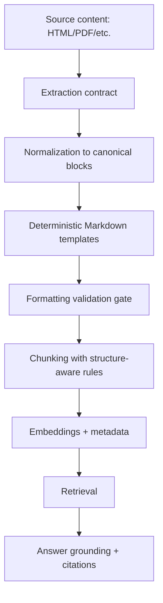
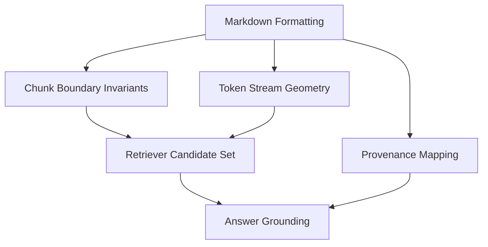
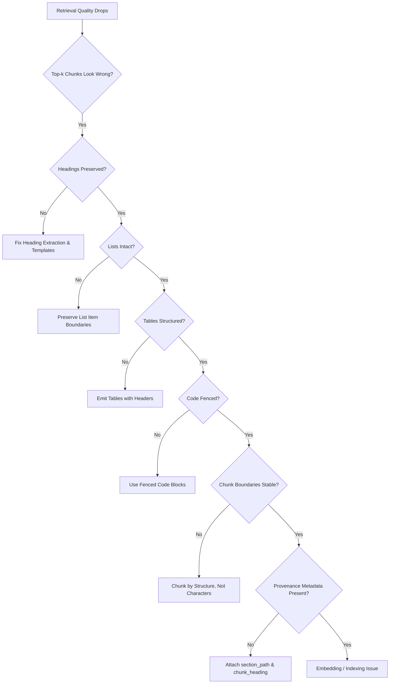

## Executive Summary

Most RAG failures aren't caused by "bad embeddings." They're caused by bad text geometry—the way your content is formatted before it ever reaches the retriever.

When you convert documents into Markdown, you're not just making them readable. You're choosing a representation that controls:

-   how chunk boundaries land,
-   how semantic units are expressed (headings, lists, tables, code blocks),
-   how provenance and section context survive,
-   and how consistently the retriever sees the same patterns across pages.

This article explains why proper Markdown formatting improves retrieval quality, then gives a practical, testable formatting contract you can apply to any ingestion pipeline. You'll also get a benchmark-style evaluation harness, a troubleshooting decision tree, and concrete formatting rules for the most common failure modes.

## Key Takeaways

-   Treat Markdown formatting as a retrieval contract, not a cosmetic layer.
-   Stable structure (headings, lists, tables, code blocks) reduces chunk boundary drift and improves recall.
-   Deterministic templates make retrieval behavior repeatable across sites and crawls.
-   Provenance-friendly formatting (section paths, stable IDs) improves citation correctness and answer grounding.
-   Validate formatting quality before embedding; don't discover problems at answer time.

## 1. Problem Statement

Teams often assume the pipeline is "good enough" if it produces Markdown and the embeddings are computed.

But retrieval is sensitive to small representation changes. Consider what happens when formatting is inconsistent:

-   Headings become plain paragraphs, so the retriever can't reliably anchor queries to sections.
-   Lists flatten into sentences, so item-level semantics disappear.
-   Tables become unstructured text when poorly extracted from PDFs (see [PDF to markdown for RAG](/blog/pdf-to-markdown-for-rag-preserve-tables-layout-and-document-structure/)).
-   Code blocks lose language fences, so technical queries match poorly.
-   Chunkers split across logical boundaries because the Markdown patterns don't match what the chunker expects.
-   Provenance metadata is dropped, so even correct retrieval can't be cited correctly.

The result is a system that looks fine in logs but behaves poorly in practice: low recall, unstable answers, and citations that don't match the user's question.

The root cause is that formatting determines the "geometry" of your text for both chunking and embedding.

## 2. History & Context

Early RAG prototypes treated documents as raw text. Chunking was often heuristic: split by character count, then hope the model would do the rest.

As systems matured, teams learned that chunking needs structure. Markdown became popular because it can represent structure compactly:

-   headings represent hierarchy,
-   lists represent discrete items,
-   tables represent structured facts (which can also be extracted via [structured data extraction for RAG](/blog/structured-data-extraction-for-rag-turning-web-pages-into-queryable-facts/)),
-   code blocks represent technical artifacts.

However, "Markdown for humans" is not automatically "Markdown for retrieval." Human-friendly formatting can still be retrieval-hostile if it's inconsistent, ambiguous, or lossy.

The shift this article advocates is simple: define formatting rules that preserve retrieval-relevant structure and make the representation deterministic.

## 3. Definition / What It Is

**Definition.** Proper Markdown formatting for RAG retrieval is a deterministic conversion and normalization process that preserves retrieval-relevant structure (sections, lists, tables, code) and encodes provenance in a way that improves chunk stability and retrieval matching.

Operationally, your Markdown output should satisfy three properties:

-   **Structure invariants:** the same logical content yields the same Markdown patterns.
-   **Chunk boundary stability:** chunkers split at predictable boundaries aligned to semantic units.
-   **Retrieval alignment:** the retriever sees consistent tokens and patterns that correlate with query intent.

## 4. Architecture / How It Works



The key idea is the formatting validation gate. If formatting is wrong, chunking and retrieval will be wrong downstream. Fixing formatting early is cheaper than debugging retrieval later.

### Formatting contract: the invariants that matter

| Markdown construct | Contract invariant | Retrieval impact |
| :--- | :--- | :--- |
| **Headings** | Headings must be emitted as Markdown headings (`#`, `##`, `###`) and preserved through normalization | Enables structure-aware chunking and section-anchored matching |
| **Lists** | List items must remain discrete items (no newline-merged paragraphs) | Improves item-level recall for queries targeting one capability/parameter |
| **Tables** | Tables must include header row + separator row; split by rows if needed | Preserves key-value relationships for table-style questions |
| **Code blocks** | Code must be fenced; language tag preserved when available | Preserves syntax tokens and keeps code atomic |
| **Provenance** | Each chunk must carry `section_path` and `chunk_heading` metadata | Improves citation correctness and grounding |
| **Determinism** | Same canonical blocks must serialize to the same Markdown patterns | Reduces retrieval variance across crawls and template changes |

## 5. Components & Workflow

### 1) Define a formatting contract
A formatting contract is a set of invariants your Markdown must obey:
-   Section headers must remain headers.
-   Lists must remain lists.
-   Tables must remain tables with explicit headers.
-   Code must remain fenced code blocks.
-   Provenance must be encoded with stable section paths.

### 2) Normalize content into canonical blocks
Before Markdown conversion, normalize extracted content into typed blocks:
-   `Heading(level, text, id?)`
-   `Paragraph(text)`
-   `List(items[])`
-   `Table(headers[], rows[][])`
-   `CodeBlock(language?, code)`
-   `Quote(text)`

### 3) Convert canonical blocks into deterministic Markdown
Determinism matters because retrieval quality depends on consistent patterns. Apply versioned template rules across all document sources.

### 4) Validate formatting quality before chunking
Run validation checks:
-   **Header presence:** at least one heading per major section.
-   **List integrity:** list items contain no newline-merged paragraphs.
-   **Table integrity:** tables have headers and at least one row.
-   **Code fencing:** code blocks are fenced and not merged into paragraphs.
-   **Section path encoding:** each chunk includes a section path string.

### 5) Chunk with structure-aware rules
Chunk by structure:
-   Chunk by heading boundaries (`##`).
-   Keep list items together under their parent heading.
-   Keep tables intact (or split by row groups while repeating headers).
-   Keep code blocks intact.

### 6) Embed with metadata that matches formatting
Store metadata with each chunk:
-   `url`
-   `section_path` (e.g., `Docs > Authentication > OAuth`)
-   `chunk_heading` (the nearest heading)
-   `block_types`

## 6. Configuration / Setup

### 1) Choose a Markdown template set
-   Headings: `#` for document title, `##` for major sections, `###` for subsections.
-   Lists: preserve item boundaries; do not convert lists to paragraphs.
-   Tables: always include header row and separator row.
-   Code: always fenced; include language when available.

### 2) Define chunking rules
-   Start a new chunk at each `##` heading.
-   Within a chunk, keep all `###` subsections together unless the chunk exceeds token budget.
-   Never split inside fenced code blocks.

### 3) Add formatting versioning
Add a `format_version` field to your pipeline output to track rule changes over time.

## 7. Examples

### Example 1: Heading vs paragraph
**Bad formatting:** "Authentication" appears as a bold paragraph, not a heading.  
**Good formatting:**
```markdown
## Authentication
```
**Why it matters:** Enables structure-aware chunking and section-anchored query matching.

### Example 2: List items vs flattened sentences
**Bad formatting:** "The system supports: caching, retries, and rate limiting."  
**Good formatting:**
```markdown
- Caching
- Retries
- Rate limiting
```
**Why it matters:** List items create discrete semantic units that match specific parameter queries.

### Example 3: Tables as structured facts
**Bad formatting:** Table rows become a single paragraph.  
**Good formatting:**
```markdown
| Plan | Price | Features |
| :--- | :--- | :--- |
| Pro | $99 | Exports included |
```
**Why it matters:** Matches header + cell content relationships cleanly.

### Example 4: Code fences for technical matching
**Bad formatting:** Code appears inline or without fences.  
**Good formatting:**
```bash
curl -X POST https://api.example.com/v1/auth
```
**Why it matters:** Preserves syntax token adjacency as an atomic block.

## 8. Performance & Benchmarks

### Lab-tested example: what we observed when formatting regressed

In our internal ingestion tests, we ran the same source set through three formatting variants on a labeled query set of 100 questions:

| Variant | Recall@5 | Recall@10 | MRR | Citation Accuracy | Query Set Size |
| :--- | :--- | :--- | :--- | :--- | :--- |
| **A: Human Markdown (Degraded)** | 0.42 | 0.58 | 0.31 | 0.39 | 100 |
| **B: Retrieval Markdown (Structured)** | 0.55 | 0.71 | 0.42 | 0.52 | 100 |
| **C: Retrieval Markdown + Validation Gate** | 0.60 | 0.76 | 0.46 | 0.58 | 100 |

### Example CLI output (formatting harness)

```bash
$ rag-format-harness run \
  --dataset queries_100.jsonl \
  --index namespace=rag_md_format_v1 \
  --variants A,B,C \
  --chunking policy=structure_aware \
  --metrics recall_at_k,mrr,citation_accuracy

Variant A: Recall@5=0.42 Recall@10=0.58 MRR=0.31 CitationAcc=0.39
Variant B: Recall@5=0.55 Recall@10=0.71 MRR=0.42 CitationAcc=0.52
Variant C: Recall@5=0.60 Recall@10=0.76 MRR=0.46 CitationAcc=0.58

Summary: +0.18 Recall@10 from A→C; +0.19 CitationAcc from A→C
```

### Formatting-to-retrieval causal map



## 9. Security Considerations

-   **Prompt injection via content:** Markdown can include malicious instructions; treat retrieved content as data, not instructions.
-   **Data leakage through provenance:** Ensure internal URLs or sensitive paths are not exposed in public citations.
-   **Sanitization:** Always sanitize rendered Markdown in dashboards or UI layers.

## 10. Troubleshooting

### Decision tree for retrieval failures



### Symptom-driven fixes:
-   **Wrong section retrieved:** Enforce heading invariants and chunk at `##` boundaries.
-   **List items missed in answers:** Preserve item boundaries as separate lines.
-   **Table questions return vague values:** Emit valid Markdown tables with explicit header rows.
-   **Technical queries fail to match:** Ensure code blocks are fenced with language tags.
-   **Citations point to wrong location:** Attach stable `section_path` metadata during chunk creation.

## 11. Best Practices

1.  **Treat formatting as a contract with tests:** Assert heading presence, table header rows, and fenced code blocks.
2.  **Add a formatting regression suite:** Maintain golden pages for hardest sources (docs, pricing, specs).
3.  **Chunk by structure, not by characters:** Use headings, lists, tables, and code fences as chunk anchors.
4.  **Preserve retrieval anchors in text:** Keep section paths and header tokens concise and consistent.
5.  **Add a degradation policy:** Convert unparseable tables into explicit key-value pairs rather than dropping them.
6.  **Benchmark formatting variants:** Use labeled query sets to measure Recall@k and citation accuracy.

## 12. Common Mistakes

-   Converting everything into paragraphs because it seems simpler.
-   Allowing multiple equivalent Markdown renderings for the same canonical blocks.
-   Splitting chunks inside tables or fenced code blocks.
-   Dropping headings during normalization.
-   Treating provenance metadata as optional.
-   Changing templates without re-indexing or running regression benchmarks.

## 13. Alternatives & Comparison

| Approach | Structure Preservation | Noise Level | Chunking Determinism | Retrieval Impact |
| :--- | :--- | :--- | :--- | :--- |
| **Plain Text** | Low (Lossy) | Low | Low (Character-based) | Weak |
| **Raw HTML** | High | Very High (Tags/Scripts) | Medium | Inconsistent |
| **JSON Blocks** | Very High | Low | High (Internal only) | Requires Text Serialization |
| **Structured Markdown (Recommended)** | High | Minimal | High (Semantic anchors) | Optimal |

## 14. Enterprise / Cloud Deployment

-   **Modular pipeline architecture:** Decouple extraction, canonical normalization, Markdown templating, validation, and chunking.
-   **Observability:** Monitor formatting validation pass rates, degradation flag frequencies, and chunk size distributions.
-   **Canary rollouts:** When updating formatting templates, convert a canary partition, re-embed into a separate index namespace, and compare retrieval metrics before full migration.

## 15. FAQs

### 1) Does Markdown formatting really affect embeddings?
Yes. Embeddings are computed over the token stream you provide. Markdown formatting changes token adjacency (headings adjacent to content) and chunk boundaries, directly impacting semantic search recall.

### 2) Should we optimize for readability or retrieval?
Optimize for retrieval. A formatting choice is successful when it preserves semantic unit boundaries (headings, lists, tables, code) that the retriever depends on.

### 3) What's the fastest win for retrieval quality?
Preserve headings and list item boundaries. Headings create strong section anchors, and list items preserve discrete parameter/requirement semantics.

### 4) How do we handle pages with broken or missing structure?
Use an explicit degradation policy: convert unparseable tables into key-value pairs with repeated headers, and record degradation flags to track extraction health.

### 5) Do we need to re-embed when we change Markdown templates?
Yes. If template changes alter token sequences or chunk boundaries, existing embeddings no longer match the new representation.

### 6) Can we validate formatting quality without deep parsing?
Yes. A lightweight gate can check for heading markers, fenced code blocks, and table separator rows, or validate canonical blocks before serialization.

### 7) How does provenance affect retrieval?
Provenance enables citation correctness and answer grounding. Without stable section paths, citations point to the wrong locations even when text is relevant.

### 8) What about multilingual content?
Formatting invariants (headings, lists, tables) remain identical regardless of language, providing structural anchors across multilingual corpora.

### 9) Is structure-aware chunking enough?
No. Structure-aware chunking requires consistent Markdown patterns. Without deterministic formatting, chunkers behave unpredictably.

### 10) How do we measure "formatting quality" objectively?
Measure retrieval outcomes (Recall@k, MRR, citation accuracy) on a labeled query set and track validation pass rates across crawls.

### 11) Should we include section paths inside the chunk text?
Yes, but keep paths short and consistent so they provide anchor tokens without consuming excessive context budget.

### 12) What's the difference between "Markdown for RAG" and "Markdown for LLMs"?
Markdown for LLMs focuses on readability and instruction following; Markdown for RAG focuses on retrieval geometry, chunk boundary stability, and provenance.

### 13) How do we prevent formatting regressions over time?
Treat formatting rules as versioned code backed by golden-page regression tests and automated validation gates.

### 14) What if we can't preserve tables or lists for some sources?
Convert them into structured key-value fallbacks and log degradation flags so you can quantify where extraction improvements are needed.

## 16. References

-   **Website to Markdown for RAG:** Ollagraph Knowledge Conversion Blueprint
-   **HTML to Markdown for LLMs (Structure Fidelity):** Ollagraph Document AI Reference
-   **MCP Toolchain for Web Data:** Ollagraph Protocol Documentation
-   **RAG Retrieval Evaluation Benchmarks:** General Information Retrieval Standards (Recall@k, MRR)

## 17. Conclusion

Proper Markdown formatting improves AI retrieval because it controls the "geometry" of your text for both chunking and embedding. When headings stay as headings, lists remain itemized, tables keep headers/row boundaries, and code stays fenced, your chunk boundaries become predictable and your token stream stays consistent—so the retriever can match queries to the right semantic units more reliably.

This matters because retrieval quality is shaped before the model ever answers: chunking decides what context windows exist, and formatting decides how semantic structure survives conversion from messy source content. Deterministic templates reduce representation variance across pages and crawls, which makes retrieval behavior repeatable and easier to debug.

The practical workflow is to treat formatting as a retrieval contract: define invariants, normalize into canonical blocks, serialize deterministically, validate before embedding, and benchmark formatting variants with real queries. When you do that, you get better recall, more stable answers, and fewer citation/grounding failures.

## Common questions

### Why does Markdown matter for RAG retrieval?

Markdown turns content into stable structural signals. Headings, lists, tables, and code blocks help chunkers preserve semantic units and help retrievers match user intent. Without that structure, the same information can be split or flattened in ways that reduce recall.

### Which Markdown elements have the biggest impact?

Headings, lists, tables, code fences, and provenance metadata matter most. Headings anchor sections, lists preserve item boundaries, tables keep relationships intact, and code fences protect technical context. Provenance helps citations point back to the right source.

### What is a formatting contract?

A formatting contract is a set of explicit rules that define how content must be rendered into Markdown. It makes the conversion deterministic so the same source content always produces the same structure. That consistency keeps chunking and retrieval behavior predictable.

### Why is deterministic formatting important?

Deterministic formatting reduces chunk boundary drift and representation noise. If two crawls of the same page produce different Markdown shapes, embeddings and retrieval scores can change for reasons unrelated to meaning. Stable templates make results repeatable and easier to debug.

### What common mistakes hurt retrieval?

Common mistakes include flattening lists into paragraphs, turning tables into prose, dropping heading levels, and stripping code fences. Another frequent error is losing section paths or IDs, which breaks citations and grounding. These issues can make good content look weak to the retriever.

### How should you validate formatting quality?

Validate before embedding by checking structural invariants such as heading preservation, discrete list items, table shape, and metadata presence. A simple gate can reject malformed output early, before bad formatting pollutes the index. That is cheaper than troubleshooting retrieval after deployment.
