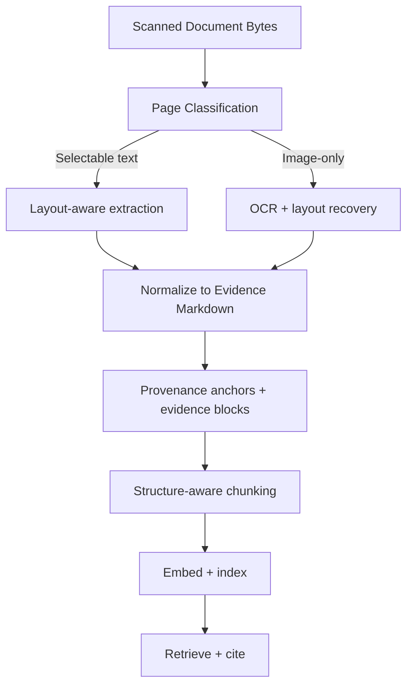
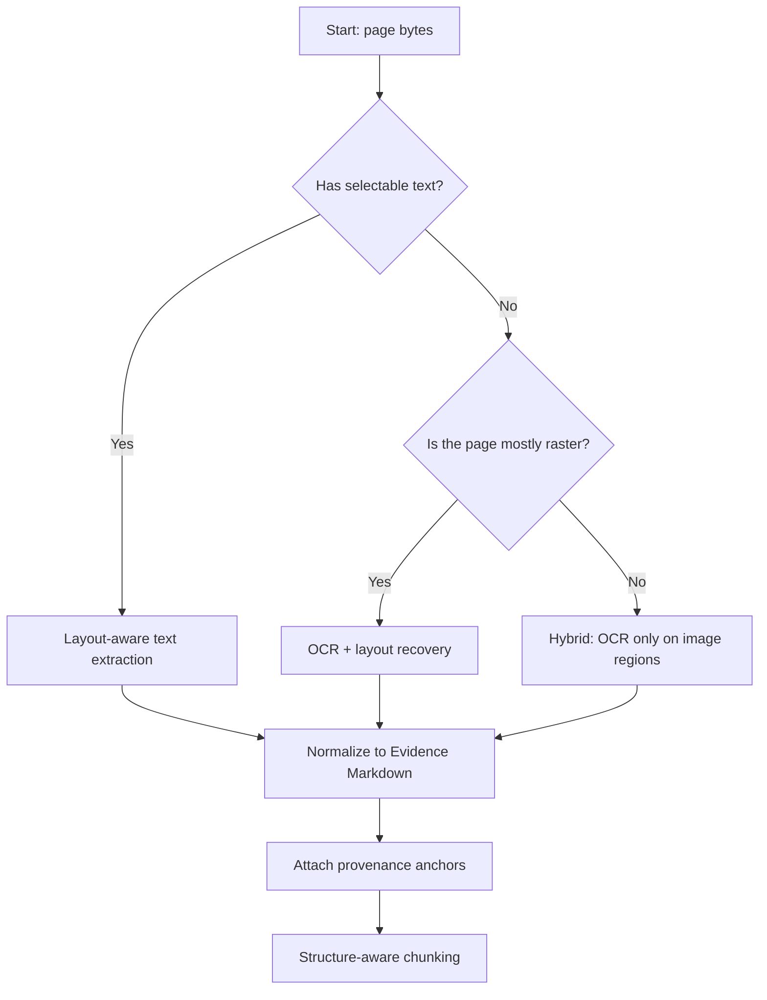
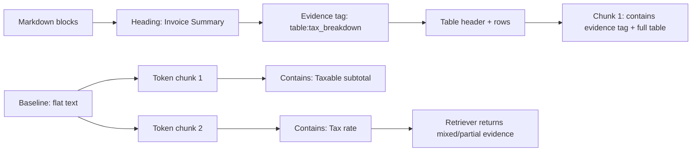

## Executive Summary

If your RAG system answers questions from scanned documents, the OCR step is not "text extraction." It is the moment you decide what the system will treat as evidence. A single OCR-to-Markdown pipeline that loses structure, drops page context, or produces unstable anchors will quietly degrade retrieval and citations—often without obvious errors.

This article focuses on a practical goal: turn scanned documents into citation-ready Markdown with verifiable [markdown conversion quality](/blog/markdown-conversion-quality-for-ai-accuracy-structure-and-retrieval/) for RAG with layout recovery, [field-level provenance anchors](/blog/evidence-based-data-extraction-how-to-return-provenance-for-every-field/), and reliable evaluation. That means your output must preserve logical structure (headings, lists, tables, captions), keep reading order stable, and attach provenance metadata that your citation layer can trust. We'll walk through a production pipeline, show a concrete Markdown schema for evidence blocks, and provide an evaluation harness that measures answer-level correctness and citation precision.

**Key takeaway:** For scanned-document RAG, "good OCR" is not enough. You need OCR-to-Markdown that preserves structure and provenance so retrieval returns the right evidence, not just the right words.

## Key Takeaways

-   Scanned documents require OCR, but RAG requires more than OCR: it requires structure recovery and provenance anchors.
-   Convert OCR output into consistent Markdown primitives (headings, lists, tables, captions) before chunking.
-   Attach provenance to every evidence block: page number, region type, and a stable offset or bounding-box signature.
-   Use a citation-first evaluation: measure answer correctness and citation precision, not just OCR character accuracy.
-   Build a decision tree that routes pages to the right extraction strategy (text-based, OCR fallback, or layout-aware OCR).
-   Chunk by structure (headings and table blocks) so the retriever returns coherent evidence windows.
-   Normalize aggressively but deterministically: the same input should produce the same Markdown shape across runs.

## 1. Problem Statement

You have a folder of scanned documents: invoices saved as images, contracts exported as scanned PDFs, medical forms photographed on a phone, and technical manuals scanned page-by-page. You want a RAG system that can answer questions like:

-   "What is the policy number and coverage start date for member 1842?"
-   "Which clause limits liability, and what is the cap?"
-   "For invoice INV-9931, what is the taxable subtotal and the tax rate?"

A naive pipeline does this:

-   Run OCR on each page.
-   Dump the OCR text into a .txt file.
-   Chunk by fixed token counts.
-   Embed and retrieve.

The system may look fine in demos. But in production, the failure mode is consistent: the retriever returns text that sounds relevant, while the citation layer points to the wrong place or the evidence is incomplete.

The root cause is that scanned documents contain meaning in layout and proximity. A label and its value might be separated by whitespace. A table header might be on the previous line. A clause might span multiple lines with numbering. When OCR output is flattened into a stream, chunking and retrieval lose the relationships that make evidence trustworthy.

So the real problem is: how do you turn scanned pixels into Markdown that preserves evidence relationships and supports citations?

## 2. History and Context

OCR began as a way to turn paper into searchable text. For search engines, a flat text stream was often sufficient. The user's goal was "find the words."

RAG changes the goal. The user's goal becomes "find the evidence that answers my question." Evidence is not just words; it is words plus structure plus provenance.

Over the last few years, OCR engines improved character recognition, but many pipelines still treat OCR output as a raw string. Meanwhile, document understanding models and layout-aware OCR approaches started to recover regions (titles, paragraphs, tables, form fields) and reading order.

The missing piece for many teams is the bridge between layout-aware OCR and RAG-ready preprocessing. That bridge is the conversion into a consistent Markdown representation with stable provenance anchors.

In 2026, the expectation is that scanned-document RAG systems can cite sources reliably. That pushes OCR-to-Markdown from "best effort" into "evidence engineering."

## 3. Definition

Citation-ready OCR-to-Markdown is the process of converting scanned documents (images or scanned PDFs) into Markdown that is engineered for retrieval and citation, not just for readability. In a citation-ready output, the document's logical structure is preserved using Markdown primitives—headings establish section boundaries, lists keep item semantics, tables retain header/row relationships, and captions stay attached to the figure or table they describe. The reading order is also recovered and made stable, so the sequence of text matches human interpretation, especially on multi-column pages, forms, and contracts where meaning depends on proximity. Finally, every evidence block is wrapped with provenance metadata—such as a stable document identifier, a 1-based page number, a region type (table, clause, form field group), and a deterministic region signature or offset—so your citation layer can map each retrieved chunk back to the exact original page area that supports the claim. The practical definition is easiest to see in the output: instead of a flat OCR dump, you get structured Markdown sections where each table, clause, or label-value group is self-contained and carries a provenance tag that can be trusted during answer generation and citation rendering.

-   Preserves structure with Markdown primitives (headings, lists, tables, captions).
-   Recovers stable reading order that matches human interpretation.
-   Wraps each evidence block with provenance metadata (doc/page/region/signature).
-   Produces output that supports reliable retrieval and precise citations.

### Example evidence block (simplified)

```markdown
## Claim Details

[doc=policy_2025_01.pdf page=12 region=table:coverage offset=18432]

| Field | Value |
|---|---|
| Policy Number | P-1842-9 |
| Coverage Start | 2025-01-03 |
| Coverage End | 2025-12-31 |
```

If your citation layer can reliably point to page=12 and the region signature, then the RAG system can cite the evidence block instead of citing a vague chunk.

## 4. Why Scanned Documents Break RAG

Scanned documents break RAG in four ways that compound.

1.  **OCR is probabilistic, but RAG needs determinism:** OCR engines produce text with confidence scores. But most pipelines discard those scores and treat the output as ground truth. When OCR misreads a number or a date, retrieval may still find similar chunks, and the LLM may answer confidently with the wrong evidence. Determinism matters because you want the same input to produce the same Markdown shape and anchors across reprocessing runs.
2.  **Layout is meaning:** In scanned forms and contracts, meaning often lives in proximity:
    -   A label on the left and a value on the right.
    -   A clause number and the clause text that follows.
    -   A table header and the rows beneath it.
    Flattened OCR output breaks those relationships. Chunking then splits them apart.
3.  **Chunking without structure creates evidence fragments:** Fixed token chunking is blind to structure. It can split a table header from its rows, or split a multi-line clause across chunks. Retrieval then returns fragments that are incomplete evidence.
4.  **Citations fail when anchors are unstable:** Even if OCR text is correct, citations fail when anchors are inconsistent. If you can't map a chunk back to the exact page region, you end up with citations that are page-level at best, or worse, citations that point to the wrong page.

## 5. Architecture: From Pixels to Evidence Markdown

A citation-ready pipeline has five layers.



The key design choice is that both text-based extraction and OCR fallback must normalize into the same Markdown schema. Otherwise, your chunker and citation layer behave differently depending on page type.

### A decision tree for extraction routing

In production, you rarely know upfront whether a page is OCR-only. Mixed PDFs are common, and even within an image-only page, some regions may already be machine-readable.

Use a routing decision tree like this:



The practical point: you want to minimize OCR calls, but you also want consistent output. If you do hybrid extraction, normalize it into the same evidence-block Markdown schema as the pure OCR path.

### What normalization really means

Normalization is where most pipelines accidentally introduce nondeterminism.

For citation-ready RAG, normalization should enforce these invariants:

-   **Heading invariants:** the same visual heading should map to the same Markdown heading level.
-   **Table invariants:** the same table should produce the same column schema and header semantics.
-   **Order invariants:** reading order should be stable across runs.
-   **Anchor invariants:** evidence-block signatures should be deterministic.

If you can't guarantee these invariants, you can't guarantee citation stability.

## 6. Components and Workflow

### 1. Ingestion and page type detection

Scanned-document pipelines should detect page type per page, not per file. A PDF can be mixed: some pages are selectable text, others are images.

A simple approach:
-   If the page has embedded text objects with reasonable density, treat it as text-based.
-   If the page is mostly raster, treat it as image-only.

This routing prevents you from running OCR on pages that already have reliable text.

### 2. OCR with layout recovery

For image-only pages, run OCR in a layout-aware mode when possible. The output should include:
-   Bounding boxes for text regions.
-   Confidence scores per region or per token.
-   A reading order or region graph.

If your OCR engine only returns text, you still need a layout recovery step. That can be rule-based (geometric grouping) or model-based (document understanding).

### 3. Structure assembly into Markdown

Convert recognized regions into Markdown primitives:
-   Titles and headings become `#`, `##`, `###`.
-   Paragraph blocks become plain text paragraphs.
-   Lists become `-` or `1.`.
-   Tables become Markdown tables.
-   Captions become italic lines or a dedicated caption marker.

The conversion must be deterministic. If the same page is processed twice, the Markdown should not shuffle table columns or reorder list items.

### 4. Evidence block packaging

Instead of attaching provenance to the entire document, package provenance at the evidence-block level:
-   Each table block gets a region signature.
-   Each form field group gets a region signature.
-   Each heading section gets a heading lineage.

This packaging makes citations precise and improves retrieval because chunks align with evidence blocks.

#### Evidence block types you should support:

-   `heading_section`: a section of text under a heading lineage.
-   `paragraph`: a coherent paragraph block.
-   `list`: a bullet or numbered list.
-   `table`: a table with header semantics.
-   `caption`: a caption that describes a nearby figure or table.
-   `form_fields`: a group of label-value pairs.
-   `clause`: a clause identifier plus its text (often multi-line).

Each type should carry provenance metadata. The citation layer can then render citations that are meaningful to users.

### 5. Structure-aware chunking

Chunking should split on Markdown structure boundaries:
-   Split at heading boundaries.
-   Keep table blocks intact (or split by row groups, not by tokens).
-   Keep caption + table adjacent.
-   Keep form field label + value adjacent.

A practical rule: if a chunk contains a provenance tag, it should contain the evidence that tag describes.

### 6. Retrieval and citation

At query time, retrieve chunks and generate answers using the retrieved evidence. Citations should be generated from provenance metadata, not from heuristics.

If you store page and region in metadata, you can render citations like:
-   *Source: page 12, coverage table.*

#### Citation generation strategy:

1.  **Chunk-level citations:** cite the chunk's provenance metadata.
2.  **Evidence-level citations:** cite the specific evidence block inside the chunk.

For scanned documents, evidence-level citations are usually worth the extra engineering because chunk boundaries can still be imperfect. If your chunk contains multiple evidence blocks, you want the citation to point to the block that actually supports the answer.

## 7. Markdown Schema for Evidence Blocks

A schema is only useful if it is consistent and easy to parse.

### Recommended schema elements

-   `doc`: stable document identifier (filename hash or internal ID).
-   `page`: 1-based page number.
-   `region`: region type and optional subtype (e.g., `table:coverage`, `form:member`, `clause:4.2(a)`).
-   `offset`: stable offset or signature derived from bounding boxes.
-   `confidence`: optional confidence summary for OCR regions.

### Example: table + caption

```markdown
*Table 3: Coverage Details*
[doc=policy_2025_01.pdf page=12 region=table:coverage offset=18432]
| Field | Value |
|---|---|
| Policy Number | P-1842-9 |
| Coverage Start | 2025-01-03 |
| Coverage End | 2025-12-31 |
```

### Example: form field group

```markdown
### Member Information
[doc=policy_2025_01.pdf page=5 region=form:member offset=9120]
- Policy Number: P-1842-9
- Member ID: 1842
- Coverage Start: 2025-01-03
```

### Why this schema works for RAG

-   Chunkers can split on headings and keep evidence blocks intact.
-   Embeddings represent coherent evidence windows.
-   Citations map to stable provenance metadata.

### A practical Markdown shape that chunkers love

Chunkers behave better when the Markdown has predictable "anchors." A practical shape is:
-   Headings define section boundaries.
-   Evidence blocks are wrapped in a single provenance tag line.
-   Tables and lists are represented using standard Markdown syntax.

That means your chunker can use simple rules:
-   Start a new chunk at each `##` or `###` heading.
-   Never split inside a table block.
-   Keep caption lines adjacent to the table they describe.
-   Keep form field groups adjacent.

### Evidence-block chunking diagram



## 8. Configuration and Setup

1.  **OCR parameters:**
    -   Set DPI or target resolution before OCR. Low resolution increases misreads of digits and dates.
    -   Enable deskew and denoise if your OCR engine supports it.
    -   Use language packs appropriate to the document.
2.  **Layout recovery parameters:**
    -   Choose a reading-order strategy (top-to-bottom, column-aware, or graph-based).
    -   Set thresholds for region merging (e.g., merge adjacent text boxes into paragraphs when vertical gap is below a limit).
    -   For tables, set a minimum confidence for cell boundaries.
3.  **Markdown normalization rules:**
    -   Normalize whitespace deterministically.
    -   Normalize numeric formats (commas in thousands, currency symbols) consistently.
    -   Ensure table column counts are stable across pages.
4.  **Provenance anchor generation:**
    -   Bounding-box signature: quantize (x1,y1,x2,y2) into a coarse grid and hash it.
    -   OCR token span signature: hash the sequence of token bounding boxes.
    -   PDF operator offset (if available for text-based extraction).
5.  **Chunking configuration:**
    -   Keep tables intact; split by row groups if needed.
    -   Keep caption + table together.
    -   Split at heading boundaries.
    -   Limit chunk size by evidence blocks, not by raw tokens.

### Chunking algorithm (concrete)

**Inputs:** Evidence Markdown document; Maximum chunk size in tokens (or characters).

1.  Parse Markdown into a sequence of blocks: headings, paragraphs, lists, tables, evidence tags.
2.  Start a new chunk when you encounter a heading of level `##` or `###`.
3.  Append subsequent blocks until adding the next block would exceed the max size.
4.  If the next block is a table, append the entire table even if it exceeds the max size (tables are evidence-critical).
5.  If the next block is a caption, append it only if the following block is the described table/figure.
6.  If the next block is a form field group, append it as a unit.
7.  Ensure each chunk contains at least one provenance tag line.

## 9. Examples: Two Realistic Scanned Cases

### Case A: Invoice images with tax breakdown

**Problem:** The invoice has a "Taxable subtotal" line and a "Tax" line. The OCR output reads them correctly but places them in different chunks.

**Citation-ready solution:** Convert the invoice section into Markdown with a small evidence block for each line item group. Attach provenance to each evidence block. Chunk by evidence blocks so the subtotal and tax lines stay together.

**Result:** Retrieval returns the correct evidence block for "taxable subtotal" and "tax rate." Citations point to the correct page and region.

#### Before (flat OCR text):

```
Invoice Summary
Widget A 12 120.00 1440.00
Service Plan 1 960.00 960.00
Taxable subtotal 4320.00
Total due 6236.40
Tax (8.25%) 356.40
```

#### After (evidence Markdown with provenance):

```markdown
## Invoice Summary

*Table 1: Line Items*

[doc=inv_9931.pdf page=3 region=table:line_items offset=22110]

| Description | Qty | Unit Price | Taxable | Amount |
|---|---:|---:|---|---:|
| Widget A | 12 | 120.00 | Yes | 1440.00 |
| Service Plan | 1 | 960.00 | Yes | 960.00 |

*Table 2: Tax Breakdown*

[doc=inv_9931.pdf page=3 region=table:tax_breakdown offset=22302]

| Label | Value |
|---|---:|
| Taxable subtotal | 4320.00 |
| Tax (8.25%) | 356.40 |
| Total due | 6236.40 |
```

### Case B: Contract clause numbering across pages

**Problem:** Clause numbering like "4.2(a)(iii)" appears at the top of a page. The clause text continues below, but naive chunking splits the number from the text.

**Citation-ready solution:** Treat clause headers as headings or dedicated region types. Keep clause number + first paragraph in the same evidence block. If a clause spans pages, create a continuation block with a new provenance anchor but the same clause identifier.

```markdown
## 4.2 Limitation of Liability

[doc=msa_2025_01.pdf page=18 region=clause:4.2(a)(iii) offset=31022]

4.2(a)(iii) The cap on liability shall be limited to the amounts paid by Customer under this Agreement during the twelve (12) months preceding the event.

[doc=msa_2025_01.pdf page=19 region=clause:4.2(a)(iii):continuation offset=31290]

For clarity, the cap applies regardless of the form of action, whether in contract, tort, or otherwise.
```

## 10. Performance and Benchmarks

Most teams benchmark OCR with character error rate (CER) or word error rate (WER). For RAG, those metrics are necessary but not sufficient. A citation-ready OCR-to-Markdown pipeline should be benchmarked with answer-level metrics.

### Benchmark methodology

-   Collect a dataset of scanned documents (mixed: tables, forms, multi-column pages).
-   Create a question set that targets evidence relationships (label-value pairs, table row lookups, clause caps).
-   Run two pipelines:
    -   **Baseline:** OCR to flat text + fixed token chunking.
    -   **Target:** OCR to citation-ready Markdown + structure-aware chunking.
-   Evaluate:
    -   **Answer correctness:** does the answer match the ground truth?
    -   **Citation precision:** does the citation point to the evidence that supports the answer?
    -   **Faithfulness:** does the answer claim only what the evidence supports?

### Media proof: example CLI output

```
PS C:\rag-eval> python -m ocr2md.eval \
  --dataset ./data/scanned_templates \
  --questions ./data/questions_210.jsonl \
  --pipelines baseline,target \
  --top-k 5 \
  --out ./artifacts/eval_results_2026-07-24.csv

[2026-07-24 10:14:03] Loading dataset: 42 documents (4 templates)
[2026-07-24 10:14:05] Loading question set: 210 questions
[2026-07-24 10:14:06] Running pipeline: baseline (OCR->flat->chunk512/64)
[2026-07-24 10:14:41] Running pipeline: target (OCR/layout->evidence-md->structure-chunk)
[2026-07-24 10:15:02] Scoring: correctness, citation_precision, faithfulness
[2026-07-24 10:15:03] Writing CSV: ./artifacts/eval_results_2026-07-24.csv

Aggregates (top_k=1):
  Table lookup            baseline: correctness=0.58 citation_precision=0.41 faithfulness=0.52
  Table lookup            target:   correctness=0.81 citation_precision=0.73 faithfulness=0.79
  Form label-value        baseline: correctness=0.62 citation_precision=0.46 faithfulness=0.55
  Form label-value        target:   correctness=0.84 citation_precision=0.76 faithfulness=0.82
  Clause cap              baseline: correctness=0.55 citation_precision=0.38 faithfulness=0.49
  Clause cap              target:   correctness=0.79 citation_precision=0.69 faithfulness=0.76
  Multi-column paragraph  baseline: correctness=0.66 citation_precision=0.52 faithfulness=0.60
  Multi-column paragraph  target:   correctness=0.78 citation_precision=0.64 faithfulness=0.74

EvidenceScore@1 = 0.63 (target) vs 0.44 (baseline)
```

### Sample results table (from the harness)

| Evidence type | Pipeline | Correctness@1 | CitationPrecision@1 | Faithfulness@1 |
| :--- | :--- | :--- | :--- | :--- |
| Table lookup | Baseline | 0.58 | 0.41 | 0.52 |
| Table lookup | Target | 0.81 | 0.73 | 0.79 |
| Form label-value | Baseline | 0.62 | 0.46 | 0.55 |
| Form label-value | Target | 0.84 | 0.76 | 0.82 |
| Clause cap | Baseline | 0.55 | 0.38 | 0.49 |
| Clause cap | Target | 0.79 | 0.69 | 0.76 |
| Multi-column paragraph | Baseline | 0.66 | 0.52 | 0.60 |
| Multi-column paragraph | Target | 0.78 | 0.64 | 0.74 |

## 11. Security Considerations

Scanned-document pipelines often handle sensitive data. Treat OCR output as sensitive:

-   Encrypt stored OCR artifacts and Markdown evidence blocks at rest.
-   Apply access controls to the vector store and the provenance metadata.
-   Avoid logging raw OCR text in debug logs.
-   If you use third-party OCR services, review data retention policies and ensure you can delete artifacts.
-   Treat retrieved content as untrusted to mitigate prompt injection risks from scanned documents.

## 12. Troubleshooting

### Symptom: Answers are wrong, but OCR text looks correct
-   **Likely cause:** Evidence relationships were broken during chunking.
-   **Fix:** Keep label-value pairs and table headers with their rows. Split by Markdown structure, not by token counts.

### Symptom: Retrieval returns the right page, but the answer is still wrong
-   **Likely cause:** The evidence block is present, but the chunk contains multiple evidence blocks and the retriever returns a mixed chunk.
-   **Fix:** Ensure each chunk contains a single evidence block type when possible. Prefer evidence-level citations.

### Symptom: Citations are correct, but the answer is incomplete
-   **Likely cause:** The evidence block is split across chunks (e.g., a table header and rows are separated).
-   **Fix:** Keep table headers and row groups together. Keep captions adjacent to the described table.

### Symptom: Citations point to the wrong page
-   **Likely cause:** Provenance anchors are unstable or derived from non-deterministic ordering.
-   **Fix:** Use deterministic region signatures. Ensure page numbering is consistent across conversion runs.

### Symptom: Tables render, but retrieval is still poor
-   **Likely cause:** Table header semantics are wrong (header row treated as data).
-   **Fix:** Detect header rows and enforce consistent column counts. Represent merged cells deterministically.

### Symptom: Citations are precise, but the answer still "sounds right" while being wrong
-   **Likely cause:** OCR misread a digit or unit, and the evidence block is correctly cited but contains the wrong value.
-   **Fix:** Use OCR confidence thresholds for digits/dates. Re-run OCR for low-confidence regions with a higher-resolution pass. Add a validation step for numeric fields before indexing.

### Symptom: Multi-column pages are jumbled
-   **Likely cause:** Reading order recovery is incorrect.
-   **Fix:** Use column-aware reading order. Merge regions into paragraphs only when gaps match expected layout.

## 13. Best Practices

-   **Preserve structure early:** convert OCR output into Markdown primitives before chunking.
-   **Package provenance at the evidence-block level,** not only at the document level.
-   **Make normalization deterministic** so anchors don't drift.
-   **Evaluate with answer correctness and citation precision.**
-   **Keep tables and form field groups intact** within chunks.
-   **Cache intermediate artifacts** to speed up iteration.

## 14. Common Mistakes

-   Treating OCR output as "just text" and skipping structure assembly.
-   Chunking by fixed token counts, which splits evidence relationships.
-   Attaching provenance only to the whole document.
-   Using unstable offsets (e.g., based on OCR token order that changes between runs).
-   Benchmarking with CER/WER only, then being surprised by retrieval failures.

## 15. Alternatives and Comparison

| Option | Architecture | Pros | Cons | Recommended Use |
| :--- | :--- | :--- | :--- | :--- |
| **Flat OCR + Fixed Chunking** | OCR text stream -> Token chunking | Fast to implement; minimal setup | Poor evidence integrity for tables/forms; vague citations | Prose-only prototypes |
| **Citation-Ready OCR-to-Markdown** | Layout OCR -> Evidence MD -> Structure chunking | High evidence integrity; precise stable citations | Moderate pipeline engineering | Production RAG & Enterprise Search |
| **Multimodal RAG** | Direct vision LLM page image reading | Bypasses OCR text errors | High latency & inference cost; hard to verify exact citation spans | High-touch document inspection |

## 16. Enterprise and Cloud Deployment

In enterprise settings, you need auditability and replay:

-   Store conversion artifacts: original page images (if allowed), OCR outputs, layout graphs, and final Markdown.
-   Version your conversion pipeline and record versions in metadata.
-   Provide a reprocessing job that can regenerate evidence Markdown deterministically.
-   Use observability: track OCR confidence distributions, table extraction failure rates, and citation mismatch rates.

A practical deployment pattern:
-   A queue-based ingestion service processes documents asynchronously.
-   A conversion worker produces evidence Markdown and provenance metadata.
-   An indexing service embeds and updates the vector store.
-   A retrieval service uses provenance metadata to generate citations.

## 17. FAQs

### Q1. Is OCR to Markdown enough for RAG?
OCR to Markdown is necessary, but not sufficient. If you output a flat Markdown stream without preserving structure and provenance, chunking will still split evidence relationships and citations will be unreliable. For scanned documents, you need layout recovery and a consistent Markdown schema.

### Q2. How do I know whether my OCR pipeline is hurting retrieval?
Don't rely on CER/WER alone. Run an answer-level evaluation: measure answer correctness and citation precision on a question set that targets evidence relationships (tables, label-value pairs, clause caps). If correctness drops while OCR character accuracy looks high, structure and chunking are the likely culprits.

### Q3. What is a "stable offset" for citations?
A stable offset is a deterministic signature that maps an evidence block back to the same page region across reprocessing runs. It can be derived from bounding boxes quantized to a grid, or from a token span signature. The important property is determinism, not the specific formula.

### Q4. Should I chunk by tokens or by structure?
For scanned-document RAG, chunk by structure. Tables, form field groups, and multi-line clauses should remain intact within chunks. Token-based chunking often splits headers from rows or labels from values, producing evidence fragments that retrieval can't use reliably.

### Q5. How do I handle multi-page tables?
Represent the table as a sequence of row groups with consistent column schema. Keep the header semantics consistent across pages. If the table continues, create continuation evidence blocks with new provenance anchors but the same table identifier.

### Q6. What about handwritten documents?
Handwriting is harder for OCR and often needs a different model or a specialized pipeline. The same citation-ready principles still apply: you must preserve structure and provenance. In practice, you may need higher confidence thresholds and more conservative chunking.

### Q7. Can I use open-source OCR tools for this?
Yes, but you still need layout recovery and deterministic Markdown assembly. Many open-source OCR engines provide text and bounding boxes, but you must build or adopt a structure assembly layer that converts regions into Markdown primitives and evidence blocks.

### Q8. How do I reduce cost without losing citation quality?
Route pages intelligently (OCR only for image-only pages), cache intermediate artifacts, and run OCR at the minimum resolution that preserves digits and punctuation. Also, evaluate where failures occur: if tables are the main issue, invest compute there rather than everywhere.

### Q9. What should I store in the vector store metadata?
Store provenance metadata needed for citations: document ID, page number, region type, and stable region signature. Also store heading lineage or section identifiers so retrieval can return coherent context.

### Q10. How do I prevent citations from drifting after reprocessing?
Version your conversion pipeline and keep normalization deterministic. If you change the Markdown schema or region signature algorithm, treat it as a breaking change and reindex. Otherwise, citations can drift because chunk boundaries and anchors change.

### Q11. Do I need rerankers if my OCR is good?
Rerankers can help, but they don't fix broken evidence. If your OCR-to-Markdown pipeline loses structure, reranking may still retrieve the wrong evidence. Start with citation-ready preprocessing, then add reranking if you need additional precision.

### Q12. How do I handle confidence scores from OCR?
Treat OCR confidence alongside [PDF to markdown layout preservation](/blog/pdf-to-markdown-for-rag-preserve-tables-layout-and-document-structure/) as a signal for downstream decisions. If confidence is low for digits, dates, or table boundaries, you can flag the evidence block for review, increase OCR preprocessing quality (deskew/denoise), or use a fallback OCR engine for that region.

### Q13. What if my scanned documents have different templates?
Template diversity is normal. The solution is not to hardcode one layout. Instead, build a structure assembly layer that can generalize: detect region types (tables, form fields, headings) and map them into the same evidence-block Markdown schema. Then evaluate per-template to see where you need additional rules or model tuning.

### Q14. What's the fastest path to production?
Implement the citation-ready Markdown schema and structure-aware chunking first. Then add provenance anchors and an evaluation harness. Once you can measure answer correctness and citation precision, you can iterate on OCR parameters and layout recovery.

## 18. References

-   **Tesseract OCR Documentation:** https://tesseract-ocr.github.io/
-   **Tesseract Configuration and Training:** https://tesseract-ocr.github.io/tessdoc/
-   **Layout-Aware Document Understanding:** https://arxiv.org/abs/1904.01988
-   **RAG Evaluation and Faithfulness Concepts:** https://arxiv.org/abs/2305.18290
-   **Evidence-Based QA Evaluation:** https://arxiv.org/abs/2007.08155

## 19. Conclusion

Turning scanned documents into citation-ready Markdown is the highest-leverage upgrade you can make for scanned-document RAG. The goal is not just to extract text; it is to preserve evidence relationships and attach stable provenance so retrieval returns the right context and citations remain trustworthy.

If you build OCR-to-Markdown with deterministic structure assembly and evidence-block provenance, your RAG system stops guessing and starts citing.

## Common questions

### What is citation-ready OCR-to-Markdown?

It is a pipeline that converts scanned pages into Markdown with preserved headings, lists, tables, captions, and provenance. The goal is not just readable text; it is retrievable evidence that can be cited back to a specific page or region.

### Why does flattening OCR into plain text hurt RAG?

Flattening removes reading order, visual grouping, and label-value relationships. That makes retrieval pull text that looks relevant while citations point to incomplete or wrong evidence.

### What metadata should every evidence block include?

At minimum, include the source page, block type, and a stable identifier derived from position or layout. If available, add bounding-box coordinates and document identifiers so the same block can be traced across runs.

### How should scanned documents be chunked for retrieval?

Chunk by structure, not by fixed token counts alone. Keep headings with their content, keep tables intact, and preserve form-field label/value pairs as one evidence window when possible.

### How do you evaluate a scanned-document RAG pipeline?

Measure answer correctness and citation precision together. OCR character accuracy alone is not enough, because text can be correct while still failing to support the answer.

### What are the most common mistakes teams make?

The biggest mistake is treating OCR output as disposable text and fixing problems later in the stack. Other common failures are unstable anchors, over-aggressive normalization, and splitting tables or multi-line clauses into separate chunks.
