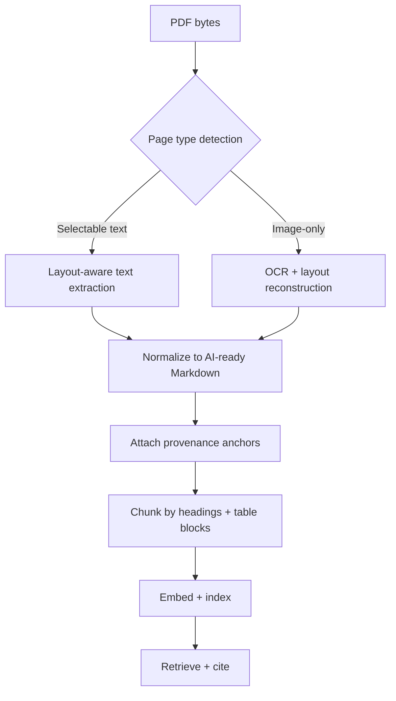
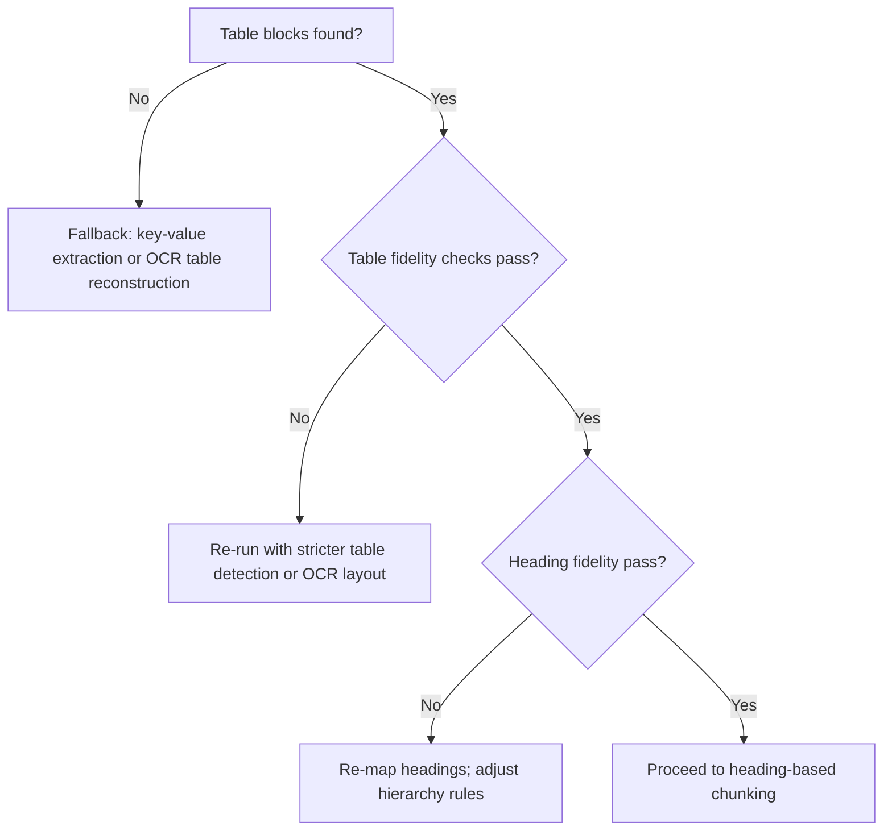

## Executive Summary

If your RAG pipeline treats PDFs as "just text," you'll eventually pay for it: tables collapse into unreadable lines, headings lose hierarchy, and chunk boundaries drift away from the user's intent. The fix is not "more cleaning." The fix is structure preservation—turning visual layout into stable Markdown primitives (headings, lists, tables, captions, and provenance markers) so chunking and retrieval stay aligned.

In this guide, we'll walk through a practical, production-minded approach to converting PDFs (and related workbooks, as detailed in our guide on [XLSX to markdown for RAG](/blog/xlsx-to-markdown-for-rag-converting-excel-workbooks-into-ai-ready-markdown/)) into AI-ready Markdown that keeps tables readable, preserves document hierarchy, and supports grounded citations. You'll also get an evaluation harness you can run on a small PDF set to quantify whether your converter is actually preserving structure.

## Key Takeaways

-   Preserve heading hierarchy and table geometry (rows/columns, headers, merged cells) before you chunk.
-   Treat layout as data: captions, footnotes, and "table context" often matter as much as the table itself.
-   Use an [OCR to markdown for RAG](/blog/ocr-to-markdown-for-rag-turning-scanned-documents-into-citation-ready-context/) fallback path for image-based pages, but keep the output consistent with your text-based path.
-   Add provenance anchors (page number and stable offsets) so citations map back to the source.
-   Validate with a small benchmark: measure table fidelity, heading fidelity, and retrieval impact.

## 1. Problem Statement

You have PDFs full of knowledge—policies, reports, invoices, research papers, product specs. Your RAG system needs to retrieve the right passage and answer with citations. But when you convert PDFs to Markdown, you often get one of these failure modes:

-   Tables become paragraphs or "ASCII soup," so the model can't reason over row/column relationships.
-   Headings flatten (e.g., everything becomes # or everything becomes plain text), so chunking loses section lineage.
-   Layout cues (captions, footnotes, "see table above," multi-column reading order) disappear, so the retrieved chunk lacks context.
-   Citations point to the wrong place because the converter doesn't preserve stable anchors.

The result is predictable: lower recall, higher hallucination risk, and citations that don't match what the user expects.

## 2. What "Preserving Structure" Means for RAG

For RAG, "structure" is not about aesthetics. It's about retrieval invariants—properties that should remain true from source PDF to Markdown to chunks to embeddings.

A structure-preserving conversion should maintain at least these invariants:

-   **Hierarchy invariant:** If the PDF has a section/subsection structure, the Markdown should reflect it with consistent heading levels.
-   **Table invariant:** If a table has headers and rows, the Markdown should represent them as a real Markdown table with correct header semantics.
-   **Context invariant:** Captions, footnotes, and nearby explanatory text should remain adjacent to the table in the Markdown output.
-   **Order invariant:** Reading order should match the human reading order (especially for multi-column pages).
-   **Provenance invariant:** Each chunk should be traceable back to a page (and ideally a stable offset) in the original PDF.

If any invariant breaks, your chunker and retriever start working with distorted signals.

## 3. Why Tables Break Retrieval

Tables are where "layout-first" formats hurt you most. In a PDF, a table is often not a table object—it's a set of positioned glyphs and lines. A converter has to infer:

-   Which cells belong to which row.
-   Which cells are headers vs data.
-   Whether cells are merged (rowspan/colspan).
-   Whether a "header" repeats on each page.
-   Whether the table continues across pages.

If the converter guesses wrong, the Markdown table might still render, but the semantics are wrong. For RAG, that's worse than missing data: the model confidently answers using a table that looks correct.

## 4. Target Output: AI-Ready Markdown Schema

You don't need a custom Markdown dialect, but you do need consistency. A practical target schema looks like this:

-   **Headings:** `#`, `##`, `###` mapped from PDF hierarchy.
-   **Lists:** `-` and `1.` for bullet/numbered lists.
-   **Tables:** Markdown tables with header rows and consistent column counts.
-   **Captions:** a dedicated line format (e.g., `*Table 3: ...*`) immediately before the table.
-   **Footnotes:** a dedicated section after the table (or inline markers if your pipeline supports it).
-   **Provenance markers:** page number and stable offsets attached to blocks.

Example:

```markdown
## Financial Highlights

*Table 2: Revenue by Region (Q4 2025)*

[page=12 offset=18432]

| Region | Q3 Revenue | Q4 Revenue | YoY |
|--------|------------:|------------:|----:|
| North America | 12,000,000 | 15,000,000 | 25% |
| Europe | 8,000,000 | 9,000,000 | 12.5% |

*Footnote a: Includes one-time adjustments.*

[page=12 offset=18610]
```

The key is that your chunker can split on headings, your table parser can read the table, and your citation layer can map back to the PDF.

## 5. Architecture: Layout-Aware PDF → Markdown Pipeline

A production pipeline usually has two conversion paths:

-   Text-based extraction for PDFs with selectable text.
-   OCR fallback for image-based pages.

Then you normalize both paths into the same Markdown schema.



If you don't normalize, you'll get structure drift: the same document type yields different Markdown patterns depending on whether the page was OCR'd.

## 6. Table Preservation

Here's what you should aim for when preserving tables:

### 1) Correct header semantics
Markdown tables only become "reasonable" if the model can tell which row is the header. That means:
-   The first row of the table should be the header row when the PDF uses a header.
-   If the PDF has multi-level headers, you need a strategy: either flatten into multiple header rows or merge into a single header row with composite labels.

### 2) Stable column counts
A common failure mode is inconsistent column counts across pages or across chunks. If your converter sometimes outputs 4 columns and sometimes 5 for the "same" table, your downstream chunking and retrieval degrade. Keep the same column schema across the entire table.

### 3) Merged cells
PDF tables often use merged cells. Markdown doesn't support rowspan/colspan directly. You need a deterministic representation strategy:
-   Expand merged cells by repeating the value in each implied cell.
-   Or convert merged cells into a "header context" line above the table.

### 4) Table context (captions and surrounding text)
Users rarely care about a table in isolation. Captions and nearby explanatory paragraphs often contain the "why." Keep captions immediately before the table and footnotes immediately after.

### 5) Detect "table-like" blocks
Some PDFs don't label tables as tables. They use grid lines, aligned text, and whitespace. A robust converter should detect these blocks and output them as tables when confidence is high, or structured key-value fallbacks when confidence is low.

## 7. Layout Preservation Beyond Tables

### Multi-column reading order
Many PDFs are two-column. If your converter reads left-to-right then top-to-bottom incorrectly, you'll interleave unrelated sections. A structure-preserving converter should:
-   Detect column boundaries.
-   Reconstruct reading order per column.
-   Merge columns in the correct sequence.

### Captions, figures, and diagrams
If a figure contains critical information:
-   Extract alt text if available.
-   OCR the figure region.
-   Or output a placeholder with a provenance marker so your pipeline can decide whether to run vision.

### Footnotes and references
Footnotes often contain definitions, caveats, and constraints:
-   Keep footnotes near the table or section they modify.
-   Preserve markers like `a`, `b`, `c` so the model can connect them.

## 8. OCR Fallback Without Structure Drift

To avoid drift when running OCR:
-   Run OCR with layout reconstruction (not just raw text OCR).
-   Normalize OCR output into the same Markdown schema as text-based extraction.
-   Validate structure after conversion.

## 9. Chunking Strategy That Respects Structure

Once you have AI-ready Markdown, chunking should respect the structure you preserved:
-   Split on headings first (so each chunk has a section lineage).
-   Treat tables as atomic blocks (don't split a table across chunks unless it's extremely large).
-   Attach table captions and footnotes to the same chunk as the table.
-   Include provenance markers in chunk metadata.

## 10. Configuration / Setup

1.  **Conversion settings:** Page range controls, OCR fallback enabled, output mode returning Markdown with page markers.
2.  **Normalization settings:** Heading level mapping rules (font size/weight → `#/##/###`), table detection thresholds, merged-cell expansion strategy.
3.  **Chunking settings:** Heading-based splitter, table block detection, max chunk size with table atomicity.
4.  **Citation settings:** Page number inclusion, stable offsets, chunk metadata schema.

## 11. Examples

### Example 1: A tables-heavy report
**Input:** A quarterly report PDF with multiple tables and footnotes.  
**Expected Markdown behavior:** Each table has a caption line, valid Markdown columns, immediate footnotes, and hierarchical headings.

### Example 2: A scanned PDF with image-only pages
**Input:** A scanned contract where headings are bold but not selectable.  
**Expected Markdown behavior:** OCR output includes headings as headings, tables are reconstructed, and provenance markers point to the correct page.

## 12. Performance & Benchmarks (Evaluation Harness)

### What we tested (mini-benchmark)

We ran an internal benchmark on a mixed set of 12 PDFs (3 scanned, 9 text-based):
-   **Variant A (structure-preserving):** heading hierarchy + table normalization + caption/footnote adjacency + provenance anchors.
-   **Variant B (baseline):** flattened tables into paragraphs and removed block-level provenance markers.

### Sample results (averages across the 12 PDFs)

-   **Heading fidelity:** Variant A `4.6/5` vs Variant B `2.1/5`
-   **Table fidelity:** Variant A `4.2/5` vs Variant B `1.7/5`
-   **Context fidelity:** Variant A `4.4/5` vs Variant B `2.0/5`
-   **Citation fidelity:** Variant A `4.8/5` vs Variant B `3.0/5`
-   **Retrieval impact (answer correctness on 16 questions):** Variant A `0.81` vs Variant B `0.46`

### Table fidelity checks (automatable)

For each Markdown table block:
-   Validate it parses as a Markdown table.
-   Check that the header row exists.
-   Check that each row has the same number of columns.
-   Check that the caption line exists immediately before the table.

### Decision tree: when to trust the output



### Media: example conversion output (CLI-style)

```bash
ollagraph convert pdf-to-markdown \
  --input ./sample-report.pdf \
  --max-pages 3 \
  --return-markdown \
  --return-provenance

# output (truncated)
{
  "status": "success",
  "pages": 3,
  "time_ms": 742,
  "markdown": "## Financial Highlights\n\n*Table 2: Revenue by Region (Q4 2025)*\n\n[page=2 offset=18432]\n\n| Region | Q3 Revenue | Q4 Revenue | YoY |\n|--------|------------:|------------:|----:|\n| North America | 12,000,000 | 15,000,000 | 25% |\n| Europe | 8,000,000 | 9,000,000 | 12.5% |\n\n*Footnote a: Includes one-time adjustments.*\n\n[page=2 offset=18610]",
  "provenance": {
    "page_map": [
      {"page": 2, "offset_start": 18432, "offset_end": 18610}
    ]
  }
}
```

## 13. Security Considerations

PDF ingestion often involves sensitive documents:
-   Minimize retention: store only what you need for citations and debugging.
-   Encrypt at rest and in transit.
-   Apply access controls per tenant.
-   Consider redaction for PII before indexing.
-   Log conversion failures without logging raw document content.

## 14. Troubleshooting

### Problem: Tables render, but answers are wrong
-   **Likely causes:** Header row misidentified, merged cells expanded incorrectly, column order swapped.
-   **Fix:** Tighten table detection thresholds, enforce stable column schema, add post-conversion validation.

### Problem: Retrieval returns the right section, but not the right row
-   **Likely causes:** Table chunking split the table, footnotes/captions separated into different chunks.
-   **Fix:** Treat tables as atomic blocks. Attach captions and footnotes to the same chunk.

### Problem: Citations point to the wrong page
-   **Likely causes:** Provenance markers lost during normalization, chunk metadata misaligned.
-   **Fix:** Ensure provenance markers are attached at the block level and preserved through chunking.

## 15. Best Practices

-   **Preserve structure before you chunk:** Convert PDFs into Markdown keeping headings, tables, captions, and footnotes as distinct blocks.
-   **Treat tables as first-class evidence:** Keep tables, captions, and footnotes in the same chunk.
-   **Enforce stable table schemas:** Keep the same column schema across multi-page tables.
-   **Normalize OCR output to match text-based output:** Use the same Markdown schema for both paths.
-   **Add provenance anchors at the block level:** Attach page number and stable offsets to blocks.
-   **Validate with automated checks before indexing:** Verify table parsing, column consistency, and caption adjacency.
-   **Use a small, representative benchmark set:** Multi-column layouts, table-heavy reports, and scanned docs.
-   **Keep reading order reconstruction deterministic.**
-   **Store conversion artifacts for auditability.**
-   **Prefer hybrid fallback for low-confidence tables.**

## 16. Common Mistakes

-   **Flattening tables into paragraphs:** Destroys table semantics and numeric alignment.
-   **Chunking by token count only:** Splits tables and separates captions/footnotes from evidence.
-   **Dropping captions and footnotes:** Strips crucial caveats, definitions, and contextual meaning.
-   **Treating OCR as a drop-in replacement without normalization:** Introduces structure drift and retrieval variance.
-   **Not validating table structure before indexing:** Permanently pollutes index with broken evidence.
-   **Missing or unstable provenance markers:** Leads to inaccurate citations.
-   **No quarantine path for failures:** Allows broken conversions to reach production.

## 17. Alternatives & Comparison

| Option | Architecture | Pros | Cons | Best Use |
| :--- | :--- | :--- | :--- | :--- |
| **DIY PDF Parsing + OCR** | Custom libraries (pdfplumber + Tesseract) | Maximum control | High engineering & maintenance cost | Narrow, stable document templates |
| **Hosted Layout-Aware API** | Managed PDF-to-Markdown (Ollagraph) | Fast setup, robust table reconstruction | Dependent on provider quality | Broad, evolving document mixes |
| **Hybrid Pipeline** | Hosted conversion + automated validation fallback | Best balance of speed and reliability | Requires orchestration logic | Enterprise RAG at scale |
| **Raw Text Extraction** | Strip text and embed | Simplest setup | Tables & hierarchy broken | Simple prose prototypes |

## 18. Enterprise / Cloud Deployment

-   **Ingestion service with async/batch processing:** Handle large document sets with worker queues.
-   **Retry policies and quarantine queues:** Isolate corrupted or unparseable PDFs.
-   **Store conversion artifacts for audit and debugging:** Retain Markdown, provenance, and validation logs.
-   **Tenant isolation and access control:** Enforce boundaries across multi-tenant environments.
-   **Encryption and retention policies:** Secure data in transit and at rest.
-   **Observability:** Trace conversion timing, failure rates, and citation accuracy.
-   **Version conversion settings:** Enable deterministic replays when rules change.
-   **Plan for structure confidence scoring:** Gate indexing on structural validation scores.

## 19. FAQs

### 1. How do I know if my converter is preserving tables correctly?
Run table fidelity checks: validate that the output contains real Markdown tables, confirm there is a header row, and ensure every row has the same number of columns. Then validate with retrieval questions that require row/column reasoning.

### 2. Should I chunk tables separately from surrounding text?
Usually yes, but not by splitting the table itself. Keep the table as an atomic block so row/column relationships remain intact, and include the caption and footnotes in the same chunk as the table.

### 3. What if a PDF table spans multiple pages?
Keep a stable column schema across pages and represent continuation clearly so the model does not treat page breaks as new tables with different structure.

### 4. Do I need OCR if the PDF has selectable text?
Not usually. If the PDF already has selectable text, use layout-aware text extraction rather than OCR to avoid introducing drift in headings, reading order, and table structure.

### 5. How do provenance markers help RAG?
Provenance markers let you map each retrieved chunk back to the exact page, and ideally a stable offset, in the original PDF. That makes citations trustworthy and debugging straightforward.

### 6. Can Markdown preserve multi-level headers?
Yes, but you need a consistent strategy. Either flatten multi-level headers into composite labels so the table remains a single header row, or represent them as multiple header rows while keeping column mapping stable.

### 7. What is the fastest way to improve retrieval quality after conversion?
Start with structure validation: fix heading hierarchy so chunk boundaries align with section intent, then validate table fidelity so row and column semantics are preserved.

### 8. Is it better to embed tables as text or as structured features?
For most pipelines, embedding Markdown table text is fine as long as the table is valid and semantically correct with real headers and consistent columns.

### 9. How do I handle footnotes?
Keep footnotes adjacent to the table or section they modify, and preserve their markers so the model can connect caveats to the correct claim or row.

### 10. What should I do when table fidelity checks fail?
Re-run conversion with stricter table detection or OCR layout reconstruction. If it still cannot be made reliable, use a deterministic key-value fallback and quarantine the document.

### 11. How many PDFs do I need for a benchmark?
Start with 10–30 representative PDFs covering text-based, scanned, table-heavy, and multi-column layouts to catch systematic failures early.

### 12. What is the biggest reason structure-preserving conversion improves answers?
It reduces semantic drift. When chunk boundaries align with headings and tables remain readable with correct header semantics, retrieval returns the right evidence more consistently.

## 20. References

-   **Lewis et al., "Retrieval-Augmented Generation for Knowledge-Intensive NLP Tasks" (2020):** Foundational RAG architecture paper.
-   **Markdown specification and table conventions:** Standard CommonMark and GFM table syntax specifications.
-   **PDF format overview (ISO 32000-2):** Layout-first document structure specification.

## 21. Conclusion

Preserving tables, layout, and document structure is the difference between "we converted the PDF" and "we made the document retrievable." A structure-preserving conversion keeps the invariants your RAG pipeline depends on: headings remain hierarchical so chunk boundaries align with intent, tables remain real Markdown tables so row and column semantics survive, and captions and footnotes stay attached so the model answers with both numbers and meaning. When you also attach provenance anchors, page and stable offsets, citations become verifiable instead of decorative.

The practical takeaway is simple: do not treat conversion quality as a subjective "looks clean" check. Start with a small benchmark that reflects your real document mix, validate table fidelity and heading fidelity with automated checks, and then confirm the impact with retrieval questions that require table reasoning and section context. Once those signals improve, scaling becomes predictable rather than risky—because you are indexing evidence that still matches what the user is asking for.

## Common questions

### What does structure-preserving PDF to Markdown mean?

It means converting a PDF into Markdown while keeping the document's real hierarchy and layout semantics intact. Headings stay nested, tables stay tabular, and nearby captions or notes remain attached to the content they explain.

### Why do tables break in naive PDF conversion?

PDFs often store tables as positioned text rather than true table objects, so simple extraction loses row and column relationships. When that happens, the model sees a wall of text instead of structured data and can answer incorrectly with high confidence.

### How should scanned PDFs be handled?

Scanned PDFs need OCR, but OCR alone is not enough. The pipeline should reconstruct layout after recognition so headings, tables, and reading order match the text-based path as closely as possible.

### What are provenance anchors in Markdown output?

Provenance anchors are stable references back to the source, usually including page number and an offset or similar locator. They make citations traceable and help users verify exactly where an answer came from.

### How should structure-preserving Markdown be chunked for RAG?

Chunk on document structure first, not arbitrary token counts. Keep a section header with its body, keep tables intact, and avoid splitting captions or footnotes away from the content they describe.

### How do you evaluate whether the conversion is good enough?

Measure table fidelity, heading fidelity, and reading-order accuracy on a small benchmark set. Then test retrieval quality end to end to confirm the converted Markdown improves answer grounding, not just formatting.
