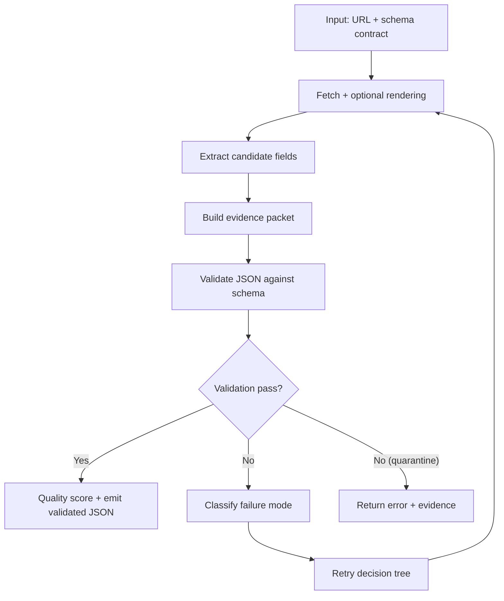

## Executive Summary

A structured data extraction API becomes reliable only when it emits validated JSON—output that has passed deterministic schema checks and quality gates.

In this post, you'll see a production-grade pipeline: define a schema contract, extract candidates (with rendering and anti-bot handling when needed), validate with deterministic gates, score quality, and route failures through a retry decision tree.

## Key Takeaways

-   Validated JSON is a contract: types, required fields, allowed values, and structural invariants.
-   Evidence packets make extraction debuggable: you store intermediate artifacts (fetched HTML, rendered DOM snapshot, extracted spans, validation errors).
-   Validation gates prevent silent corruption: you quarantine bad outputs before embedding or indexing.
-   Quality scoring measures completeness, consistency, and alignment with page signals.
-   A retry decision tree reduces cost by retrying with the right strategy for the specific failure mode.

## 1. Problem Statement

You can extract JSON from a web page and still end up with unusable data.

The failure mode is usually subtle: the API returns a JSON object that "looks right" but violates the assumptions your downstream system relies on. Maybe a price is missing currency, a date is in the wrong format, a product variant list is truncated, or an author field is populated with a navigation label.

When that happens, brittle pipelines fail quietly—which is why [reliable web data pipelines](/blog/reliable-web-data-pipelines-from-crawling-to-validated-json/) require strict validation gates, and the first time you notice is when retrieval answers start drifting.

So the real requirement is not extraction. It's validated extraction.

## 2. History & Context

Web extraction started with selectors: grab HTML, run CSS/XPath, parse strings, and hope the DOM stays stable (learn [why schema-driven extraction beats CSS selectors](/blog/why-schema-driven-extraction-beats-css-selectors-for-web-scraping/)).

Then sites got more dynamic. Data moved into JavaScript, lists became paginated or infinite scroll, and anti-bot defenses became common. Teams responded by adding headless browsers, proxies, and retries.

But the next bottleneck arrived: quality.

As soon as you scale beyond a handful of pages, you need a system that can answer three questions for every record:

-   Did we extract the right fields?
-   Did we extract them with the right structure and types?
-   Can we prove it with evidence?

Validated JSON is the answer.

## 3. Definition / What It Is

A structured data extraction API is an API that takes a URL (and often rendering hints) plus a schema contract, then returns structured data.

In this post, "validated JSON" means the API output has passed a validation layer that enforces:

-   Schema correctness: required fields exist, types match, and nested objects follow the contract.
-   Structural invariants: lists are not truncated, identifiers are present when needed, and cross-field consistency holds.
-   Quality gates: extracted values meet confidence thresholds and alignment checks.
-   Evidence availability: the response includes enough artifacts to debug failures.

If you want a one-sentence mental model:

Validated JSON out of an extraction API is like a compiler output—only emitted after the checks pass.

## 4. Architecture / How It Works

Below is the control flow you want in production.



The key is that validation is not an afterthought. It is the gate that decides whether the JSON is safe to ingest.

## 5. Components & Workflow

### 1) Schema contract (what you ask for)

A schema contract is more than a JSON Schema file. In practice, you define:

-   Field types (string, number, boolean, arrays, objects)
-   Required fields and optional fields
-   Constraints (min/max, regex patterns, enumerations)
-   Normalization rules (currency symbols removed, dates normalized to ISO-8601)
-   Identifier strategy (when to require stable IDs)

A good contract is strict enough to catch silent corruption, but not so strict that it rejects legitimate formatting differences.

### 2) Extraction engine (how candidates are produced)

The extraction engine typically does four things:

-   Fetches the page (and handles redirects)
-   Renders when needed (JavaScript execution, lazy content)
-   Locates candidate spans for each field
-   Normalizes values into the schema's expected formats

You should treat extraction as producing candidates, not final truth.

### 3) Evidence packet (why you trust it)

Evidence packets are the difference between "it failed" and "we can fix it."

A minimal evidence packet includes:

-   fetch: final URL, HTTP status, content-type
-   render: whether rendering was used, render duration, and a DOM snapshot reference
-   extraction: which selectors/strategies produced each field
-   validation: which checks failed and why

In practice, evidence packets should be stable enough that you can diff them across runs. That means:

-   Use consistent check IDs (e.g., `required_fields_present`, `types_match`).
-   Include a schema contract version (`contract.v1`) so you know what rules were applied.
-   Store enough [field-level extraction provenance](/blog/evidence-based-data-extraction-how-to-return-provenance-for-every-field/) to reproduce candidate selection.

When you store evidence, debugging becomes a deterministic workflow instead of a guessing game.

### 4) Validation gate (the correctness boundary)

Validation gates should be deterministic and fast.

Common gates include:

-   JSON Schema validation (types, required fields)
-   Cross-field checks (e.g., `endDate >= startDate`)
-   Completeness checks (e.g., at least N items in a list)
-   Alignment checks (e.g., extracted currency matches the page's currency context)

Here's a concrete failure example you can wire into your pipeline:

```json
{
  "validation": {
    "passed": false,
    "schema_version": "contract.v1",
    "checks": [
      { "id": "required_fields_present", "passed": false, "error": "missing: price.currency" },
      { "id": "types_match", "passed": true },
      { "id": "cross_field_consistency", "passed": false, "error": "currency_ambiguous" }
    ]
  }
}
```

Notice what's missing: there's no "best effort" currency. The pipeline can quarantine this record and retry with a strategy that targets currency context.

If validation fails, you do not emit "best effort JSON." You quarantine it.

### 5) Quality scoring (how good it is)

Quality scoring answers: even if it passes validation, how confident are we?

A practical scoring model might include:

-   **Completeness score:** fraction of required fields present
-   **Consistency score:** cross-field invariants satisfied
-   **Confidence score:** extraction confidence signals
-   **Evidence score:** evidence packet completeness

You can use the score to decide whether to accept, retry, or route to a human review queue.

### 6) Retry decision tree (how you recover)

Retries should be strategy-aware.

Instead of "retry the same call," classify the failure mode:

-   **Empty extraction:** try rendering or a different main-content strategy
-   **Truncated lists:** switch pagination mode or increase scroll depth
-   **Type mismatch:** tighten normalization rules or adjust parsing strategy
-   **Identifier missing:** require stable IDs and re-run with stricter entity linking

This is where cost drops and success rate rises.

#### Failure mode to retry strategy (decision table)

Use a table like this to keep retries deterministic.

| Failure mode (validation check) | What it usually means | First retry strategy | Second retry strategy |
| :--- | :--- | :--- | :--- |
| `required_fields_present` (missing field) | Layout changed or extraction missed a span | Switch to rendered DOM extraction | Switch to alternate source hints (meta tags / JSON blobs) |
| `types_match` (type mismatch) | Normalization rules don't match page formatting | Tighten normalization (e.g., strip symbols) | Add locale-aware parsing |
| `cross_field_consistency` (invariant broken) | Extracted values disagree across page sections | Re-extract with stricter entity linking | Enforce stricter "same section" constraints |
| `list_truncation_suspected` | Pagination/infinite scroll not fully loaded | Increase scroll depth / render time | Switch pagination mode (nextPageUrl vs crawl) |
| `currency_ambiguous` / `date_ambiguous` | Multiple candidates exist | Prefer visible text spans | Prefer structured hints (meta tags, JSON-LD) |

## 6. Configuration / Setup

This section is written as a generic contract you can map to Ollagraph.

### Input contract

-   **url:** the page to extract
-   **schema:** the JSON schema contract (or a schema ID)
-   **rendering:** auto | never | always plus optional timeouts
-   **pagination:** auto | first_page_only | crawl_until_limit
-   **validation:** strictness level and quality thresholds
-   **evidence:** minimal | full

### Output contract

A validated response should include:

-   **data:** the validated JSON object
-   **validation:** pass/fail plus error details when failing
-   **quality:** score breakdown
-   **evidence:** references or embedded artifacts

If your API doesn't return validation details, you're blind when something breaks.

### Validation Contract Design

Most teams start with a schema that checks types. That's necessary, but it's not sufficient.

To reach "validated JSON" quality, design your contract around invariants that reflect downstream truth:

-   **Normalization invariants:** dates are ISO-8601, prices are numeric with explicit currency.
-   **Completeness invariants:** lists meet minimum expected lengths when the page indicates more.
-   **Identity invariants:** if you need stable IDs, require them and fail when missing.
-   **Consistency invariants:** cross-field relationships (e.g., `endDate >= startDate`).

This is also where you decide what "strict" means. Strictness is a cost lever: stricter contracts reduce silent corruption but increase quarantines. The right balance depends on how expensive wrong data is for your use case.

## 7. Examples

### Example 1: Product page to validated JSON

Imagine you want a product record with:

-   name
-   price.amount
-   price.currency
-   availability
-   variants[] (optional)

A validated JSON output might look like:

```json
{
  "name": "Ollagraph Web Scraping API",
  "price": { "amount": 49.0, "currency": "USD" },
  "availability": "in_stock",
  "variants": [
    { "label": "Monthly", "billingPeriod": "P1M" }
  ]
}
```

If the page shows "$49" but the currency context is ambiguous, the validation gate can fail with a structured error like:

```
currency_missing_or_ambiguous
```

Then the retry decision tree can switch strategies (e.g., extract currency from a meta tag or locale block).

Here's the "quarantine" behavior you want when validation fails:

```json
{
  "data": null,
  "validation": {
    "passed": false,
    "checks": [
      { "id": "required_fields_present", "passed": false, "error": "missing: price.currency" }
    ]
  },
  "evidence": {
    "fetch": { "final_url": "https://example.com/product", "status": 200 },
    "render": { "used": true, "render_ms": 1420 },
    "extraction": { "price": { "strategy": "rendered_dom_span", "source_hint": "text: $49" } }
  }
}
```

### Example 2: Research article to validated citation metadata

For an article page, you might require:

-   title
-   authors[] with name and optional orcid
-   publicationDate normalized to ISO-8601
-   publisher
-   doi (optional but strongly preferred)

A common corruption is date formatting drift. Validation should enforce ISO-8601 and reject ambiguous formats.

When validation fails, evidence packets let you see whether the extracted date came from the visible page or from a hidden template.

### Example 3: Paginated list to validated array

For job listings or product catalogs, you often need:

-   items[] with stable IDs
-   pagination.nextPageUrl (or a crawl limit)

Validation gates should detect truncation:

If the page indicates more results but the extracted list is shorter than expected, fail with *list_truncation_suspected*.

Then retry with a pagination strategy that matches the site's behavior.

## 8. Performance & Benchmarks

You can't optimize what you don't measure.

A useful benchmark set for validated extraction includes:

-   **Success rate:** percentage of calls that pass validation
-   **Validation failure rate:** percentage quarantined
-   **Retry rate:** average retries per successful record
-   **Latency:** p50/p95 end-to-end time
-   **Evidence overhead:** size/time impact of evidence packets

To make benchmarks actionable, measure by failure mode, not just overall pass rate.

### Benchmark dataset design (what to include)

Build a dataset that covers the failure modes you actually see:

-   Static pages with stable DOM
-   JavaScript-rendered pages where content appears only after render
-   Paginated lists (next page links)
-   Infinite scroll lists
-   Pages with multiple currency/date formats
-   Pages with partial blocks (e.g., "out of stock" variants)

Then run the same schema contract across the dataset and record:

-   pass rate
-   quarantine rate
-   retry rate
-   top 5 validation check failures

A practical way to report results:

-   Run the same schema contract across a fixed dataset of URLs
-   Track outcomes per failure mode
-   Compare strategies: `rendering=auto` vs `rendering=always`, evidence `minimal` vs `full`

### Example benchmark table (template)

| Strategy | Validation pass rate | p95 latency | Avg retries | Notes |
| :--- | :--- | :--- | :--- | :--- |
| rendering=auto, evidence=minimal | 0.86 | 2.1s | 0.22 | Best cost/quality |
| rendering=always, evidence=minimal | 0.90 | 3.4s | 0.18 | Higher cost |
| rendering=auto, evidence=full | 0.86 | 2.3s | 0.22 | Debuggable failures |

### A simple "cost per validated record" metric

If you want a single number to compare strategies, compute:

```
cost_per_validated_record = total_api_cost / number_of_records_that_pass_validation
```

This metric forces you to account for retries and quarantines. A strategy with a higher pass rate can still be worse if it's too expensive per attempt.

In production, the goal is not maximum pass rate. The goal is maximum validated throughput at acceptable cost.

## 9. Security Considerations

Validated extraction still touches untrusted content.

Key security practices:

-   Treat fetched HTML as untrusted input; never execute it in your own environment.
-   Sanitize logs and evidence packets (avoid storing secrets from authenticated pages).
-   Enforce allowlists for domains when possible.
-   Rate-limit and apply abuse detection.
-   Validate schema contracts server-side to prevent injection via schema definitions.
-   If you store evidence packets, apply retention policies and access controls.

## 10. Troubleshooting

When validated JSON fails, you want a fast path to root cause.

### Symptom: validation fails with missing required fields

**Likely causes:**
-   The page layout changed
-   The extraction strategy didn't render dynamic content
-   The schema contract is too strict for real-world formatting

**What to do:**
-   Inspect evidence packet validation errors
-   Check whether rendering was used
-   Adjust normalization rules or relax constraints where appropriate

### Symptom: validation passes but data is wrong

**Likely causes:**
-   Validation gates are too shallow (types match, but semantics don't)
-   Cross-field invariants are missing
-   Confidence thresholds are too low

**What to do:**
-   Add cross-field checks (e.g., currency context)
-   Increase quality thresholds
-   Add alignment checks based on page signals

### Symptom: list truncation

**Likely causes:**
-   Pagination mode mismatch
-   Infinite scroll not fully loaded
-   Anti-bot throttling mid-crawl

**What to do:**
-   Switch pagination strategy
-   Increase render/scroll depth within limits
-   Use evidence to confirm whether more items existed on the page

### Symptom: validation fails with type mismatch

**Likely causes:**
-   Normalization rules don't match the page's formatting (e.g., "$1,299.00" vs "1299.00").
-   Locale differences (decimal separators, thousands separators).
-   The field is present but extracted from the wrong DOM region.

**What to do:**
-   Inspect the evidence packet for the failing check (usually `types_match`).
-   Tighten normalization (strip currency symbols, unify decimal separators).
-   If the wrong region is being targeted, adjust the extraction strategy to prefer structured hints (meta tags, JSON-LD) over visible text.

## 11. Best Practices

1.  **Treat the schema contract as a correctness boundary**
    
    Start strict where downstream systems need certainty, and flexible where formatting varies.
    
    -   Make required fields truly required for meaning-critical use cases (e.g., `price.amount` + `price.currency`, `publicationDate` in ISO-8601, stable `id` when you need entity linking).
    -   Keep optional fields optional, but still normalize them consistently when present (e.g., trim whitespace, unify decimal separators, map "in stock" variants to a canonical enum).
    -   Encode invariants that reflect truth, not just shape. Examples:
        -   Cross-field: `endDate >= startDate`.
        -   Completeness: if the page indicates multiple variants, require `variants.length >= 2`.
        -   Identity: if you need deduplication, require an identifier or fail with `identifier_missing`.
    
    Practical rule: if a missing/incorrect value would silently degrade answers, it should be required and validated.
    
2.  **Include evidence packets early, then make them selective**
    
    Evidence packets are how you debug extraction failures without re-running expensive steps.
    
    In non-production (staging, QA, early rollout), default to `evidence=full` so you can inspect:
    -   fetch outcome (final URL, status, content-type)
    -   whether rendering was used and how long it took
    -   extraction provenance per field (strategy + source hint)
    -   validation check failures (check IDs + error reasons)
    
    In production, reduce overhead by using `evidence=minimal` for pass cases and `evidence=full` for failures or low-quality records.
    
    Practical rule: evidence should be "cheap enough to keep," but "rich enough to fix."
    
3.  **Quarantine failures; never ingest "best effort" as if it were correct**
    
    Quarantine means you separate "extraction happened" from "data is safe."
    
    If validation fails, do not write the extracted data into your canonical store.
    
    Instead, store:
    -   the validation result (which checks failed)
    -   the evidence packet (what the system saw)
    -   the retry plan (what you attempted next)
    
    Route quarantined records to one of:
    -   automated retry (strategy-aware)
    -   human review queue (when the failure mode is rare or ambiguous)
    -   schema contract update (when the contract is too strict or missing invariants)
    
    Practical rule: "best effort" is fine for exploration, not for ingestion.
    
4.  **Use a retry decision tree keyed by failure mode**
    
    Retries should be deterministic and explainable.
    
    Build a small taxonomy of failure modes based on validation checks, then map each mode to the next strategy.
    
    Example mappings:
    -   **`required_fields_present` failed:** Usually means the extraction missed spans or the page layout changed. Retry strategy: switch from visible-text extraction to rendered DOM extraction, or switch to structured hints (meta tags / JSON blobs).
    -   **`types_match` failed:** Usually means normalization rules don't match the page's formatting. Retry strategy: tighten normalization (strip symbols, unify separators) or add locale-aware parsing.
    -   **`list_truncation_suspected`:** Usually means pagination/infinite scroll didn't fully load. Retry strategy: increase scroll depth or switch pagination mode (next-page URL vs crawl).
    -   **`currency_ambiguous` / `date_ambiguous`:** Usually means multiple candidates exist. Retry strategy: prefer structured hints first, then visible spans, and enforce "single-candidate" rules.
    
    Practical rule: retry should change one controlled variable at a time (rendering strategy, pagination strategy, or extraction hint source), not "try everything."
    
5.  **Score quality and route low-score records**
    
    Validation answers "pass/fail." Quality scoring answers "how trustworthy is it?"
    
    Use quality scoring to decide whether to accept, retry, or review even when validation passes.
    
    Common scoring inputs:
    -   Completeness: fraction of required fields present and non-empty.
    -   Consistency: cross-field invariants satisfied.
    -   Confidence signals: extraction confidence, candidate uniqueness, and evidence coverage.
    -   Evidence completeness: did you capture the provenance needed to trust the result?
    
    Routing examples:
    -   High score: ingest into canonical store.
    -   Medium score: ingest but mark for background re-extraction.
    -   Low score: quarantine and retry with a more expensive strategy (often rendering or alternate hints).
    
    Practical rule: quality scoring prevents "valid but weak" records from silently degrading downstream retrieval.

## 12. Common Mistakes

1.  **Treating "JSON returned" as correctness**
    
    Mistake: you accept the output because it parses.
    
    Why it fails: parsing only proves syntax. You can still have missing required fields, wrong types, truncated lists, or values that violate invariants.
    
    Fix: require deterministic validation gates and quarantine failures.
    
2.  **Contracts that only validate types**
    
    Mistake: the schema checks that fields are strings/numbers, but doesn't encode meaning.
    
    Why it fails: you'll pass records where the structure is correct but the semantics are wrong (e.g., date ordering, currency ambiguity, swapped fields).
    
    Fix: add cross-field invariants and normalization invariants that reflect downstream truth.
    
3.  **Blind retries that don't change strategy intentionally**
    
    Mistake: "retry the same call" or "retry with everything enabled."
    
    Why it fails: you waste cost and still fail the same invariant. Worse, you can create non-deterministic outcomes that are hard to debug.
    
    Fix: classify failure mode using check IDs, then route to a decision tree that changes the right strategy.
    
4.  **Evidence packets without governance**
    
    Mistake: you store evidence packets indefinitely, or you log raw content that may include secrets.
    
    Why it fails: evidence is operationally valuable, but it can become a security liability.
    
    Fix:
    -   Apply retention policies (shorter for pass cases, longer for failures).
    -   Use access controls and audit logging.
    -   Sanitize logs and avoid persisting sensitive page content.

5.  **Treating rendering as a simple on/off switch**
    
    Mistake: you either always render or never render.
    
    Why it fails: rendering is expensive and can introduce variability (timing, dynamic content, A/B tests). It should be a strategy, not a toggle.
    
    Fix: use `rendering=auto` by default, then force rendering only when evidence indicates missing content or when the site is known to require it.

6.  **Not measuring outcomes by failure mode**

    Mistake: you track only overall pass rate.

    Why it fails: you can improve pass rate while making a specific failure mode worse (e.g., type mismatches become more frequent but are hidden by retries).

    Fix: break metrics down by top validation check failures and route engineering effort to the highest-impact failure modes.

## 13. Alternatives & Comparison

When teams compare approaches, they usually compare "how to extract," not "how to trust." For validated extraction, trust is the differentiator.

### Selector-based scraping

Selector-based scraping is the classic approach (explore [why schema-driven extraction beats CSS selectors](/blog/why-schema-driven-extraction-beats-css-selectors-for-web-scraping/)): you define CSS/XPath selectors and hope nothing breaks.

**Pros:**
-   Cheap for stable pages where the DOM structure rarely changes.
-   Fast and predictable latency when the content is already present in HTML.
-   Easy to reason about for a small number of templates.

**Cons:**
-   Brittle under layout changes (class names, nesting, or A/B variants).
-   Validation is often shallow: you can validate types, but semantic correctness is harder (e.g., "price" might come from the wrong block).
-   Maintenance cost grows quickly because every site change becomes a code change.

**Where it fits best:**
-   Internal sites or partner sites with stable markup.
-   Early prototypes where you want quick wins and can tolerate occasional breakage.

### LLM-only extraction

LLM-only extraction asks a model to read the page (or a representation of it) and output JSON directly.

**Pros:**
-   Flexible when the structure is unclear or when selectors are hard to maintain.
-   Can infer intent from surrounding text.

**Cons:**
-   Probabilistic output: even with "JSON mode," the model can produce plausible-but-wrong values.
-   Without deterministic validation gates, you can't reliably distinguish "correct" from "confidently wrong."
-   Debugging is harder: you need to reconstruct why the model chose a value, not just why a selector failed.

**Where it fits best:**
-   Exploratory extraction where you're still learning the schema contract.
-   Cases where you can tolerate a quarantine/review workflow.

### Hybrid approach (recommended): candidates first, deterministic validation second

The hybrid approach separates concerns:
-   Extraction strategies produce candidates (from rendered DOM, structured hints, or targeted text spans).
-   Deterministic validation gates decide whether the candidates are safe to ingest.

This is the core idea behind "validated JSON out."

Here's a comparison that focuses on trust and operations:

| Approach | Extraction reliability | Validation strength | Debuggability | Maintenance cost | Best use case |
| :--- | :--- | :--- | :--- | :--- | :--- |
| Selector-based | High on stable DOMs, drops on layout changes | Often shallow unless you add invariants | Medium (selector failures are visible) | High at scale | Stable templates |
| LLM-only | Variable (depends on prompt + page representation) | Usually weak unless you add strict post-checks | Low to medium (reasoning is opaque) | Medium to high | Unstructured pages |
| Hybrid (recommended) | High when candidates are well-targeted | Deterministic gates with check IDs | High (evidence + failing checks) | Lower (contract-driven) | Production ingestion |

**Decision guidance:**
-   If you need correctness guarantees and auditability, hybrid wins.
-   If you only need "good enough" for exploration, LLM-only can be faster to prototype.
-   If the DOM is stable and you can invest in selector maintenance, selector-based can be cost-effective.

## 14. Enterprise / Cloud Deployment

At enterprise scale, validated extraction stops being a "script" and becomes an operational system.

The goal is to make outcomes measurable, retries safe, and evidence auditable—without turning validation into a bottleneck.

### Reference architecture (practical separation of concerns)

Use separate services so each part can scale independently:

**API Gateway / Ingestion Service**
-   Accepts `url`, schema contract ID, and extraction options (rendering/pagination/evidence level).
-   Performs request validation and rate limiting.
-   Writes a job record with a correlation ID.

**Extraction Workers**
-   Fetch and optionally render pages.
-   Produce candidate JSON plus provenance (what strategy produced each field).
-   Emit an evidence packet (or a pointer to evidence artifacts) for downstream validation.

**Validation Service**
-   Runs deterministic schema validation and invariant checks.
-   Produces a structured validation result (pass/fail, check IDs, error reasons).
-   Applies quality scoring and routing rules.

**Orchestration / Retry Router**
-   Classifies failure mode from validation check IDs.
-   Selects the next strategy from the retry decision tree.
-   Schedules retries with backoff and caps.

**Storage Layer**
-   Canonical store for validated data.
-   Quarantine store for failed records (with evidence pointers).
-   Evidence object store (HTML snapshots, rendered DOM references, logs).

### Durable queues and safe retries

Retries are where systems get expensive and messy if you don't design for it.
-   Use durable queues so jobs survive worker restarts.
-   Make retries idempotent using a job correlation ID and attempt number.
-   Cap retries per failure mode to prevent infinite loops.
-   Apply backoff when anti-bot throttling is detected (based on fetch status patterns and evidence).

### Evidence storage with lifecycle policies

Evidence packets are your audit trail, but they must be governed.
-   Store evidence in an object store (e.g., S3-compatible) with lifecycle policies.
-   Keep full evidence longer for failures than for pass cases.
-   Redact or avoid storing sensitive content from authenticated pages.

### Dashboards by failure mode (turn failures into engineering work)

If you only track "pass rate," you'll miss where engineering effort should go.

Build dashboards that break down:
-   Top failing validation checks (e.g., `required_fields_present`, `types_match`, `list_truncation_suspected`).
-   Quarantine rate by schema contract version.
-   Retry success rate by failure mode and strategy.
-   Latency percentiles by rendering/pagination mode.

This turns validated extraction into a feedback loop: contract updates and strategy improvements become measurable.

### Auditability and compliance

If you need auditability, evidence packets are your audit trail.
-   Persist the validation result alongside the validated data.
-   Store evidence pointers (not necessarily full artifacts) for long-term audit.
-   Ensure access controls and audit logs for evidence retrieval.

## 15. FAQs

### Q1. What's the difference between "structured output" and "validated JSON"?

Structured output means the API returns JSON that matches the shape you asked for (or at least parses as JSON). Validated JSON means the output passed deterministic checks that enforce correctness boundaries. In a validated extraction pipeline, that typically includes schema correctness, structural invariants, and quality gates. Without validation, you can ingest records that "look right" but violate invariants your downstream system assumes are true.

### Q2. Do I need JSON Schema for validation?

JSON Schema is a common baseline because it standardizes types, required fields, and basic constraints. But JSON Schema alone usually isn't enough for validated extraction. You typically also need deterministic checks that go beyond syntax, such as cross-field invariants, normalization invariants, and completeness invariants. So: JSON Schema helps, but validated extraction should include invariants and quality gates that reflect downstream truth.

### Q3. How do evidence packets help when extraction fails?

Evidence packets make failures reproducible. When extraction fails (or validation fails), you want to answer four questions quickly: what the system fetched, whether it rendered (and how long), what candidates it extracted (strategy + source hint), and which validation checks failed (check IDs + error reasons). With that, you can decide whether the fix is a rendering/pagination change, a normalization rule update, a schema contract adjustment, or a targeted extraction hint change.

### Q4. Can validated extraction reduce hallucinations in downstream LLMs?

Yes—indirectly, but in a way that matters. Downstream hallucinations often happen when the model is given incorrect or fabricated facts as context. Validated extraction reduces that risk by ensuring only records that pass deterministic correctness checks are emitted to your knowledge base. Quarantine prevents "plausible but wrong" facts from entering the system, and evidence/check IDs help you improve the extraction pipeline so the same failure mode doesn't keep recurring. The result isn't that the LLM becomes perfect; it's that the grounding layer becomes more trustworthy, which reduces incorrect answers.

### Q5. What should I do when validation fails frequently?

Don't start by changing everything. Start by classifying the failure mode using the validation check IDs. Then apply the smallest strategy change that targets that failure: for empty extraction, try rendering or switch main-content strategy; for truncation, adjust pagination mode or increase scroll/render depth; for type mismatch, tighten normalization and add locale-aware parsing; for cross-field invariant failures, refine invariants and re-extract with stricter constraints. Finally, measure whether the change reduces the specific failing check rate—not just overall pass rate.

### Q6. Is rendering always required?

No. Rendering is expensive and can introduce variability. Use rendering as a strategy: default to `rendering=auto`, force rendering when evidence indicates missing content, and force rendering for known JavaScript-heavy sites or failure modes like infinite scroll. Practical approach: run a small benchmark on your target domains to determine which ones actually require rendering to pass validation reliably.

### Q7. How do I choose quality thresholds?

Quality thresholds are a cost/benefit decision. Start conservative so you prioritize correctness: require high confidence for meaning-critical fields and route borderline cases to re-extraction or review. Then tune using a fixed dataset and track pass rate/quarantine rate, retry rate/average retries per validated record, and downstream impact (like retrieval accuracy or answer grounding improvements). Adjust thresholds based on the cost of wrong data versus the cost of retries—if wrong data is expensive, bias toward stricter thresholds.

### Q8. What about rate limits and anti-bot defenses?

In production, anti-bot handling must be part of the extraction workflow, not an afterthought. Recommended practices include applying backoff and retry caps when throttling is detected, using rendering/pagination strategies that minimize repeated requests, and detecting blocked responses early (status codes and content patterns) to fail fast into quarantine. Validation still matters because blocked pages can produce partial HTML that "looks parseable" but fails invariants (missing required fields, truncated lists, ambiguous values). Quarantine prevents those partial records from entering your canonical store.

### Q9. Can I validate nested arrays and complex objects?

Yes. Nested validation is where contracts become powerful. Typical nested checks include array constraints (min/max length, uniqueness rules, required fields per element), nested required fields (e.g., each variant must include label and billingPeriod), and cross-field consistency across nested objects (e.g., variant pricing currency matches the parent product currency). When a nested element fails, evidence packets should point you to the failing element and the check ID so debugging stays targeted.

### Q10. How do I store validated JSON for long-term use?

Store three things together: the validated data (canonical output), the validation result (pass/fail, schema contract version, check IDs, and error reasons when failing), and evidence references (pointers to stored artifacts; you don't always need full raw content). This gives reproducibility (compare validation outcomes on re-runs) and auditability (trace which contract version and checks were applied). It also helps incident response by quickly identifying whether issues came from extraction, validation, or contract drift.

### Q11. What's a good first schema contract?

Start with the fields that downstream systems truly depend on. Make those required and strict by choosing invariants that reflect meaning (not formatting) and normalizing values into canonical formats (ISO-8601 dates, numeric prices, canonical enums). Then add optional fields once you can validate them consistently across your failure-mode dataset. Practical rule: don't expand the contract faster than you can validate it—evidence and quarantine rates tell you when it's safe to add more required fields.

### Q12. How do I measure success beyond pass/fail?

Pass/fail is necessary, but not sufficient. Measure success using failure mode distribution (which check IDs fail most often), completeness (fraction of required fields present and non-empty), quality score (how trustworthy the record is even when it passes), retry efficiency (retries per validated record and time-to-success), and downstream impact (retrieval accuracy, answer grounding, or business KPIs). This prevents the trap of improving pass rate while quietly degrading the quality of what you ingest.

### Q13. What if my schema contract is too strict?

When the contract is too strict, you'll see high quarantine rates and repeated failures on the same checks. Relax constraints that reflect formatting differences (whitespace variations, thousands separators, currency symbol placement) while keeping invariants that reflect meaning (numeric price must pair with explicit currency, dates must be normalized into a single canonical format, required identifiers must be present when you need stable entity linking). If you relax too much, you'll pass corrupted records; if you relax too little, you'll quarantine everything. Evidence packets tell you which fields are failing and why, so you can adjust the contract with confidence.

## 16. References

-   JSON Schema specification (for schema validation concepts): https://json-schema.org/
-   Ajv (Another JSON Schema Validator) documentation (practical JSON Schema validation patterns): https://ajv.js.org/
-   Fastify / Zod / TypeBox style schema validation references (contract-first validation approaches):
    -   Zod: https://zod.dev/
    -   TypeBox: https://github.com/sinclairzx81/typebox
    -   Fastify schema validation: https://www.fastify.io/docs/latest/Reference/Validation-and-Serialization/
-   schema.org structured data guidance (entity modeling patterns and structured fields): https://schema.org/
-   Google Search Central: Structured data / schema markup documentation (how search engines interpret structured data): https://developers.google.com/search/docs/appearance/structured-data
-   MDN Web Docs: DOM, parsing, and rendering fundamentals (what "rendered DOM" means operationally): https://developer.mozilla.org/
-   Playwright documentation (reliable headless rendering and DOM inspection for extraction): https://playwright.dev/

## 17. Conclusion

Validated JSON out of a structured data extraction API is what turns web scraping into reliable infrastructure.

Scraping alone answers the question, "did we manage to pull something from the page?" Validated extraction answers the harder question: "is what we pulled actually safe to trust?" That's why the pipeline is built around candidates first, then deterministic validation gates, and finally evidence packets that make failures explainable. When validation fails, you quarantine instead of ingesting "best effort" data, so downstream systems do not quietly accumulate corrupted facts.

This approach also changes how you operate the system. With evidence packets and structured validation results—check IDs, error reasons, and provenance—debugging becomes targeted: you can identify whether the problem is rendering, pagination, normalization, schema contract drift, or extraction strategy selection. Add quality scoring on top of validation, and you can route records based on trust level, not just pass/fail, so "valid but weak" outputs do not degrade retrieval quality over time.

Finally, a retry decision tree keyed by failure mode makes recovery cost-aware. Instead of retrying blindly, you retry with the strategy most likely to fix the specific invariant that failed. That improves validated throughput while keeping latency and spend under control.

If you're building ingestion for AI agents, RAG, or analytics, this is the control layer you want before you scale: a pipeline that prevents silent corruption, produces auditable outputs, and gives you measurable feedback loops to continuously improve extraction quality.

## Common questions

### What makes extracted JSON "validated"?

Validated JSON has passed deterministic checks before it is emitted. That includes schema validation, structural invariants, and quality gates that catch missing fields, type mismatches, and inconsistent values. If the output fails those checks, it should be quarantined rather than ingested.

### Why is a schema contract necessary?

A schema contract defines exactly what the extraction API must return: field types, required fields, allowed values, and normalization rules. It prevents silent drift by making bad structure fail fast. Without it, data can look correct while still breaking downstream systems.

### What is an evidence packet?

An evidence packet is the debug trail for an extraction run. It typically includes fetched HTML, rendered DOM snapshots when needed, extracted spans, final field values, and validation errors. With that context, failures are diagnosable instead of opaque.

### When should an extraction pipeline retry?

Retry only when the failure mode suggests the first attempt was incomplete or the strategy was wrong, such as a rendering miss or a transient fetch issue. A retry decision tree helps route each failure to the cheapest effective recovery path. If the record is structurally invalid after validation, retrying blindly usually just burns compute.

### How does quality scoring improve trust?

Quality scoring measures how complete, consistent, and source-aligned the extracted record is. It gives you a second signal beyond schema pass/fail, so borderline outputs can be flagged or quarantined. That reduces the risk of feeding weak data into search, analytics, or retrieval.

### What are the most common mistakes teams make?

The biggest mistakes are treating extraction as the final step instead of the beginning of validation. Teams also overfit the schema, skip evidence collection, or ingest low-confidence records without quarantine rules. The result is data that appears structured but is not dependable.
