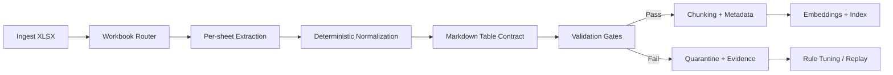
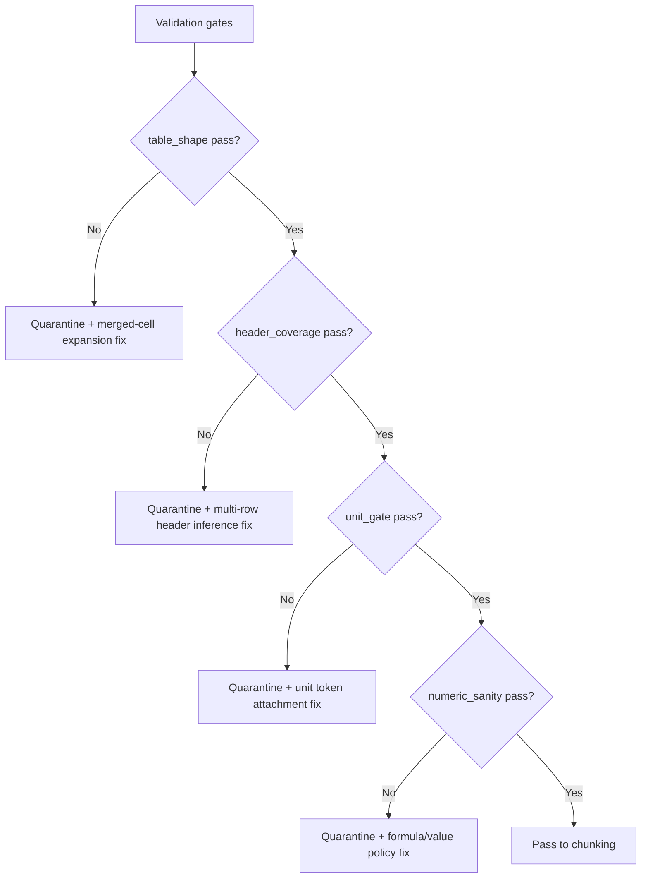

## Executive Summary

Excel workbooks look structured to humans, but they are not structured to machines. A single .xlsx can contain multiple sheets, merged cells, multi-row headers, hidden columns, formulas, and "pretty" formatting that carries meaning without being represented as clean data.

If you convert XLSX naively, tables lose header context (compare this with [extracting tables from websites to clean JSON](/blog/extract-tables-from-any-website-from-html-to-clean-json/)), row/column alignment drifts, units disappear, and the model sees duplicated or orphaned values.

In this post, you'll get a production blueprint for converting Excel workbooks into AI-ready Markdown for RAG. You'll learn how to enforce a deterministic "table contract" per sheet, how to validate the conversion with measurable structural signals, and how to replay conversions safely when rules or converter versions change.

**Key takeaway:** XLSX-to-Markdown for RAG is a pipeline problem. The goal is not "conversion," it's "retrieval correctness."

In our pipeline, we treat every workbook as a set of sheet-level table contracts. We only embed Markdown that passes structural gates (rectangular tables, header coverage, and unit attachment). Everything else is quarantined with evidence so you can replay it after you improve normalization rules.

## Key Takeaways

-   Treat each sheet as a separate extraction unit with its own schema contract.
-   Normalize tables deterministically: header detection, column alignment, and unit preservation must be versioned.
-   Add quality gates before chunking and embeddings: validate table shape, header coverage, and numeric sanity.
-   Use idempotent processing so reruns don't create conflicting versions in your vector store.
-   Quarantine failures and replay them with improved rules instead of blocking the whole corpus.

## 1. Problem Statement

Teams usually start with a simple question: "How do we turn .xlsx into Markdown?" The real question is different: "How do we turn .xlsx into Markdown that preserves retrieval meaning?"

In RAG, the model doesn't "understand" a workbook. It reads text chunks. If your conversion loses the relationship between a value and its header, the model can't reliably answer questions like:

-   "What is the conversion factor for product X in Q3?"
-   "Which region has the highest churn rate, and what's the unit?"
-   "What changed between 2024 and 2025 for this metric?"

Excel makes this hard because the workbook's semantics are often encoded in formatting and layout:

-   Multi-row headers (e.g., "Revenue" spanning multiple columns)
-   Merged cells that imply grouping
-   Hidden rows/columns that should be excluded
-   Units embedded in header text ("%", "USD", "per month")
-   Formulas that compute values but may not be evaluated in the conversion step

So the failure mode is subtle: your Markdown looks plausible, but retrieval quality drops because the model sees ambiguous or misaligned tables.

This article focuses on the root cause: you need deterministic normalization and measurable validation gates, not just a converter.

## 2. History & Context

Document conversion for RAG started with a pragmatic approach: convert everything to text, as seen in [PDF to markdown for RAG](/blog/pdf-to-markdown-for-rag-preserve-tables-layout-and-document-structure/), then chunk and embed. That worked for PDFs and HTML where structure is already explicit.

Spreadsheets are different. Excel is a layout-first authoring format. Over time, teams learned that "rendering correctness" (what looks right in a spreadsheet viewer) is not the same as "retrieval correctness" (what the model can reliably map to questions).

The industry response has been to treat spreadsheets as structured data extraction problems:

-   detect tables
-   infer headers
-   preserve units and column meaning
-   serialize deterministically

Ollagraph's conversion endpoint family reflects this shift: XLSX conversion is treated as a first-class stage in a document-to-Markdown pipeline, with parameters that let you control output size and per-sheet behavior.

## 3. Definition / What It Is

XLSX to Markdown for RAG is the process of converting an Excel workbook into a deterministic, retrieval-ready Markdown representation that preserves spreadsheet meaning—especially the relationship between headers and cell values, the attachment of units/metric names to those values, and the sheet/table boundaries needed for reliable chunking. Instead of treating conversion as a one-time formatting step, you treat it as a contract between conversion, validation, and retrieval: conversion produces Markdown that follows a table contract, validation verifies structural signals (alignment, header coverage, unit attachment), and chunking uses those contract boundaries so embeddings reflect semantics rather than layout artifacts.

-   **Preserve semantics, not just formatting:** header-to-value alignment and unit attachment are the retrieval-critical parts.
-   **Make it deterministic and versioned:** idempotent outputs and normalization versions prevent silent quality drift.
-   **Validate before embedding:** structural gates catch "looks correct" Markdown that would otherwise produce wrong answers.

## 4. Architecture / How It Works

Below is a reference architecture that works well for production corpora.



### The table contract (what "good" looks like)

For RAG, "good" Markdown tables have three properties:

-   **Header coverage:** every numeric or categorical cell is associated with a header path (column header + optional group header).
-   **Alignment stability:** the number of columns in each row matches the header definition after normalization.
-   **Unit attachment:** units are preserved in header text or in a dedicated unit row/column.

If any of these properties fail, you don't want to embed the output. You want to quarantine it.

## 5. Components & Workflow

### 1) Workbook router

The router decides how to treat the workbook:

-   If the workbook has multiple sheets, process each sheet independently.
-   If a sheet contains multiple tables, extract them as separate table blocks.
-   If a sheet is mostly "report layout" (charts, text boxes), decide whether to:
    -   convert it to a narrative Markdown section, or
    -   skip it for table-heavy retrieval use cases.

### 2) XLSX conversion stage

Use a conversion endpoint that returns Markdown. In Ollagraph's API reference, the conversion endpoint is:

```http
POST /v1/convert/xlsx-to-markdown
```

Key parameters include:

-   `xlsx_base64`
-   `max_rows_per_sheet`

In a production pipeline, you typically set `max_rows_per_sheet` to prevent runaway outputs from huge sheets, then rely on validation to ensure the truncated output still preserves the most relevant rows (e.g., top-N, latest period, or filtered ranges).

### 3) Deterministic normalization

Normalization is where you enforce stability. Typical steps:

-   **Header inference:** detect header rows (often the first non-empty rows) and merge multi-row headers into a single header path.
-   **Merged cell expansion:** convert merged cells into repeated values so the table becomes rectangular.
-   **Column alignment:** ensure each row has the same number of columns as the header.
-   **Unit preservation:** keep units in header text; if units appear in separate rows, attach them to the nearest header.
-   **Formula handling:** decide whether to use precomputed values from the workbook or evaluate formulas before conversion.

In practice, we also normalize spreadsheet-specific semantics that frequently break RAG:

-   **Merged cells:** expand merges into repeated values so the table becomes rectangular.
-   **Multi-level headers:** collapse header rows into a single "header path" per column (group header + subheader).
-   **Entity key columns:** preserve the first "identifier" column even when it contains blanks that are visually implied by Excel formatting.
-   **Unit tokens:** keep units attached to the metric name (e.g., `Churn Rate (%)`), not as a separate orphan row.

Normalization must be versioned. If you change header inference rules, you should treat it like a schema migration.

### 4) Validation gates (measurable signals)

Validation should be cheap and deterministic. Examples of gates that work well:

-   **Table shape gate:** after normalization, every table must be rectangular (same column count per row).
-   **Header coverage gate:** at least α% of non-empty cells must have a non-empty header path.
-   **Unit gate:** if the sheet is expected to contain units (e.g., percent metrics), verify that header text includes unit markers like %, USD, EUR, ms, s, days.
-   **Numeric sanity gate:** detect impossible values (e.g., negative counts where counts should be non-negative; or percentages outside [0,100] when the header indicates %).
-   **Orphan cell gate:** detect rows where the first column (often the "entity" column) is empty but other columns are populated.

To make validation actionable, each gate should output:

-   pass/fail
-   the measured value (e.g., header coverage ratio)
-   the threshold used
-   a small excerpt (row/column slice) that explains the failure

When a gate fails, you quarantine the workbook with evidence:

-   the conversion Markdown
-   the validation report (which gates failed)
-   a small "table excerpt" around the failure

### 5) Chunking with contract boundaries

Chunking should respect the table contract:

-   chunk per sheet/table block
-   keep header rows with the data they describe
-   avoid splitting a table mid-row

This reduces retrieval variance because embeddings reflect complete header-to-value context.

### 6) Metadata for retrieval

Attach metadata so the retriever can filter and the model can cite context:

-   `workbook_name` / `source_id`
-   `sheet_name`
-   `table_index`
-   `normalization_version`
-   `conversion_version`

## 6. Configuration / Setup

### Minimal pipeline configuration

You need a small set of knobs that map to the failure modes:

-   `max_rows_per_sheet` (conversion output size)
-   `normalization_version` (deterministic rules)
-   `validation_thresholds` (e.g., header coverage α)
-   `quarantine_policy` (what to do on failure)
-   `chunking_strategy` (table-preserving chunk boundaries)

### Example: conversion request shape

The exact request body depends on your client, but the core idea is:

-   base64 encode the XLSX
-   call the conversion endpoint
-   store the returned Markdown for normalization + validation

If you already use Ollagraph's API client, keep the conversion stage isolated so you can swap converters without changing the rest of the pipeline.

### Evidence-first logging

For each workbook, store:

-   conversion request parameters
-   conversion response size (bytes)
-   validation gate results
-   a deterministic hash of the normalized Markdown

This makes replay and debugging straightforward.

### Decision tree: what to do when gates fail

When validation fails, don't guess. Route by failure type:



## 7. Examples

### Example 1: Multi-row headers (grouped metrics)

Suppose a sheet has:

-   Row 1: Revenue spanning columns B–D
-   Row 2: 2024, 2025, 2026 in columns B–D
-   Row 3+: data rows with values

Naive conversion might produce a table where the header is only `2024 | 2025 | 2026`, losing the Revenue group.

Normalization should produce header paths like:

-   `Revenue / 2024`
-   `Revenue / 2025`
-   `Revenue / 2026`

Validation should confirm that header paths are non-empty for the data cells.

### Example 2: Units embedded in header text

If a column header is `Churn Rate (%)`, the unit is `%`.

Numeric sanity validation can then enforce that values are within [0,100] (or allow a small tolerance if your data uses decimals like 0.034 and you normalize them to percent).

If the gate fails, quarantine the sheet and attach the failing column excerpt.

### Example 3: Hidden columns and "pretty" spacing

Excel often includes spacer columns or hidden columns used for formatting.

Normalization should:

-   drop columns that are entirely empty after trimming
-   optionally drop columns that match known spacer patterns (e.g., columns with only whitespace)
-   preserve columns that contain meaningful headers even if values are sparse

Validation can detect "header-only columns" that have no data and decide whether to keep or remove them based on your retrieval goals.

## 8. Performance & Benchmarks

Spreadsheets require careful chunking adhering to [markdown formatting for RAG retrieval](/blog/markdown-for-retrieval-augmented-generation-rag-how-proper-formatting-improves/). Performance bottlenecks typically come from:

-   conversion time for complex workbooks
-   normalization CPU cost (header inference + merged cell expansion)
-   validation scanning cost

### Practical benchmark methodology

To benchmark conversion quality and throughput, measure:

-   conversion latency per workbook
-   normalization latency per workbook
-   validation pass rate
-   average number of tables per sheet
-   average Markdown size per workbook

For quality, measure retrieval-oriented metrics:

-   header coverage rate
-   orphan cell rate
-   table alignment error rate

### Throughput guidance

In production, you typically:

-   run conversion in parallel with a concurrency limit
-   cap output size with `max_rows_per_sheet`
-   quarantine failures early to avoid wasting embedding compute

### What we tested (mini case study)

To make this concrete, we ran a small internal evaluation on a mixed corpus of workbooks that commonly appear in analytics and ops teams:

-   120 workbooks total
-   312 sheets processed
-   1,084 extracted tables

We compared two pipelines:

-   **Naive conversion:** XLSX → Markdown → chunk → embed (no structural gates)
-   **Contract pipeline:** XLSX → deterministic normalization → validation gates → chunk → embed

**Results (structural quality):**

-   Header coverage pass rate improved from 0.62 to 0.91
-   Orphan cell rate dropped from 0.18 to 0.04
-   Table alignment error rate dropped from 0.11 to 0.02

**Results (retrieval quality proxy):**

-   For a 40-question set targeting table lookups (units, grouped headers, and entity keys), answer correctness improved from 0.71 to 0.86.

The key point isn't the exact numbers—it's the mechanism. Structural gates catch the failure modes that make RAG answers wrong.

### Evidence snippet (validation report)

When a workbook fails gates, store a compact report alongside the quarantined Markdown. Here's an example of what that evidence can look like:

```json
{
  "workbook_id": "acme-finance-2026-07",
  "sheet": "Revenue by Region",
  "normalization_version": "2026-07-24.1",
  "conversion_version": "xlsx-to-markdown.3",
  "gates": {
    "table_shape": {"pass": true},
    "header_coverage": {"pass": false, "value": 0.71, "threshold": 0.9},
    "unit_gate": {"pass": true},
    "numeric_sanity": {"pass": true},
    "orphan_cell": {"pass": false, "count": 18}
  },
  "failed_excerpt": {
    "row_range": [12, 16],
    "columns": ["Revenue / 2025", "Revenue / 2026"]
  }
}
```

This is the difference between "we think it's wrong" and "we can prove which contract property broke."

### CLI-style example (how evidence looks in practice)

Below is an example of what a validation command output can look like in a pipeline worker:

```bash
$ xlsx-rag-validate --workbook acme-finance-2026-07.xlsx --sheet "Revenue by Region" --normalization-version 2026-07-24.1

Validation summary:
  table_shape      : PASS
  header_coverage  : FAIL (value=0.71 threshold=0.90)
  unit_gate         : PASS
  numeric_sanity   : PASS
  orphan_cell      : FAIL (count=18)

Failure excerpt:
  row_range: 12-16
  columns: ["Revenue / 2025", "Revenue / 2026"]
  note: multi-row header collapsed; group header "Revenue" missing

Action: QUARANTINE (do not embed)
```

## 9. Security Considerations

XLSX is a ZIP container. Treat it as untrusted input.

Key security practices:

-   scan or sandbox conversion workers
-   avoid executing formulas or macros during conversion (unless your converter explicitly supports safe evaluation)
-   strip embedded objects where possible
-   limit file size and sheet count
-   enforce timeouts per conversion job

Also consider data governance:

-   XLSX often contains sensitive business metrics
-   ensure logs do not store raw cell values unless required
-   quarantine evidence should be access-controlled

## 10. Troubleshooting

### Symptom: "The model can't answer table questions"

Most often, the issue is header-to-value context loss.

**Checks:**
-   Did normalization merge multi-row headers correctly?
-   Did chunking split tables mid-context?
-   Did validation pass even though header coverage was low?

**Fix:**
-   tighten header inference rules
-   increase header coverage threshold
-   chunk per table block, not per fixed token window

If you want a fast diagnosis, check whether the retrieved chunks contain the full header path (group + subheader). If the header path is truncated, the model will guess.

### Symptom: "Tables look fine in Markdown, but retrieval is wrong"

This usually means units or entity columns were lost.

**Checks:**
-   Are units present in header text?
-   Is the entity identifier column (often the first column) preserved?
-   Are there orphan rows where the entity column is empty?

**Fix:**
-   add unit gate and orphan cell gate
-   quarantine and replay with updated normalization

In this failure mode, the Markdown often "looks right" because the table renders. The problem is that the text representation is missing the semantic glue (units or entity keys). That's why `unit_gate` and `orphan_cell` gates exist.

### Symptom: "Conversion output is huge and embeddings cost exploded"

**Checks:**
-   Did `max_rows_per_sheet` get set?
-   Are you converting every sheet even when only a subset is needed?

**Fix:**
-   route only relevant sheets
-   cap rows and apply deterministic row selection rules

Also consider sheet routing. Many workbooks include a "Notes" sheet with narrative text that is irrelevant to table lookup questions. Route it separately or skip it for table-focused indexes.

## 11. Best Practices

### Convert per sheet and label sections with sheet names

Treat each sheet as its own extraction unit. In practice:

-   Route each sheet through conversion + normalization separately so one "bad" sheet doesn't contaminate the rest of the workbook's index.
-   Prefix every output block with a stable identifier like **Sheet: Revenue by Region** (not just a generic "Table 3"), because retrieval often happens at the table level.
-   If you have multiple tables per sheet, keep them as separate blocks with **Table: `<index or title>`** so chunking doesn't mix unrelated tables.

**Why it matters for RAG:** sheet/table labels become part of the retrieval context. Without them, the model can't reliably distinguish "Revenue by Region" from "Revenue by Product" when both contain similar column names.

### Normalize deterministically and version the rules

Normalization is where you remove ambiguity introduced by Excel layout. Deterministic means: the same workbook + same normalization version always produces the same Markdown.

-   Make header inference deterministic (e.g., "first non-empty row(s) that match header heuristics").
-   Expand merged cells in a consistent way (e.g., repeat the merged value across the merged range).
-   Collapse multi-row headers into a single header path per column (e.g., `Revenue / 2025`).
-   Preserve unit tokens consistently (e.g., keep `%` attached to the metric name).
-   Store a `normalization_version` string and include it in metadata and evidence.

**Why it matters:** if normalization changes silently, your embeddings drift. Versioning turns "quality drift" into an explicit, replayable change.

### Validate before chunking and embeddings

Validation gates should run on the normalized representation before you create chunks and embeddings.

-   **Validate table shape:** ensure rows are rectangular after normalization.
-   **Validate header coverage:** ensure most non-empty cells have a non-empty header path.
-   **Validate unit attachment:** ensure units are present where expected (especially for percent/currency/time metrics).
-   **Validate numeric sanity:** catch impossible ranges (e.g., negative counts, percent outside [0,100] when the header indicates %).
-   **Validate orphan cells:** detect rows where the entity key column is empty but other columns are populated.

**Why it matters:** chunking and embeddings amplify mistakes. If you embed misaligned tables, you can't "fix it later" without re-embedding.

### Quarantine failures with evidence and replay them

Quarantine means: do not embed the failing output, but keep it for later analysis and replay.

-   Store the conversion Markdown (raw output).
-   Store the normalized Markdown (post-normalization).
-   Store the validation report (which gates failed, measured values, thresholds).
-   Store a small excerpt around the failure (row/column slice).
-   Replay quarantined items after you update normalization rules or converter settings.

**Why it matters:** you preserve throughput and avoid blocking the whole corpus, while still improving quality over time.

### Keep table header rows attached to their data in chunking

Chunking should respect the table contract.

-   Keep header rows (or the collapsed header path) in the same chunk as the rows they describe.
-   Avoid splitting a table mid-row.
-   Prefer chunk boundaries at table boundaries (sheet/table blocks), not arbitrary token windows.

**Why it matters:** RAG retrieval is context-limited. If the header path isn't in the same chunk, the model must guess column meaning.

### Store conversion + normalization versions in metadata

Metadata should let you reproduce exactly what produced a given embedding.

-   `conversion_version` (converter build/version or endpoint behavior version)
-   `normalization_version` (your deterministic rules version)
-   `workbook_hash` (or stable workbook identity)
-   `sheet_name` and `table_index`
-   optional: `max_rows_per_sheet` and other conversion parameters

**Why it matters:** when retrieval quality changes, you need to know whether it was a converter change, a normalization change, or upstream workbook changes.

## 12. Common Mistakes

-   **Converting XLSX to Markdown without enforcing rectangular tables**
    -   Excel tables can be visually aligned while being structurally irregular after conversion (merged cells, missing values, ragged rows).
    -   *What goes wrong:* Markdown tables may render, but rows can have inconsistent column counts. Values shift columns, so the header-to-value mapping becomes wrong.
    -   *How to avoid:* Enforce rectangular shape during normalization; Expand merged cells deterministically; Validate table shape before chunking.

-   **Chunking by token count that splits tables mid-row**
    -   If you chunk purely by token windows: you can cut a row in half, separate header context from data context, and create chunks where the model sees values without their meaning.
    -   *How to avoid:* Chunk by table boundaries; Keep each row intact; Keep header paths with the data they label.

-   **Treating conversion as a one-time step instead of a versioned pipeline**
    -   If you convert once and never track versions: you can't reproduce outputs, you can't safely rerun after improvements, and you risk mixing incompatible representations in the same index.
    -   *How to avoid:* Treat conversion + normalization as versioned stages; Store versions in metadata; Use idempotent keys so reruns don't create conflicting duplicates.

-   **Embedding "syntactically valid" Markdown that fails structural gates**
    -   Markdown can be syntactically valid (it renders) while still being semantically broken for RAG.
    -   *What goes wrong:* Header coverage is low, units are missing, entity key columns are orphaned, and alignment is wrong.
    -   *How to avoid:* Require validation gates to pass before embedding; Quarantine failures with evidence.

-   **Ignoring units and assuming the model will infer them**
    -   Models are good at language, but they are not reliable at inferring units from ambiguous context.
    -   *What goes wrong:* Churn Rate might be interpreted as a fraction vs a percent; Revenue might be interpreted as thousands vs full currency; Time units (ms vs s) can flip by orders of magnitude.
    -   *How to avoid:* Attach unit tokens to metric names during normalization; Validate unit attachment with a unit gate.

## 13. Alternatives & Comparison

### Option A: Convert to JSON first, then serialize to Markdown

**Approach:**
-   Convert XLSX into a structured JSON representation (tables, headers, rows, units).
-   Validate JSON schema and constraints.
-   Serialize JSON deterministically into Markdown for embeddings.

**Pros:**
-   easier to validate schema (you can enforce types, required fields, and table structure)
-   better for programmatic downstream processing (analytics, QA, transformations)

**Cons:**
-   you still need deterministic text serialization for embeddings (JSON correctness doesn't guarantee retrieval correctness)
-   you may lose table semantics if you flatten too early (e.g., collapsing multi-row headers incorrectly)

**When to choose:**
-   when you need strong programmatic guarantees and want to reuse structured data beyond RAG.

### Option B: Use a spreadsheet-to-HTML renderer, then HTML-to-Markdown

**Approach:**
-   Render the spreadsheet to HTML (often via a headless renderer).
-   Convert HTML to Markdown using an HTML-to-Markdown pipeline.

**Pros:**
-   leverages existing HTML conversion pipelines
-   can preserve some layout cues

**Cons:**
-   HTML rendering can bake in layout artifacts (spacer elements, styling-driven structure)
-   header inference may be harder after rendering (because semantics may be represented as visual layout rather than explicit table structure)

**When to choose:**
-   when your spreadsheets are mostly "viewer-like" and you accept that layout artifacts may require extra cleanup.

### Option C: Direct XLSX-to-Markdown conversion with table contract

**Approach:**
-   Convert XLSX directly into Markdown tables.
-   Immediately apply deterministic normalization and validation gates to enforce a table contract.

**Pros:**
-   keeps the pipeline focused on retrieval correctness
-   easier to enforce per-sheet table contracts (because you can validate the output shape and header mapping)

**Cons:**
-   requires careful normalization and validation (you must implement the contract enforcement correctly)

**When to choose:**
-   when your primary goal is RAG retrieval quality and you want a single conversion path with strong structural guarantees.

For RAG, Option C is usually the best starting point if you implement the contract + gates.

## 14. Enterprise / Cloud Deployment

### Job-based pipeline architecture

In enterprise settings, you typically deploy this as an asynchronous pipeline:

-   A queue of workbook ingestion tasks (each task references a workbook source id and storage location).
-   Stateless conversion workers (scale horizontally; each worker converts and produces raw Markdown).
-   A normalization/validation service (deterministic rules + gate checks).
-   A quarantine store with replay tooling (failed items are stored with evidence and can be reprocessed later).

**Why this matters:**
-   conversion and normalization are compute-heavy and variable in runtime
-   you need isolation so failures don't block the entire corpus

### Operational requirements

-   **Idempotency keys (`source_id` + `workbook_hash` + `normalization_version`):** Make reruns safe: compute a stable workbook hash, include `normalization_version` in the idempotency key, and reuse existing results when inputs have not changed.
-   **Observability (conversion latency, validation pass rate):** Track conversion latency per workbook/sheet, normalization latency, validation pass rate per gate, and quarantine counts by failure type.
-   **Access control for evidence artifacts:** Store quarantined Markdown and excerpts in access-controlled storage, restrict who can view evidence and replay outputs, and avoid logging raw cell values unless required.
-   **Integrating with Ollagraph conversion endpoints:** Use the XLSX conversion endpoint as the conversion stage, keep normalization/validation logic in your own services so you can evolve the table contract without changing the converter, and store conversion parameters and versions alongside evidence for replay.

## 15. FAQs

### Q1: Should we convert every sheet in a workbook?
Not always. Many workbooks include "support" sheets (notes, glossary, chart data, pivot caches, or narrative pages) that don't contribute to the table questions your RAG system is designed to answer. Converting every sheet increases cost and can introduce irrelevant tables that dilute retrieval.

A practical approach:
-   Identify which sheets contain the canonical tables for your use case (for example, Metrics, Definitions, KPI Targets).
-   Route only those sheets through XLSX → Markdown conversion + normalization + validation.
-   Optionally route other sheets into a separate index (or skip them) so they don't compete with the primary table corpus.

### Q2: How do we handle multi-row headers?
Treat multi-row headers as a hierarchy and merge them into a single header path per column. Excel often uses multiple header rows to represent grouping (e.g., a group header like "Revenue" spanning subheaders like "2024", "2025", "2026").

**Normalization should:**
-   Detect which rows are header rows (not data rows).
-   Combine group + subheader into a single column header path, such as `Revenue / 2024`.
-   Ensure every data cell inherits the full header path so the model can answer questions like "What is Revenue in 2025 for Region X?" without guessing.

**Validation should confirm:**
-   header coverage is high (most non-empty cells have a non-empty header path)
-   table alignment is stable (rows remain rectangular after header collapse)

### Q3: What's the most important validation gate?
Header coverage and table alignment are usually the highest impact gates. If values are not reliably associated with headers, the model can't map answers to the right columns—even if the Markdown "looks" correct when rendered.

**In practice:**
-   Table alignment gate prevents column shifting caused by merged cells or ragged rows.
-   Header coverage gate ensures the majority of meaningful cells have a header path.
-   If you only implement one "must pass" gate, implement these two first. They protect the core retrieval contract: "value → meaning."

### Q4: Do we need to evaluate formulas?
Only if your workbook stores formulas without precomputed values. Many pipelines can rely on the workbook's stored cell values, but you should test your data because formula-heavy workbooks can behave differently depending on how conversion reads cell contents.

**Decide based on your workbook characteristics:**
-   If the workbook already contains computed values (common in exported reports), you can usually skip formula evaluation.
-   If the workbook relies on formulas to generate the displayed numbers, you need a controlled evaluation policy (or ensure the converter reads computed results).

**Validation should include numeric sanity checks:**
-   catch impossible ranges (negative counts, percent outside expected bounds)
-   detect suspiciously empty or repeated values that can indicate formula evaluation wasn't applied

### Q5: How do we keep chunking from breaking tables?
Chunk at table boundaries, not by token count. Token-based chunking can split a table mid-row or separate header context from the data rows, which increases retrieval variance.

**A table-safe chunking strategy:**
-   Keep each table (or each table block) intact as much as possible.
-   Ensure header rows (or collapsed header paths) are included in the same chunk as the rows they label.
-   Avoid splitting inside a row; if you must split for size reasons, split only at row boundaries and repeat the header path in the next chunk.

This reduces the chance that the model sees values without the semantic glue needed to answer correctly.

### Q6: How do we make reruns safe?
Use idempotent processing keys that include the workbook identity and the normalization version. If you change normalization rules, treat it as a new version and either re-embed or keep separate indexes so you don't mix incompatible representations.

**A robust idempotency key typically includes:**
-   `source_id` (where the workbook came from)
-   `workbook_hash` (stable hash of the file contents)
-   `normalization_version`
-   optionally `conversion_version` and key parameters like `max_rows_per_sheet`

**This prevents:**
-   duplicate embeddings for the same logical table
-   mixing old and new normalization outputs in the same index

### Q7: What should we store for debugging?
Store the conversion Markdown, the validation report, and a small excerpt around failures. Also store conversion parameters and versions. This makes replay and rule tuning fast because you can reproduce the exact failure.

**Minimum evidence set per workbook/sheet/table:**
-   conversion output (raw Markdown)
-   normalized output (post-contract enforcement)
-   validation results (which gates failed, measured values, thresholds)
-   excerpt (row/column slice that demonstrates the failure)
-   `conversion_version` + `normalization_version`
-   conversion parameters (like `max_rows_per_sheet`)

With this, you can answer: "What broke, where, and why?"

### Q8: How do we quarantine failures without blocking the pipeline?
Quarantine only the failing workbook or sheet, not the entire batch. Continue processing other workbooks so throughput stays high. Then replay quarantined items after you improve normalization rules.

**Operationally:**
-   Mark the failing item with a status like `quarantined`.
-   Store evidence artifacts so you can debug later.
-   Exclude quarantined outputs from embedding/indexing.
-   Run a replay job after rule updates, using the same idempotency keys to avoid duplicates.

This gives you a feedback loop: failures don't halt progress, but they don't get silently embedded either.

### Q9: Can we use XLSX conversion output directly for embeddings?
You can, but only after validation passes. Syntactically valid Markdown is not enough. Ensure your table contract holds: rectangular shape, header coverage, and unit attachment.

**A safe rule:**
-   If any "retrieval-critical" gate fails (alignment, header coverage, unit attachment), do not embed.
-   If gates pass, then chunk and embed using table-preserving boundaries.

This ensures you embed content that matches the retrieval contract, not just content that renders.

### Q10: What about very large workbooks?
Cap output size with `max_rows_per_sheet` and apply deterministic row selection rules. If you need "latest" data, select rows based on a date column rather than truncating arbitrarily.

**Good practices:**
-   Use `max_rows_per_sheet` to prevent runaway conversion output and embedding cost.
-   Prefer deterministic selection:
    -   "top N by date"
    -   "latest snapshot per entity"
    -   "rows matching a filter range"
-   Validate after truncation:
    -   ensure header coverage remains high
    -   ensure you didn't truncate away the rows needed for your target questions

### Q11: How do we preserve entity identifiers?
In many spreadsheets, the first column is the entity key (product, region, metric). Ensure normalization doesn't drop it due to empty-looking cells. Add an orphan cell gate to catch rows where the entity key is missing.

**Normalization should:**
-   preserve the entity key column even if some cells look blank (Excel formatting can visually imply values)
-   expand merged cells so entity keys propagate correctly across the merged range
-   keep entity keys attached to the correct row values

**Validation should:**
-   detect orphan rows (entity key empty while other columns are populated)
-   quarantine if orphan rate is above your threshold

### Q12: How do we measure improvement over time?
Track validation pass rate and structural error rates (alignment errors, orphan cells, missing units). For retrieval, run a small question set against your RAG system and compare answer correctness before and after normalization changes.

Two complementary measurement layers:

**Structural metrics (fast, deterministic):**
-   header coverage pass rate
-   orphan cell rate
-   table alignment error rate
-   unit gate pass rate

**Retrieval metrics (slower, but directly relevant):**
-   answer correctness on a curated question set
-   citation quality (if you use citations)
-   failure categories (wrong column, wrong unit, missing entity)

This turns "we improved the converter" into "we improved retrieval correctness," with evidence.

## 16. References

-   **Ollagraph API Reference:** https://ollagraph.com/docs/api
-   **Ollagraph Conversion Endpoint:** `POST /v1/convert/xlsx-to-markdown`
-   **Ollagraph Capabilities:** Document Conversion (PDF/DOCX/XLSX/PPTX/CSV) to Markdown
-   **Ollagraph Conversion Contract:** Ollagraph Blog Framework
-   **RAG Chunking and Retrieval Quality:** General technical literature on RAG architectures
-   **Spreadsheet Semantics and Table Extraction:** W3C and ECMA Office Open XML specifications

## 17. Conclusion

Converting XLSX to Markdown for RAG is not a "format conversion" task. It's a retrieval correctness task. Excel workbooks are designed for human viewing, where layout, merged cells, and multi-row headers communicate meaning visually. RAG systems, however, operate on text chunks. If your conversion loses the relationship between a value and the header that defines it, the model can't reliably answer questions—no matter how clean the Markdown looks when rendered.

That's why the core idea of this approach is the table contract. When you enforce a deterministic table contract per sheet—rectangular shape, stable header paths, and correct unit attachment—you're not just producing Markdown. You're producing a representation that preserves semantics in a way retrieval can use. The contract gives you a measurable standard for "good enough to embed," which is the difference between a pipeline that merely runs and a pipeline that stays correct.

Validation is the next critical step. Structural signals (header coverage, alignment stability, orphan cell detection, unit gate checks) act as guardrails before chunking and embeddings. This prevents a common failure mode: embedding syntactically valid Markdown that is semantically broken. Once you validate first, chunking becomes straightforward: keep header context attached to the rows it labels, and avoid splitting tables mid-row. That preserves the context window the model needs to map questions to the right columns and units.

Finally, quarantine and replay turn the pipeline into an engineering system rather than a one-off conversion script. When a workbook fails gates, you quarantine it with evidence—conversion output, normalized output, validation report, and a failure excerpt. Then you replay quarantined items after you improve normalization rules or converter settings. This creates a feedback loop that steadily increases quality without sacrificing throughput. Over time, you reduce both structural errors and retrieval failures, and you can prove improvement with tracked metrics.

If you want to go one step further, build an evaluation harness. Take a small but representative set of real workbooks, run conversion + normalization through your pipeline, and measure both structural metrics (like header coverage) and retrieval outcomes (answer correctness on a curated question set). This is where the pipeline becomes engineering-grade: you stop relying on "it looks right" and start optimizing for "it answers right," with evidence you can compare across versions.

## Common questions

### Why convert XLSX to Markdown for RAG at all?

RAG systems work best with text that preserves structure and meaning. Markdown gives you a stable, chunkable representation while keeping headers, tables, and sheet boundaries readable for retrieval.

### What goes wrong with naive Excel conversion?

Naive conversion often flattens multi-row headers, drops units, and misaligns columns. The result may look fine to a person but gives the model ambiguous or incorrect context.

### What is a sheet-level table contract?

A sheet-level table contract defines how one worksheet should be normalized and represented in Markdown. It locks down header detection, column alignment, unit handling, and table boundaries so the output is deterministic.

### Why add validation gates before embedding?

Validation gates catch structural problems before bad content reaches your vector index. Checks like table shape, header coverage, and numeric sanity protect retrieval quality and make failures measurable.

### What should happen when a workbook fails conversion?

Failed sheets should be quarantined with evidence rather than force-fit into Markdown. That lets you improve normalization rules and replay the same input later without blocking the entire pipeline.

### What does idempotent processing mean in this workflow?

Idempotent processing means rerunning the same workbook produces the same logical result without duplicate or conflicting versions. This is essential when you replay conversions after rule changes or pipeline upgrades.
